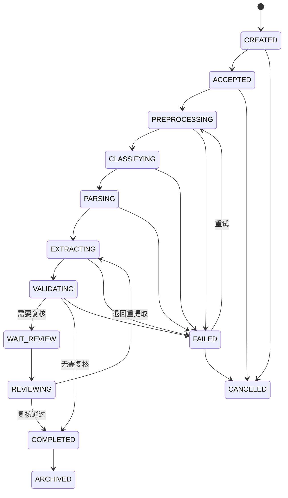
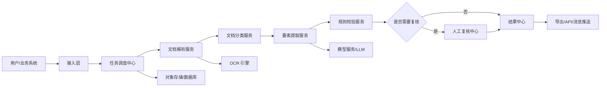
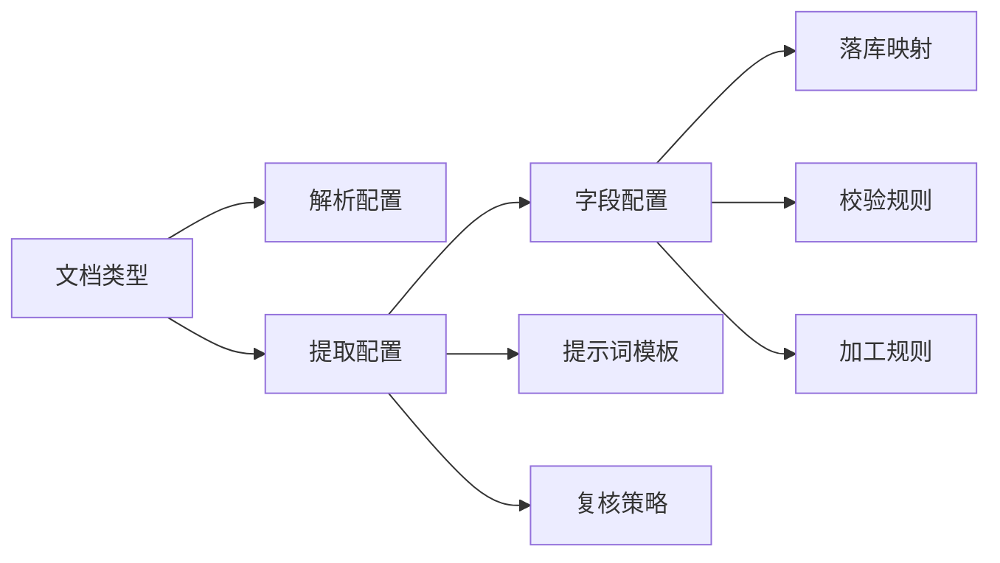
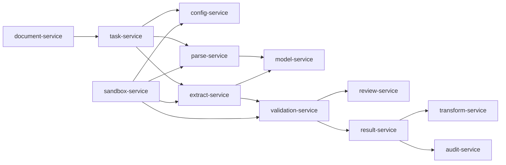

# 智能要素提取平台设计文档

## 1. 项目背景

基金公司内部存在大量 OCR、PDF、Office 文档、扫描件、图片、邮件附件等非结构化或半结构化材料。不同部门在开户、产品、交易、运营、风控、合规、财务、投研、客服等场景中，都需要从文档中提取关键业务要素，并沉淀为可复用、可追溯、可审核的数据。

本平台目标是建设一个统一的“智能要素提取”能力底座，支持多部门、多文档类型、多业务场景的要素配置、自动识别、人工复核、结果导出与系统集成。

## 2. 建设目标

### 2.1 总体目标

构建一个面向基金公司全部门的智能文档处理平台，实现文档接入、OCR 识别、版面分析、要素提取、规则校验、人工复核、结果归档、接口集成的一体化闭环。

### 2.2 业务目标

- 降低人工录入和人工核对成本。
- 提升文档处理效率和要素提取准确率。
- 统一各部门文档处理入口，避免重复建设。
- 支持业务人员通过配置方式快速新增提取模板。
- 保证提取过程可追溯、可审计、可复核。
- 支持与现有业务系统、数据平台、流程系统对接。

### 2.3 技术目标

- 支持 OCR、文档解析、表格识别、图像预处理、LLM 要素抽取等多种能力组合。
- 支持模板化提取与大模型语义提取两类模式。
- 支持高并发异步任务处理。
- 支持权限隔离、数据脱敏、日志审计。
- 支持模型、规则、模板持续迭代优化。

## 3. 适用部门与典型场景

| 部门 | 典型文档 | 提取要素示例 |
| --- | --- | --- |
| 运营部 | 开户资料、合同、指令单、对账单 | 客户名称、证件号、账号、金额、日期、签章状态 |
| 产品部 | 产品合同、托管协议、招募说明书 | 产品名称、产品代码、管理人、托管人、费率、期限 |
| 交易部 | 交易指令、划款指令、成交确认 | 交易方向、证券代码、数量、价格、账户、经办人 |
| 风控部 | 尽调材料、风险评估表、审批材料 | 风险等级、审批意见、关键阈值、异常项 |
| 合规部 | 合规审查材料、公告、法律文件 | 法规条款、承诺事项、审查意见、生效日期 |
| 财务部 | 发票、付款申请、银行回单 | 发票号、金额、税号、付款方、收款方、银行流水号 |
| 投研部 | 研报、公告、财报 | 公司名称、指标、财务数据、事件、观点摘要 |
| 客服/销售 | 客户申请表、回访记录、投诉材料 | 客户信息、业务类型、问题类型、处理结论 |

> TODO：补充公司内部真实部门、文档类型、系统边界和优先级。

## 4. 用户角色

| 角色 | 说明 | 主要权限 |
| --- | --- | --- |
| 普通业务用户 | 上传文档并查看本人或本部门任务 | 上传、查看、导出 |
| 复核人员 | 对低置信度或关键要素进行人工确认 | 复核、修正、退回 |
| 模板配置员 | 配置文档类型、提取字段、校验规则 | 模板管理、规则管理 |
| 部门管理员 | 管理本部门用户、模板和任务 | 部门级管理 |
| 平台管理员 | 管理全局配置、模型、系统参数 | 全局管理 |
| 审计人员 | 查看操作记录和处理链路 | 审计查询 |

## 5. 核心业务流程

### 5.1 文档处理主流程

1. 用户上传文档或通过接口接入文档或通过邮件分拣系统推送文档或通过文件分拣系统推送文档。
2. 平台创建提取任务，识别文档类型。
3. 对图片或扫描件执行图像预处理。
4. 执行 OCR、版面分析、表格识别、文本解析。
5. 根据文档类型匹配提取模板或语义抽取策略。
6. 输出结构化要素、置信度、来源位置和校验结果。
7. 对低置信度、规则异常、关键字段进入人工复核。
8. 复核通过后归档结果。
9. 结果通过页面导出、API、消息队列或数据库同步给下游系统。

### 5.2 模板配置流程

1. 模板配置员新增文档类型。
2. 配置字段名称、字段编码、数据类型、是否必填。
3. 配置字段提取方式：位置提取、关键词提取、正则提取、表格提取、语义提取。
4. 配置校验规则：格式校验、枚举校验、金额校验、日期校验、跨字段校验。
5. 上传样本文档进行调试。
6. 发布模板版本。
7. 线上任务按模板版本执行，历史任务保留原版本追溯。

### 5.3 人工复核流程

1. 系统根据置信度、字段重要性、规则异常决定是否进入复核。
2. 复核页面展示原文档、识别框、提取值、置信度和规则提示。
3. 复核人员修正字段值或标记无法识别。
4. 系统保存人工修正结果，并记录操作日志。
5. 修正样本可进入训练集或提示词优化集。

### 5.4 任务状态机

平台以“提取任务”为核心对象管理文档处理全过程。任务状态需要支持异步流转、失败重试、人工复核、结果归档和审计追踪。

### 5.5 全链路追踪与 TraceId

从邮件分拣系统、文件分拣系统、业务系统 API 推送、业务手工上传进入平台的每一份文档，都必须在接入层生成全局唯一 `traceId`。`traceId` 贯穿后续解析、提取、加工、校验、落库、复核、推送下游等所有环节，用于全链路监控、日志关联和快速回溯。

#### 5.5.1 TraceId 生成规则

| 项目 | 说明 |
| --- | --- |
| 生成时机 | 文档接入成功并完成基础校验后立即生成 |
| 唯一性 | 全平台唯一，不允许重复 |
| 格式建议 | TRACE-日期-序列号，例如 TRACE-20260628-0001 |
| 绑定对象 | 文档、任务、子任务、解析结果、提取结果、落库记录、复核记录、推送记录 |
| 外部传递 | 对下游推送、回调、导出日志中均携带 traceId |

#### 5.5.2 链路环节

| 环节 | 监控内容 |
| --- | --- |
| 文档接入 | 来源系统、文件名、文件大小、文件哈希、接入人或系统账号 |
| 规则匹配 | 命中的文档类型、解析配置、提取配置、映射方案 |
| 优先级入队 | 队列名称、优先级、等待时长 |
| 文档解析 | OCR/解析引擎、解析参数、耗时、输出摘要、错误信息 |
| 要素提取 | 提取策略、模型名称、提示词版本、JSON Schema、耗时、置信度 |
| 加工校验 | 字段转换规则、校验规则、异常等级、失败原因 |
| 落库 | 目标表、映射方案、入库字段、入库状态 |
| 人工复核 | 复核人、复核前值、复核后值、复核意见 |
| 推送下游 | 目标系统、请求摘要、响应摘要、推送状态 |

#### 5.5.3 链路日志要求

每个环节至少记录：

| 字段 | 说明 |
| --- | --- |
| traceId | 全链路追踪编号 |
| taskId | 任务编号 |
| documentId | 文档编号 |
| stage | 当前环节 |
| status | SUCCESS、WARNING、FAILED、WAITING、PENDING |
| startedAt | 开始时间 |
| endedAt | 结束时间 |
| durationMs | 耗时 |
| operator | 处理人、系统账号或服务名 |
| inputSummary | 输入摘要，不保存大体积或敏感原文 |
| outputSummary | 输出摘要 |
| errorCode | 错误码 |
| errorMessage | 错误信息 |

#### 5.5.4 回溯能力

平台需要支持按以下条件快速回溯：

- traceId。
- taskId。
- documentId。
- 业务流水号。
- 文件名。
- 来源系统。
- 目标落库表。
- 下游推送流水号。

回溯结果需要展示链路概览、阶段时间线、每个环节的输入输出摘要、耗时、异常信息和建议处理动作。

#### 5.4.1 主任务状态

| 状态编码 | 状态名称 | 说明 |
| --- | --- | --- |
| CREATED | 已创建 | 用户上传、接口接入或分拣系统推送后生成任务 |
| ACCEPTED | 已接入 | 文件完成格式校验、权限校验和基础信息登记 |
| PREPROCESSING | 预处理中 | 执行文件拆分、PDF 转图片、图像增强、去重等处理 |
| CLASSIFYING | 分类中 | 自动识别文档类型，或确认用户指定的文档类型 |
| PARSING | 解析中 | 执行 OCR、PDF 文本抽取、表格识别、Markdown 结构化 |
| EXTRACTING | 提取中 | 按模板和策略执行 AI、正则、表格等要素提取 |
| VALIDATING | 校验中 | 执行字段级、业务级、跨字段和外部系统校验 |
| WAIT_REVIEW | 待复核 | 存在低置信度、阻断级异常或强制复核字段 |
| REVIEWING | 复核中 | 复核人员正在处理 |
| COMPLETED | 已完成 | 提取结果已确认，可导出或推送下游 |
| FAILED | 失败 | 任务处理失败，需支持查看失败原因和重试 |
| CANCELED | 已取消 | 用户或系统取消任务 |
| ARCHIVED | 已归档 | 结果和文件按保留策略归档 |

#### 5.4.2 状态流转规则



#### 5.4.3 异常与重试机制

- 每个任务记录当前状态、上一状态、失败阶段、失败原因、重试次数、最后处理时间。
- OCR、模型调用、外部系统校验等可重试异常进入 FAILED 状态，并允许人工或系统自动重试。
- 任务重试应从失败阶段或指定阶段开始，避免重复执行已成功阶段。
- 超过最大重试次数后，任务保持 FAILED，并进入人工处理列表。
- 用户可对失败任务执行“重新解析”“重新提取”“重新校验”“取消任务”等操作。
- 对 ZIP、邮件附件包、多文档 PDF 拆分场景，平台应支持父任务和子任务关系，父任务状态由子任务汇总计算。

#### 5.4.4 父子任务关系

| 场景 | 处理方式 |
| --- | --- |
| ZIP 批量上传 | 一个上传批次生成父任务，每个文件生成子任务 |
| 邮件附件接入 | 邮件作为父任务，附件作为子任务 |
| PDF 按页或关键字拆分 | 原 PDF 为父任务，拆分后的子文档为子任务 |
| 文件分拣系统推送 | 分拣批次作为父任务，分拣结果文档作为子任务 |

父任务需要展示整体进度、成功数量、失败数量、待复核数量和最终汇总状态。

## 6. 功能模块设计

### 6.1 门户与工作台

- 任务概览：待处理、处理中、待复核、已完成、失败任务。
- 最近上传：展示最近文档处理状态。
- 部门统计：处理量、成功率、平均耗时、人工复核率。
- 快捷入口：上传文档、新建模板、复核任务、导出结果。

### 6.2 文档接入模块

- 支持手工上传：PDF、JPG、PNG、TIFF、DOCX、XLSX、TXT、ZIP。
- 支持批量上传。
- 支持业务系统 API 接入。
- 支持对象存储文件地址接入。
- 支持通过邮件分拣系统推送文档接入。
- 支持通过文件分拣系统推送文档接入。
- 支持文件去重、大小限制、格式校验、病毒扫描。

### 6.3 文档分类模块
- 基于文件来源、命名规则、上传入口进行初步分类。
- 基于关键词、版面特征、模型分类进行自动识别。
- 支持用户手工指定文档类型。
- 支持分类置信度和分类冲突提示。

### 6.4 文档解析模块
- 文档预处理：支持 PDF 按指定页号拆分、按文档内容包含关键字拆分、按文档内容不包含关键字拆分；支持 PDF 转图片等。
- 解析方式一-OCR 识别：图片、PDF、扫描件等支持通过 PaddleOCR-VL 模型、MinerU 模型等识别解析输出 Markdown 格式文本结果。
- 解析方式二-规则解析：文本型 PDF、TXT 等文档支持直接抽取文档内容。

### 6.5 要素提取模块

- 基于 AI 大模型（如 Qwen3.6 27B）的语义提取能力，将文档解析出来的文本结果及要素提取提示词提交给 AI 大模型实现文档要素提取，输出结构化 JSON 结果。
- 正则表达式提取：针对传统方式可实现的，可通过正则表达式实现要素提取。
- 表格字段提取：适用于清单、明细、持仓、交易记录等excel格式的。

注：要素提取规则设置要支持设置提取策略，如优先按 AI 提取，如果 AI 有问题，自动切换到传统规则提取方式，确保大模型出问题时有兜底方案。

#### 6.5.1 提取策略配置设计

提取策略用于定义“某类文档如何提取全部字段、哪些字段可用规则兜底、如何判定结果是否可信”。配置边界建议明确拆分为两层：

- AI 大模型提取为配置级能力：一个配置版本维护一套系统提示词和一套用户提示词，一次性覆盖该配置下的全部字段，并要求输出完整 JSON 对象或 JSON 数组。
- 正则、关键词、表格映射等传统规则为字段级能力：一个字段对应一套或多套取数规则，用于固定格式字段提取、兜底或与 AI 结果比对。

因此，平台不建议维护“字段级 AI 提示词”。字段差异通过字段定义、字段描述、落库映射、JSON Schema 和全局提示词中的字段清单表达；字段级差异明显、格式稳定的场景，使用正则或表格规则表达。

##### 6.5.1.1 策略配置维度

| 配置项 | 说明 | 示例 |
| --- | --- | --- |
| strategyCode | 策略编码 | ai_first_with_regex_fallback |
| strategyName | 策略名称 | AI 优先，正则兜底 |
| documentType | 适用文档类型 | payment_instruction |
| fieldCode | 适用字段。AI 策略为空表示覆盖全部字段；正则等规则策略填写具体字段 | amount |
| primaryExtractor | 主提取器 | LLM |
| fallbackExtractors | 兜底提取器列表 | REGEX、TABLE、KEYWORD |
| priority | 策略优先级 | 100 |
| confidenceThreshold | 置信度阈值 | 0.85 |
| reviewThreshold | 低于该阈值进入复核 | 0.70 |
| requiredEvidence | 是否要求返回证据 | true |
| onEmpty | 空值处理 | fallback / review / fail |
| onError | 异常处理 | fallback / retry / fail |
| maxRetry | 最大重试次数 | 2 |
| enabled | 是否启用 | true |

##### 6.5.1.2 AI 提示词配置

AI 提取提示词按配置版本维护，覆盖当前配置下的全部字段：

| 配置项 | 说明 |
| --- | --- |
| aiEnabled | 是否启用 AI 大模型提取 |
| systemPrompt | 系统提示词，约束模型角色、输出规范、禁止编造等全局行为 |
| userPrompt | 用户提示词，基于字段配置、落库映射、输出模式自动生成，允许高级用户补充 |
| outputMode | 输出单对象或数组对象 |
| jsonSchema | 当前配置全部字段的 AI 输出 JSON Schema |
| fieldList | 当前配置覆盖的字段清单，包含字段编码、名称、描述、是否提取必填、是否多值、目标字段 |
| promptVersion | 提示词版本号，用于任务追溯 |

AI 用户提示词自动生成时，应包含：

- 文档类型、分类、子类、模板类型。
- 当前配置的全部提取字段。
- 字段编码、字段中文名、字段描述、是否提取必填、是否多值。
- 目标表字段定义中的字段类型、长度、入库必填和格式约束，用于补充 JSON Schema 与格式要求。
- 字段与落库表字段的映射关系。
- 输出 JSON 结构要求：每个字段返回 `value`、`confidence`、`evidence`、`sourcePage`。
- 无法识别时返回 `null`，不得编造。

##### 6.5.1.3 字段级规则配置

| 配置项 | 说明 |
| --- | --- |
| fieldCode | 字段编码，系统内唯一 |
| fieldName | 字段名称，页面展示使用 |
| dataType | 数据类型，如 string、number、date、amount、array、object |
| required | 是否必填 |
| multiple | 是否允许多个值 |
| extractionMethods | 支持的字段级提取方式，如 REGEX、TABLE、KEYWORD |
| regexEnabled | 是否启用正则提取 |
| regexPattern | 字段级正则表达式 |
| regexGroup | 使用第几个捕获分组作为字段值 |
| regexFlags | 正则标记，如 i、m |
| tableMapping | 表格列名、行定位、单元格定位配置 |
| keywordConfig | 关键词、前后缀、邻近范围配置 |
| normalizeRule | 标准化规则，如金额转数字、日期格式统一 |
| validationRules | 绑定的校验规则 |
| reviewPolicy | 复核策略，如 always、on_low_confidence、on_validation_error |

##### 6.5.1.4 常见策略模式

| 策略模式 | 适用场景 | 说明 |
| --- | --- | --- |
| AI_ONLY | 合同、公告、研报等非固定文本 | 仅使用大模型语义提取，失败后进入复核 |
| REGEX_ONLY | 身份证号、账号、日期、金额等格式明确字段 | 使用正则快速提取 |
| TABLE_ONLY | Excel 明细、清单、持仓、交易记录 | 根据表头和列映射提取 |
| AI_FIRST_RULE_FALLBACK | 多数业务文档 | AI 提取失败或低置信度时走正则、关键词或表格兜底 |
| RULE_FIRST_AI_FALLBACK | 固定版式表单 | 规则先提取，提取不到再调用 AI |

P0 原型和默认策略下拉框只提供 `AI_FIRST_RULE_FALLBACK`、`RULE_FIRST_AI_FALLBACK` 两种，暂不提供“AI + 正则比对”作为默认策略，避免业务用户理解成本过高。后续如确有高风险字段比对需求，可作为高级策略单独设计。

##### 6.5.1.5 AI 输出约束

调用大模型时必须要求模型按指定 JSON Schema 输出，不允许输出额外解释文本。建议统一约束如下：

- 无法识别的字段返回 null，不允许编造。
- 每个字段需要返回 value、confidence、evidence、sourcePage、sourceText。
- evidence 应记录支撑该字段的原文片段。
- sourcePage 应记录来源页码，无法定位时返回 null。
- confidence 取值范围为 0 到 1。
- 数字、金额、日期需要按字段配置进行格式化。
- 输出 JSON 解析失败时，应自动重试或切换兜底策略。

##### 6.5.1.6 策略配置示例

```json
{
  "documentType": "payment_instruction",
  "strategyCode": "ai_first_with_regex_fallback",
  "primaryExtractor": "LLM",
  "fallbackExtractors": ["REGEX"],
  "confidenceThreshold": 0.85,
  "reviewThreshold": 0.7,
  "onEmpty": "fallback",
  "onError": "fallback",
  "aiPromptConfig": {
    "aiEnabled": true,
    "systemPrompt": "你是金融文档要素提取助手，只能根据输入文档内容提取，不允许编造。",
    "userPrompt": "请从划款指令中一次性提取 payer_name、payee_account、amount、payment_date，并严格输出 JSON。",
    "outputMode": "SINGLE",
    "promptVersion": "v1"
  },
  "fieldRules": [
    {
      "fieldCode": "amount",
      "regexEnabled": true,
      "regexPattern": "(?:金额|付款金额|划款金额)[:：]?\\s*([0-9,]+(?:\\.\\d{1,2})?)",
      "regexGroup": 1,
      "regexFlags": ""
    }
  ]
}
```

### 6.6 规则校验模块

- 字段级校验：必填、类型、长度、格式、枚举。
- 业务校验：金额大小写一致、日期先后关系、账户号合法性。
- 跨字段校验：产品代码与产品名称匹配、客户名称与证件号匹配。
- 外部数据校验：调用主数据、产品系统、客户系统进行比对。
- 异常等级：提示、警告、阻断。

### 6.7 人工复核模块

- 原文档预览。
- OCR 文本层与识别框高亮。
- 字段列表编辑。
- 置信度与异常提示。
- 快捷键复核。
- 复核记录和修改历史。
- 支持双人复核或抽样复核。

### 6.8 模板与规则管理模块

- 文档类型管理。
- 字段字典管理。
- 提取模板管理。
- 校验规则管理。
- 版本管理。
- 模板调试与发布。
- 模板复制、停用、回滚。

### 6.9 结果管理与导出模块

- 任务结果查询。
- 字段级结果查看。
- JSON、Excel、CSV 导出。
- API 查询结果。
- Webhook 或消息队列推送。
- 结果归档与保留策略。

### 6.10 模型与样本管理模块

- 样本文档管理。
- 标注数据管理。
- 错误样本回流。
- 提示词版本管理。
- 模型调用配置。
- 准确率评估。
- A/B 测试。

### 6.11 权限与审计模块

- 用户、角色、部门、岗位权限。
- 文档数据按部门隔离。
- 敏感字段脱敏展示。
- 操作日志、接口日志、模型调用日志。
- 审计查询和导出。

## 7. 系统架构设计

### 7.1 逻辑架构



### 7.2 技术分层

| 层级 | 职责 |
| --- | --- |
| 前端层 | 工作台、上传、任务查询、复核、模板配置、统计报表 |
| 网关层 | 统一鉴权、路由、限流、审计、接口适配 |
| 业务服务层 | 任务、模板、规则、复核、结果、权限、统计 |
| 智能处理层 | OCR、版面分析、分类、要素提取、校验、模型调用 |
| 数据层 | 关系型数据库、对象存储、缓存、消息队列、向量库 |
| 运维层 | 日志、监控、告警、配置中心、任务追踪 |

## 8. 建议技术选型

> TODO：根据公司已有技术栈调整。

| 类型 | 建议选型 |
| --- | --- |
| 前端 | Vue 3 |
| 后端 | Java、Spring Boot、Spring Cloud、Spring AI 2.0、MyBatis、Mybatis Plus  |
| 异步任务 | Redis Stream |
| 数据库 | MySQL、Oracle、达梦都需要兼容 |
| 缓存 | Redis |
| 文件存储 | NAS |
| OCR | PaddleOCR-VL-1.6、MinerU |
| 文档解析 | PDFBox |
| 大模型 | 私有化模型（Qwen3.6 27B）、OpenAI 兼容接口 |

## 9. 核心数据模型草案

### 9.1 主要实体

| 实体 | 说明 |
| --- | --- |
| Department | 部门 |
| User | 用户 |
| Document | 原始文档 |
| ExtractionTask | 提取任务 |
| DocumentType | 文档类型 |
| ExtractionTemplate | 提取模板 |
| TemplateField | 模板字段 |
| ExtractionResult | 提取结果 |
| FieldResult | 字段结果 |
| ValidationRule | 校验规则 |
| ValidationIssue | 校验问题 |
| ReviewTask | 复核任务 |
| AuditLog | 审计日志 |
| ModelConfig | 模型配置 |
| SampleDocument | 样本文档 |

### 9.2 核心表结构草案

> 字段类型后续可按 MySQL、Oracle、达梦数据库兼容要求调整。建议业务主键使用字符串编码，数据库主键可使用 bigint 或 varchar。

#### 9.2.1 document 原始文档表

| 字段 | 说明 |
| --- | --- |
| id | 主键 |
| trace_id | 全链路追踪编号 |
| document_id | 文档业务编号 |
| file_name | 原始文件名 |
| file_type | 文件类型 |
| file_size | 文件大小 |
| file_hash | 文件哈希，用于去重 |
| storage_path | NAS 或对象存储路径 |
| source_type | 来源类型：UPLOAD、API、EMAIL、FILE_DISPATCH |
| source_ref | 来源系统流水号或邮件编号 |
| department_id | 所属部门 |
| uploader_id | 上传人 |
| status | 文档状态 |
| created_at | 创建时间 |
| updated_at | 更新时间 |

#### 9.2.2 extraction_task 提取任务表

| 字段 | 说明 |
| --- | --- |
| id | 主键 |
| trace_id | 全链路追踪编号 |
| task_id | 任务业务编号 |
| parent_task_id | 父任务编号，可为空 |
| document_id | 关联文档编号 |
| document_type | 文档类型 |
| template_id | 使用的模板 ID |
| template_version | 使用的模板版本 |
| status | 任务状态 |
| current_stage | 当前处理阶段 |
| progress | 任务进度 |
| retry_count | 重试次数 |
| max_retry | 最大重试次数 |
| fail_reason | 失败原因 |
| started_at | 开始时间 |
| completed_at | 完成时间 |
| created_at | 创建时间 |
| updated_at | 更新时间 |

#### 9.2.3 document_type 文档类型表

| 字段 | 说明 |
| --- | --- |
| id | 主键 |
| type_code | 文档类型编码 |
| type_name | 文档类型名称 |
| department_id | 所属部门，可为空表示全局 |
| description | 说明 |
| enabled | 是否启用 |
| created_at | 创建时间 |
| updated_at | 更新时间 |

#### 9.2.4 extraction_template 提取模板表

| 字段 | 说明 |
| --- | --- |
| id | 主键 |
| template_code | 模板编码 |
| template_name | 模板名称 |
| document_type | 文档类型 |
| version | 版本号 |
| status | 草稿、已发布、停用 |
| default_strategy | 默认提取策略 |
| confidence_threshold | 默认置信度阈值 |
| review_threshold | 默认复核阈值 |
| created_by | 创建人 |
| published_at | 发布时间 |
| created_at | 创建时间 |
| updated_at | 更新时间 |

#### 9.2.5 template_field 模板字段表

| 字段 | 说明 |
| --- | --- |
| id | 主键 |
| template_id | 模板 ID |
| field_code | 字段编码 |
| field_name | 字段名称 |
| data_type | 数据类型 |
| required | 是否必填 |
| multiple | 是否多值 |
| sort_no | 排序号 |
| extraction_methods | 支持的提取方式 |
| strategy_config | 字段级提取策略 JSON |
| validation_config | 字段校验配置 JSON |
| review_policy | 复核策略 |
| enabled | 是否启用 |

#### 9.2.6 field_result 字段结果表

| 字段 | 说明 |
| --- | --- |
| id | 主键 |
| trace_id | 全链路追踪编号 |
| task_id | 任务编号 |
| document_id | 文档编号 |
| field_code | 字段编码 |
| field_name | 字段名称 |
| field_value | 提取结果值 |
| normalized_value | 标准化后的值 |
| confidence | 置信度 |
| extract_method | 实际提取方式 |
| source_page | 来源页码 |
| source_box | 来源坐标 |
| source_text | 来源文本片段 |
| review_status | 复核状态 |
| final_value | 复核后的最终值 |
| created_at | 创建时间 |
| updated_at | 更新时间 |

#### 9.2.7 validation_rule 校验规则表

| 字段 | 说明 |
| --- | --- |
| id | 主键 |
| rule_code | 规则编码 |
| rule_name | 规则名称 |
| rule_type | 规则类型：FIELD、BUSINESS、CROSS_FIELD、EXTERNAL |
| target_field | 目标字段 |
| rule_config | 规则配置 JSON |
| severity | 异常等级：INFO、WARN、BLOCK |
| enabled | 是否启用 |

#### 9.2.8 validation_issue 校验问题表

| 字段 | 说明 |
| --- | --- |
| id | 主键 |
| task_id | 任务编号 |
| field_code | 字段编码 |
| rule_code | 命中的规则编码 |
| severity | 异常等级 |
| issue_message | 异常说明 |
| resolved | 是否已处理 |
| resolved_by | 处理人 |
| resolved_at | 处理时间 |

#### 9.2.9 review_task 复核任务表

| 字段 | 说明 |
| --- | --- |
| id | 主键 |
| review_task_id | 复核任务编号 |
| extraction_task_id | 提取任务编号 |
| assignee_id | 复核人 |
| status | 待复核、复核中、已通过、已退回 |
| review_reason | 进入复核原因 |
| review_comment | 复核意见 |
| submitted_at | 提交时间 |
| created_at | 创建时间 |
| updated_at | 更新时间 |

#### 9.2.10 model_config 模型配置表

| 字段 | 说明 |
| --- | --- |
| id | 主键 |
| model_code | 模型编码 |
| model_name | 模型名称 |
| provider | 模型供应方或部署平台 |
| endpoint | OpenAI 兼容接口地址或内部服务地址 |
| model_name_in_api | 调用时使用的模型名 |
| timeout_seconds | 超时时间 |
| max_tokens | 最大输出 token |
| temperature | 采样温度 |
| enabled | 是否启用 |

#### 9.2.11 audit_log 审计日志表

| 字段 | 说明 |
| --- | --- |
| id | 主键 |
| trace_id | 全链路追踪编号，可为空 |
| operator_id | 操作人 |
| operation | 操作类型 |
| target_type | 操作对象类型 |
| target_id | 操作对象 ID |
| before_value | 变更前内容 |
| after_value | 变更后内容 |
| ip_address | 操作 IP |
| created_at | 创建时间 |

### 9.3 字段结果示例

```json
{
  "taskId": "TASK-20260628-0001",
  "documentType": "payment_instruction",
  "fields": [
    {
      "fieldCode": "payer_name",
      "fieldName": "付款方名称",
      "value": "示例基金管理有限公司",
      "confidence": 0.96,
      "sourcePage": 1,
      "sourceBox": [120, 88, 420, 126],
      "extractMethod": "keyword",
      "reviewStatus": "confirmed"
    }
  ],
  "validationIssues": []
}
```

## 10. 接口设计草案

### 10.1 上传文档

```http
POST /api/documents/upload
Content-Type: multipart/form-data
```

请求参数：

| 参数 | 类型 | 说明 |
| --- | --- | --- |
| file | File | 文档文件 |
| departmentId | String | 部门 ID |
| documentType | String | 可选，文档类型 |
| businessNo | String | 可选，业务流水号 |

返回：

```json
{
  "documentId": "DOC-0001",
  "taskId": "TASK-0001",
  "status": "pending"
}
```

### 10.2 查询任务结果

```http
GET /api/tasks/{taskId}/result
```

返回结构：

```json
{
  "taskId": "TASK-0001",
  "status": "completed",
  "documentType": "payment_instruction",
  "fields": [],
  "validationIssues": []
}
```

### 10.3 提交复核结果

```http
POST /api/review-tasks/{reviewTaskId}/submit
Content-Type: application/json
```

请求体：

```json
{
  "fields": [
    {
      "fieldCode": "amount",
      "value": "100000.00",
      "reviewComment": "人工确认"
    }
  ],
  "decision": "approved"
}
```

## 11. 非功能需求

### 11.1 性能

- 单文档处理耗时：普通表单类文档目标 10 秒内完成。
- 批量处理：支持异步任务队列和横向扩容。
- 大文件处理：支持分页、分片、后台处理。

### 11.2 准确率

- 固定模板类文档字段准确率目标：95% 以上。
- 非固定长文本类文档字段准确率目标：按场景单独评估。
- 关键字段必须支持人工复核兜底。

### 11.3 安全

- 文件传输使用 HTTPS。
- 敏感字段加密存储或脱敏展示。
- 文档按部门、角色、数据权限隔离。
- 模型调用前支持敏感信息脱敏。
- 保留完整操作审计日志。

### 11.4 可用性

- 核心服务支持健康检查和故障重试。
- OCR、模型服务异常时任务进入可重试状态。
- 任务失败原因可见。

### 11.5 可扩展性

- 新增文档类型不应改代码，优先通过模板配置完成。
- OCR、LLM、表格识别引擎应支持插件化替换。
- 支持后续接入知识库、流程引擎、RPA 等能力。

## 12. MVP 范围建议

第一阶段建议优先建设“可跑通、可复核、可配置”的最小闭环。

### 12.1 MVP 试点范围

建议第一阶段选择一个业务部门、两到三类高频且规则相对明确的文档进行试点，优先验证“接入、解析、提取、校验、复核、导出”的完整闭环。

#### 12.1.1 推荐试点部门

| 试点部门 | 推荐理由 |
| --- | --- |
| 运营部 | 文档量大、格式相对稳定、人工录入和复核成本较高 |
| 财务部 | 发票、回单、付款申请等字段明确，便于衡量准确率 |
| 产品部 | 合同、协议、产品文件适合验证长文本语义提取能力 |

如需快速落地，建议优先选择“运营部”作为 MVP 试点部门。

#### 12.1.2 推荐试点文档

| 优先级 | 文档类型 | 文件格式 | 主要验证能力 |
| --- | --- | --- | --- |
| P0 | 划款指令 | PDF、扫描件、图片 | OCR、金额/账号/日期提取、人工复核 |
| P0 | 银行回单 | PDF、图片 | OCR、金额校验、付款方/收款方识别 |
| P1 | 开户资料 | PDF、扫描件 | 多页文档解析、客户信息提取、证件号校验 |
| P1 | 产品合同 | PDF、DOCX | 长文本解析、AI 语义提取 |

#### 12.1.3 MVP 字段清单示例

| 文档类型 | 字段编码 | 字段名称 | 是否必填 | 推荐提取方式 | 校验规则 | 复核策略 |
| --- | --- | --- | --- | --- | --- | --- |
| 划款指令 | payer_name | 付款方名称 | 是 | AI + 关键词 | 非空、主数据比对 | 低置信度复核 |
| 划款指令 | payee_name | 收款方名称 | 是 | AI + 关键词 | 非空、主数据比对 | 低置信度复核 |
| 划款指令 | payee_account | 收款账号 | 是 | 正则 + AI | 账号格式校验 | 必须复核 |
| 划款指令 | amount | 划款金额 | 是 | AI + 正则 | 金额格式、大小写一致 | 必须复核 |
| 划款指令 | payment_date | 划款日期 | 是 | AI + 正则 | 日期格式、不得早于申请日期 | 低置信度复核 |
| 银行回单 | transaction_no | 银行流水号 | 是 | 正则 + AI | 非空、唯一性校验 | 低置信度复核 |
| 银行回单 | amount | 回单金额 | 是 | AI + 正则 | 金额格式 | 必须复核 |
| 银行回单 | transaction_date | 交易日期 | 是 | AI + 正则 | 日期格式 | 低置信度复核 |
| 开户资料 | customer_name | 客户名称 | 是 | AI + 关键词 | 非空 | 低置信度复核 |
| 开户资料 | certificate_no | 证件号码 | 是 | 正则 + AI | 证件号格式 | 必须复核 |

#### 12.1.4 MVP 验收指标

| 指标 | 目标 |
| --- | --- |
| 支持文档类型 | 至少 2 类 |
| 单文档平均处理耗时 | 普通 5 页以内文档不超过 30 秒 |
| 关键字段提取准确率 | 试点样本人工复核后统计，目标不低于 90% |
| 任务状态可追踪 | 每个任务可查看处理阶段、失败原因和结果 |
| 人工复核闭环 | 支持字段修正、确认、退回、保存记录 |
| 结果导出 | 支持 Excel 和 JSON |
| 系统集成 | 至少提供上传接口和结果查询接口 |

### 12.2 MVP 包含

- 用户登录与基础权限。
- 文档上传。
- OCR 识别。
- 文档类型手工选择。
- 固定字段模板配置。
- 关键词、正则、LLM 三类基础提取方式。
- 字段结果展示。
- 人工复核。
- Excel/JSON 导出。
- 任务日志和简单统计。

### 12.3 MVP 暂不包含

- 复杂模型训练平台。
- 全量部门覆盖。
- 高级流程引擎。
- 多模型 A/B 测试。
- 复杂报表中心。
- 全自动模板生成。

## 13. 迭代路线

| 阶段 | 目标 | 主要内容 |
| --- | --- | --- |
| 第 1 阶段：MVP | 跑通单部门试点 | 上传、OCR、提取、复核、导出 |
| 第 2 阶段：模板化 | 支持多文档类型 | 模板管理、规则管理、版本管理 |
| 第 3 阶段：多部门推广 | 覆盖主要业务部门 | 权限隔离、统计报表、接口集成 |
| 第 4 阶段：智能优化 | 提升准确率和自动化 | 样本回流、提示词优化、模型评估 |
| 第 5 阶段：平台化 | 建成统一能力底座 | 插件化引擎、知识库、流程编排 |

## 14. 后续需要补充的问题

- 第一批试点部门是谁？
- 第一批文档类型有哪些？
- 每类文档的样本数量和格式分布如何？
- 是否必须私有化部署？
- 是否已有统一 OCR、模型平台、对象存储、用户权限系统？
- 是否需要对接 OA、流程系统、产品系统、客户系统、数据仓库？
- 文档保存期限和脱敏要求是什么？
- 哪些字段属于强监管或高风险字段，必须人工复核？
- 准确率、处理时效、并发量的验收标准是什么？

## 15. AI 开发拆解建议

后续可将平台拆分为以下 AI 开发任务：

1. 搭建前后端基础工程。
2. 实现文档上传与对象存储。
3. 实现任务队列与任务状态流转。
4. 接入 OCR 引擎并保存识别结果。
5. 实现文档预览与 OCR 框选展示。
6. 实现文档类型和字段模板管理。
7. 实现关键词、正则、LLM 提取器。
8. 实现字段结果和置信度展示。
9. 实现规则校验和异常提示。
10. 实现人工复核页面。
11. 实现结果导出和结果查询 API。
12. 实现权限、日志、统计和基础运维能力。

## 16. 实践落地方案深化

本章节基于实际建设设想，对文档接入、配置化、任务调度、权限控制和界面交互进行进一步细化，作为后续 AI 开发和原型设计的直接输入。

### 16.1 文档来源接入方案

平台需要统一承接多来源文档，所有来源接入后统一转换为“文档接入记录 + 提取任务”的内部模型。

| 来源类型 | 接入方式 | 典型数据 | 处理要求 |
| --- | --- | --- | --- |
| 邮件分拣系统 | 系统推送 API 或文件落盘通知 | 邮件主题、发件人、附件、业务标签 | 支持附件包拆分，邮件与附件建立父子关系 |
| 文件分拣系统 | 系统推送 API 或共享目录监听 | 文件路径、分拣类型、业务流水号 | 支持批量接入、重复文件识别、失败重试 |
| 上游业务系统 | API 接口推送 | 文件流、文件地址、业务主键、文档类型 | 支持同步返回任务号，异步查询处理结果 |
| 用户手工上传 | 前端页面上传 | 单文件、多文件、ZIP 包 | 支持拖拽上传、批量上传、上传前格式校验 |

#### 16.1.1 统一接入字段

无论来源如何，接入层建议统一转换为以下字段：

| 字段 | 说明 |
| --- | --- |
| sourceType | 来源类型：EMAIL、FILE_DISPATCH、API、MANUAL_UPLOAD |
| sourceSystem | 来源系统编码 |
| sourceBizNo | 来源业务流水号 |
| fileName | 文件名 |
| fileType | 文件类型 |
| fileHash | 文件哈希 |
| storagePath | 文件存储路径 |
| departmentId | 所属部门 |
| uploaderId | 上传人或系统用户 |
| documentType | 上游指定文档类型，可为空 |
| priority | 任务优先级：HIGH、MEDIUM、LOW |
| metadata | 扩展元数据 JSON |

#### 16.1.2 文档格式支持

| 处理类型 | 支持格式 | 处理方式 |
| --- | --- | --- |
| OCR 识别类 | PDF、JPG、PNG、TIFF、BMP、扫描件 | 图片预处理、PDF 转图片、OCR 引擎解析 |
| 非 OCR 文本类 | 文本型 PDF、DOCX、TXT、CSV | 直接抽取文本或结构化内容 |
| 表格类 | XLSX、XLS、CSV | 按 Sheet、表头、列映射解析 |
| 压缩包类 | ZIP | 解压后逐文件生成子任务 |

### 16.2 全场景配置化设计

平台的核心能力应围绕“配置驱动”建设，尽量减少新增场景时的代码开发。建议将一个业务场景抽象为“文档类型 + 解析配置 + 提取配置 + 落库配置 + 加工配置 + 校验配置 + 复核配置”。

#### 16.2.1 配置对象关系



#### 16.2.2 推荐配置步骤

建议前端提供一个分步骤配置向导：

1. 选择或新建文档类型。
2. 配置文档来源、匹配规则和任务优先级。
3. 配置解析引擎和解析参数。
4. 配置要素字段、字段类型、长度、必填和校验规则。
5. 配置落库表、字段映射、是否自动建表和自动扩字段。
6. 配置 AI 提示词生成规则和提取策略。
7. 配置字段加工、字典转换、SQL 衍生、接口取数。
8. 配置置信度阈值和复核策略。
9. 上传样本文档执行验证测试。
10. 发布配置版本。

### 16.3 OCR 解析引擎配置

平台应支持为不同文档类型配置不同解析引擎，并支持同一文档类型配置多个候选引擎。

#### 16.3.1 引擎配置项

| 配置项 | 说明 | 示例 |
| --- | --- | --- |
| engineCode | 引擎编码 | paddleocr_vl |
| engineName | 引擎名称 | PaddleOCR-VL-1.6 |
| engineType | 引擎类型 | OCR、LAYOUT、TABLE、SEAL |
| endpoint | 服务地址 | http://ocr-service/parse |
| enabled | 是否启用 | true |
| priority | 引擎优先级 | 100 |
| timeoutSeconds | 超时时间 | 120 |
| retryCount | 重试次数 | 2 |
| fallbackEngine | 兜底引擎 | mineru |

#### 16.3.2 解析参数配置

| 参数 | 说明 |
| --- | --- |
| enablePreprocess | 是否启用文档预处理 |
| enableDeskew | 是否启用倾斜矫正 |
| enableDenoise | 是否启用去噪 |
| enableHeader | 是否解析页头 |
| enableFooter | 是否解析页尾 |
| enableSeal | 是否识别印章 |
| enableSignature | 是否识别签名 |
| enableTable | 是否解析表格 |
| enableLayout | 是否进行版面分析 |
| outputFormat | 输出格式，如 Markdown、JSON、PlainText |
| pageRange | 指定解析页码范围 |
| splitRule | 文档拆分规则 |

#### 16.3.3 解析输出标准

无论底层使用 PaddleOCR-VL、MinerU 还是其他引擎，平台内部建议统一保存为标准解析结果：

```json
{
  "documentId": "DOC-0001",
  "pages": [
    {
      "pageNo": 1,
      "markdown": "## 标题\n正文内容",
      "plainText": "标题 正文内容",
      "blocks": [
        {
          "type": "text",
          "text": "付款金额：100000.00",
          "box": [10, 20, 300, 60],
          "confidence": 0.98
        }
      ],
      "tables": [],
      "seals": []
    }
  ]
}
```

### 16.4 落库配置与自动建表方案

平台需要支持将提取结果保存到业务结果表中，并允许通过配置自动生成表结构或为已有表追加字段。

#### 16.4.1 落库配置项

| 配置项 | 说明 |
| --- | --- |
| targetTable | 目标表名 |
| tableNameCn | 表中文名 |
| saveMode | 保存模式：单对象保存、数组批量保存 |
| autoCreateTable | 是否允许自动建表 |
| autoAddColumn | 是否允许自动增加字段 |
| primaryKeyStrategy | 主键策略 |
| uniqueKeys | 唯一键配置 |
| fieldMappings | 提取字段与落库字段映射 |
| beforeSaveRules | 入库前加工规则 |
| afterSaveAction | 入库后动作，如回调、推送消息 |

#### 16.4.2 字段映射配置

| 配置项 | 说明 |
| --- | --- |
| extractFieldCode | 提取字段编码 |
| targetColumn | 目标表字段名 |
| transformRule | 入库前转换规则 |
| remark | 字段说明 |

字段类型、长度、是否允许为空、默认值和入库校验规则不建议放在字段映射配置中，应放在目标表字段定义中维护。字段映射配置只负责说明“哪个提取字段写入哪个目标字段”，避免多个文档类型复用同一目标表时出现字段定义冲突。

#### 16.4.3 同表复用与多映射方案

部分任务可能需要复用同一张物理结果表，仅字段映射关系不同。例如“划款指令”和“银行回单”都可以写入统一的资金业务结果表 `ext_fund_business_result`，但各自的提取字段与目标字段映射不同。

为支持该场景，平台需要将“提取字段配置”和“落库表字段映射”解耦：

| 层级 | 作用 | 示例 |
| --- | --- | --- |
| 提取字段配置 | 定义当前任务需要从文档中提取哪些逻辑字段 | payee_account、amount、payment_date |
| 目标结果表 | 定义复用的物理落库表 | ext_fund_business_result |
| 映射方案 | 定义某个任务/文档类型的提取字段如何写入目标表字段 | payee_account -> counterparty_account |

推荐配置方式：

- 落库模式支持“新建结果表”和“复用已有表”。
- 复用已有表时，不执行自动建表，只校验目标表字段是否存在。
- 同一张结果表可以挂载多个映射方案。
- 每个映射方案需要绑定文档类型、提取配置版本、目标表和字段映射关系。
- AI 提示词和 JSON Schema 应优先基于提取字段生成，入库时再按映射方案转换为目标表字段。
- 映射方案应支持复制、版本化、发布和停用。

示例：

| 文档类型 | 提取字段 | 目标表 | 目标字段 |
| --- | --- | --- | --- |
| 划款指令 | payee_account | ext_fund_business_result | counterparty_account |
| 划款指令 | amount | ext_fund_business_result | business_amount |
| 银行回单 | payer_name | ext_fund_business_result | counterparty_name |
| 银行回单 | transaction_no | ext_fund_business_result | biz_no |

该设计可以减少重复建表，便于下游系统按统一结果表消费数据，同时保留不同业务场景的字段差异。

#### 16.4.4 自动建表示例

```sql
CREATE TABLE ext_payment_instruction (
  id VARCHAR(64) PRIMARY KEY,
  task_id VARCHAR(64) NOT NULL,
  document_id VARCHAR(64) NOT NULL,
  payer_name VARCHAR(200),
  payee_name VARCHAR(200),
  payee_account VARCHAR(64),
  amount DECIMAL(18, 2),
  payment_date DATE,
  review_status VARCHAR(32),
  created_at TIMESTAMP
);
```

自动建表和自动扩字段需要受平台管理员权限控制，建议默认先生成 DDL 预览，由管理员确认后执行，避免误改生产库结构。

### 16.5 AI 提示词自动生成方案

平台应根据“字段配置 + 落库映射 + 输出结构要求”自动生成系统提示词和用户提示词，减少用户手写提示词成本，并确保 AI 输出结果能与落库字段一一对应。

#### 16.5.1 系统提示词生成原则

系统提示词用于固定模型行为，建议包含：

- 你是一个金融文档要素提取助手。
- 只允许根据输入文档内容提取，不允许编造。
- 必须严格输出 JSON，不允许输出解释文字。
- 无法识别的字段返回 null。
- 每个字段需要给出值、置信度、证据文本和来源页码。
- 字段名称必须与 schema 完全一致。

#### 16.5.2 用户提示词生成原则

用户提示词根据字段配置自动生成，建议包含：

- 文档类型。
- 待提取字段清单。
- 字段含义。
- 提取必填要求。
- 是否多值。
- 目标字段定义中的类型、长度、入库必填和格式要求。
- 输出 JSON Schema。
- 文档解析后的 Markdown 或文本内容。

#### 16.5.3 单对象输出示例

```json
{
  "payer_name": {
    "value": "示例基金管理有限公司",
    "confidence": 0.96,
    "evidence": "付款方：示例基金管理有限公司",
    "sourcePage": 1
  },
  "amount": {
    "value": 100000.00,
    "confidence": 0.92,
    "evidence": "付款金额：100000.00",
    "sourcePage": 1
  }
}
```

#### 16.5.4 数组对象输出示例

适用于明细、持仓、交易流水、费用清单等批量数据。

```json
[
  {
    "security_code": {
      "value": "000001",
      "confidence": 0.95,
      "evidence": "证券代码 000001",
      "sourcePage": 2
    },
    "quantity": {
      "value": 10000,
      "confidence": 0.93,
      "evidence": "数量 10000",
      "sourcePage": 2
    }
  }
]
```

### 16.6 置信度与人工复核策略

平台默认建议将 AI 提取结果置信度阈值设置为 90%。低于 90% 的字段进入复核提示，高风险字段即使高于 90% 也可以强制复核。

| 场景 | 处理方式 |
| --- | --- |
| 字段置信度 >= 0.90 且无校验异常 | 自动通过 |
| 字段置信度 < 0.90 | 标记低置信度，进入复核 |
| 字段为空但必填 | 进入复核 |
| 字段命中阻断级校验异常 | 进入复核或任务失败 |
| 多种提取方式结果不一致 | 进入复核 |
| 高风险字段 | 按配置强制复核 |

复核页面应突出显示低置信度字段、校验异常字段和证据文本，方便业务人员快速确认。

### 16.7 多提取规则与兜底策略

针对文本型 PDF、TXT、CSV、Excel 等文档，平台应支持传统正则、表格映射、SQL/脚本规则等方式，与 AI 提取形成组合策略。

#### 16.7.1 推荐策略链

| 策略链 | 说明 |
| --- | --- |
| AI -> 正则 -> 人工复核 | 非固定格式文档优先使用 |
| 正则 -> AI -> 人工复核 | 固定格式文档优先使用 |
| 表格映射 -> AI -> 人工复核 | Excel、CSV、表格型 PDF 优先使用 |

说明：P0 原型和默认策略只提供“AI -> 正则”和“正则 -> AI”两类。AI 与正则并行比对可作为后续高级策略，不进入当前默认策略下拉框。

#### 16.7.2 策略执行结果

每次提取需要记录：

| 字段 | 说明 |
| --- | --- |
| extractorType | 提取器类型：AI、REGEX、TABLE、KEYWORD |
| extractorConfigId | 提取配置 ID |
| rawValue | 原始提取值 |
| normalizedValue | 标准化后的值 |
| confidence | 置信度 |
| success | 是否成功 |
| errorMessage | 错误信息 |
| evidence | 证据文本 |

### 16.8 入库前加工与字段衍生

提取结果落库前，需要支持按配置进行标准化、转换和扩展。

#### 16.8.1 加工类型

| 加工类型 | 说明 | 示例 |
| --- | --- | --- |
| 字典转换 | 根据字典将原始值转换为标准值 | “买入”转 BUY |
| 格式转换 | 日期、金额、百分比格式标准化 | “2026年6月28日”转 2026-06-28 |
| SQL 衍生 | 通过 SQL 查询扩展字段 | 根据产品代码查产品名称 |
| 接口取数 | 调用主数据或产品系统扩展字段 | 根据客户号查询客户名称 |
| 固定值填充 | 按配置写入固定值 | source_system = OCR |
| 表达式计算 | 根据字段计算新字段 | amount_with_tax = amount * 1.06 |

#### 16.8.2 字段衍生示例

| 原始字段 | 衍生字段 | 加工方式 |
| --- | --- | --- |
| product_code | product_name | 调用产品主数据接口 |
| product_code | product_type | SQL 查询产品表 |
| customer_no | customer_name | 调用客户系统 |
| amount | amount_level | 按金额区间字典转换 |

所有加工规则需要记录执行日志，包含输入值、输出值、规则版本和失败原因。

### 16.9 配置验证与测试沙箱

配置完成后，用户需要能够点击“验证”按钮上传样本文档进行测试。验证任务不进入正式结果表，不触发正式下游推送。

#### 16.9.1 验证流程

1. 用户在配置页面点击“验证”。
2. 上传一份或多份样本文档。
3. 系统按当前未发布配置执行解析、提取、校验和加工。
4. 页面展示解析文本、提取结果、置信度、校验问题、入库预览。
5. 用户根据结果调整配置。
6. 验证数据按临时数据保留策略自动清理。

#### 16.9.2 验证结果展示

| 展示区域 | 内容 |
| --- | --- |
| 文档预览 | 原文档、页码、OCR 框选 |
| 解析结果 | Markdown、PlainText、表格结构 |
| 提取结果 | 字段值、置信度、证据、来源页码 |
| 校验结果 | 异常字段、异常等级、错误说明 |
| 落库预览 | 目标表、目标字段、入库值 |
| 调用日志 | OCR 耗时、模型耗时、token 消耗、错误信息 |

### 16.10 规则匹配与任务创建

接收到文档后，系统需要快速匹配对应解析提取规则。匹配不到规则时，不应直接失败，应进入“待配置/待确认”列表，提醒用户或模板配置员处理。

#### 16.10.1 匹配维度

| 匹配维度 | 示例 |
| --- | --- |
| 来源系统 | 邮件分拣系统、文件分拣系统、业务系统 |
| 文档类型 | 上游传入 documentType |
| 文件名称 | 包含“划款指令”“银行回单”等关键词 |
| 文件格式 | PDF、图片、Excel、TXT |
| 文档内容 | 首页关键字、标题、表头 |
| 部门 | 运营部、财务部、产品部 |
| 业务流水 | 特定业务编码规则 |

#### 16.10.2 匹配结果

| 结果 | 处理方式 |
| --- | --- |
| 唯一匹配 | 自动创建任务并进入队列 |
| 多个匹配 | 按优先级选择，或进入人工确认 |
| 无匹配 | 进入待配置列表，提醒用户选择文档类型或新建规则 |
| 匹配置信度低 | 创建任务但标记为需确认 |

### 16.11 优先级任务队列方案

目标是确保高优先级任务始终优先处理，低优先级任务可以延后，但不能永久饿死。推荐采用“部门隔离队列 + 部门内多优先级 + 加权调度 + 高优先级抢占 + 老化保护”的方案。

平台队列需要先按部门隔离，再在同一部门内按高、中、低优先级调度。不同部门使用不同队列和容量配额，避免任务量大的部门长期占用任务量小部门的处理资源。例如运营部任务最多，部门队列最大容量可配置为 60；财务部任务较少，部门队列最大容量可配置为 10。运营部任务不能插队到财务部队列，财务部任务也不受运营部积压影响。

部门队列容量示例：

| 部门 | 最大队列容量 | 说明 |
| --- | --- | --- |
| 运营部 | 60 | 文档量最大，保留最多队列容量和 Worker 资源 |
| 财务部 | 10 | 文档量较小，使用独立小队列，避免被运营任务挤占 |
| 产品部 | 20 | 产品合同、协议、公告等文档处理 |

#### 16.11.1 队列分层

队列分层采用“部门 + 优先级”的二维结构：

| 队列 | 说明 | 处理策略 |
| --- | --- | --- |
| 部门-HIGH | 某部门高优先级任务 | 在本部门内优先处理，允许本部门任务插队 |
| 部门-MEDIUM | 某部门中优先级任务 | 本部门高优先级队列为空或资源有余量时处理 |
| 部门-LOW | 某部门低优先级任务 | 本部门空闲时处理，可被延后 |
| REVIEW | 复核任务 | 独立队列，供人工处理 |
| RETRY | 重试任务 | 按失败原因和原优先级重新投递 |
| DEAD | 死信队列 | 超过重试次数或不可恢复错误 |

#### 16.11.2 调度策略

建议执行器每次取任务时按以下规则：

1. 先根据任务所属部门进入对应部门队列，不允许跨部门混排。
2. 同一部门内如果 HIGH 队列有任务，优先取 HIGH。
3. 同一部门内如果 HIGH 队列持续有任务，MEDIUM 和 LOW 暂缓处理。
4. 同一部门内如果 HIGH 队列为空，按 MEDIUM、LOW 顺序处理。
5. 为避免低优先级永久不处理，可设置部门内最大等待时间，超过后临时提升一级。
6. 同部门高优先级任务新进入队列后，新的空闲执行线程优先处理本部门高优先级任务。
7. 已经开始执行的低优先级任务不建议强制中断，避免 OCR 或模型调用资源浪费。

#### 16.11.3 资源隔离建议

如果高优先级任务非常重要，建议进一步做资源隔离：

| 资源池 | 建议用途 |
| --- | --- |
| ops-worker | 专门处理运营部队列，可分配更高并发 |
| finance-worker | 专门处理财务部队列，保证财务任务不被运营积压影响 |
| product-worker | 专门处理产品部队列 |
| ocr-worker | OCR 解析任务 |
| llm-worker | AI 提取任务 |

部门队列可配置独立 Worker 数、队列容量和模型并发额度。同一部门内，高优先级任务可独占部分 OCR 和 LLM 并发额度，例如运营部高优先级队列保留 50% 运营部并发，避免运营部低优先级任务占满本部门资源。

#### 16.11.4 Redis Stream 实现建议

如果使用 Redis Stream，可以采用多个 Stream：

| Stream | 说明 |
| --- | --- |
| stream:extract:ops:high | 运营部高优先级提取任务 |
| stream:extract:ops:medium | 运营部中优先级提取任务 |
| stream:extract:ops:low | 运营部低优先级提取任务 |
| stream:extract:finance:high | 财务部高优先级提取任务 |
| stream:extract:finance:medium | 财务部中优先级提取任务 |
| stream:extract:finance:low | 财务部低优先级提取任务 |
| stream:extract:retry | 重试任务 |
| stream:extract:dead | 死信任务 |

消费者先绑定部门队列，再在部门内按 HIGH -> MEDIUM -> LOW 轮询。部门容量、Worker 数和并发额度可独立配置，例如运营部最大容量 60，财务部最大容量 10。

#### 16.11.5 手工插队调度

任务进入队列后，平台需要支持具备权限的运营人员或管理员进行手工插队调度。该能力属于运行期任务调度，不在配置向导中处理，应放在任务中心。手工插队必须遵守部门隔离原则：只允许在任务所属部门队列内调整高、中、低优先级和队列位置，不允许将运营部任务插入财务部队列，也不允许通过插队占用其他部门容量。

支持的调度入口：

- 任务中心 > 全部任务：在单个任务行上执行插队、调整优先级、取消加急、查看调度记录。
- 任务中心 > 队列调度：集中查看高/中/低队列、排队任务、Worker 负载，并支持批量加急。
- 全链路监控：展示调度记录和 traceId 关联，用于审计追溯，不作为主要操作入口。

手工插队支持的操作：

| 操作 | 说明 |
| --- | --- |
| 提升到本部门高优先级队列并置顶 | 将任务放入本部门高优先级队列头部，优先被本部门空闲 Worker 获取 |
| 在本部门内提升优先级并指定位置 | 调整到本部门目标优先级队列，并指定队列位置 |
| 本部门内临时加权加急 | 在指定时间内提高本部门内调度权重，到期后恢复原策略 |
| 取消加急 | 移除手工加急标记，恢复系统默认调度 |

调度限制：

- 插队只能在同部门队列内生效，不允许跨部门移动任务或占用其他部门容量。
- 推荐只对排队中、等待资源、待解析、待提取等未被 Worker 正式执行的任务插队。
- 已经处于解析中、提取中、加工中等运行态的任务不建议强制中断，避免 OCR、LLM 调用资源浪费。
- 运行中任务如确需加急，应标记“后续阶段加急”或“当前阶段完成后重新入队”。
- 插队原因必填，并记录操作人、操作时间、部门、原队列、原位置、新队列、新位置、原因和 traceId。
- 手工插队能力需要按钮权限控制，并进入审计日志。

### 16.12 权限控制与门户集成

平台可独立部署，也可挂载到不同门户系统，通过统一权限平台和单点登录进入。

#### 16.12.1 登录与认证

| 模式 | 说明 |
| --- | --- |
| 独立登录 | 平台自行维护用户、角色、密码 |
| 单点登录 | 对接统一身份认证平台，如 CAS、OAuth2、OIDC、SAML |
| 门户挂载 | 从门户系统跳转进入，携带登录态或授权码 |
| 系统账号 | 邮件分拣、文件分拣、业务系统 API 调用使用系统账号 |

#### 16.12.2 权限类型

| 权限类型 | 说明 |
| --- | --- |
| 菜单权限 | 控制用户可访问哪些菜单 |
| 按钮权限 | 控制新增、修改、删除、发布、导出等操作 |
| 接口权限 | 控制 API 调用权限 |
| 数据权限 | 控制用户可查看哪些部门、来源、文档类型、任务数据 |
| 字段权限 | 控制敏感字段是否脱敏展示 |
| 配置权限 | 控制是否可修改解析、提取、落库和模型配置 |

#### 16.12.3 数据权限隔离

数据权限建议支持以下维度组合：

- 本人数据。
- 本部门数据。
- 指定部门数据。
- 指定文档类型数据。
- 指定来源系统数据。
- 指定业务系统数据。
- 全部数据，仅平台管理员或审计人员可用。

所有任务查询、结果查询、复核列表、导出接口都必须应用数据权限过滤，避免只在前端控制。

#### 16.12.4 配置所属部门与角色权限绑定

配置向导中的“所属部门”只表示配置资源归属，不应单独作为最终访问权限。最终是否可见需要由“用户所属部门、用户在该部门下拥有的角色、配置归属部门、配置可见角色、数据权限策略”共同判断。

推荐权限判断模型：

```text
用户 -> 用户部门角色关系 -> 数据权限策略 -> 配置/任务/结果资源属性
```

关键规则：

- 用户可以在不同部门拥有不同角色，例如在运营部是复核人员，在产品部只是普通业务用户。
- 配置需要记录 `departmentId`、`ownerRole`、`visibleRoles` 等资源属性。
- 数据权限策略需要支持配置范围，例如按文档类型、配置 ID、目标表、来源系统限制。
- 用户只有同时满足“部门匹配 + 角色匹配 + 资源范围匹配”时，才能查看配置、任务、结果或落库数据。
- 后端所有查询接口必须统一应用该权限模型，不能只在前端菜单层控制。

示例：

| 用户 | 部门 | 角色 | 可访问配置 |
| --- | --- | --- | --- |
| 张三 | 运营部 | 复核人员 | 运营部下可见角色包含复核人员的配置 |
| 张三 | 产品部 | 普通业务用户 | 产品部下普通业务用户可见的配置 |
| 李四 | 运营部 | 模板配置员 | 运营部下可编辑的配置草稿和验证任务 |

### 16.13 界面与交互设计方案

界面设计目标是让业务人员可以按向导完成配置，让运维和管理员能清晰追踪任务，让复核人员能高效确认字段。

#### 16.13.1 推荐菜单结构

| 一级菜单 | 二级功能 |
| --- | --- |
| 工作台 | 任务概览、待复核、最近处理、异常提醒 |
| 文档接入 | 手工上传、接入记录、待确认文档 |
| 任务中心 | 全部任务、高优先级任务、失败任务、重试任务 |
| 配置中心 | 文档类型、解析配置、提取配置、落库配置、加工规则、校验规则 |
| 验证中心 | 配置验证、样本文档、验证历史 |
| 结果中心 | 提取结果、落库结果、导出记录、推送记录 |
| 模型中心 | OCR 引擎、LLM 配置、提示词模板、调用日志 |
| 系统管理 | 用户角色、权限、字典、审计日志、系统参数、下游系统集成 |

#### 16.13.2 配置向导页面

配置页面建议采用步骤条，字段配置和落库配置合并维护：

1. 基础信息：文档类型、所属部门、来源范围、优先级。
2. 解析配置：选择 OCR/解析引擎，设置解析参数。
3. 字段与落库配置：配置目标表、目标表字段定义、提取字段和字段映射。
4. 提取策略：配置 AI、正则、表格、兜底策略。
5. 加工规则：配置字典转换、SQL 衍生、接口取数。
6. 复核策略：配置置信度阈值、高风险字段、复核人员。
7. 下游推送：绑定目标业务系统、触发时机、推送字段和失败策略。
8. 验证发布：上传样本验证，确认后发布。

#### 16.13.3 复核页面

复核页面建议采用左右分栏：

| 区域 | 内容 |
| --- | --- |
| 左侧 | 文档预览、页码切换、OCR 框选、高亮证据文本 |
| 右侧 | 字段列表、提取值、置信度、校验结果、人工修正值 |
| 底部 | 通过、退回、保存草稿、重新提取、查看日志 |

复核页面需要支持按异常字段快速定位原文证据，减少业务人员在文档中查找的时间。

#### 16.13.4 新手引导

- 配置中心提供“从模板复制”能力。
- 字段配置提供常用字段模板，如金额、日期、账号、产品代码。
- 正则配置提供常用规则库。
- AI 提示词默认自动生成，允许高级用户编辑。
- 验证失败时给出可操作的错误提示，如“字段未匹配到目标表字段”“JSON Schema 校验失败”。

### 16.14 对 AI 开发的进一步拆解

基于上述实践方案，建议将后续开发任务进一步拆为：

1. 实现统一文档接入模型和接入 API。
2. 实现文档来源适配：手工上传、API 推送、邮件分拣、文件分拣。
3. 实现解析引擎配置管理。
4. 实现 OCR/解析服务统一输出标准。
5. 实现文档类型和规则匹配引擎。
6. 实现提取字段配置和落库映射配置。
7. 实现自动生成 DDL 预览和自动建表/扩字段能力。
8. 实现 AI 提示词自动生成。
9. 实现 AI JSON Schema 校验和结果解析。
10. 实现正则、表格、关键词提取器。
11. 实现多策略链和兜底执行器。
12. 实现置信度阈值和人工复核触发逻辑。
13. 实现字段加工、字典转换、SQL 衍生、接口取数。
14. 实现配置验证沙箱。
15. 实现 Redis Stream 多优先级队列调度。
16. 实现权限、数据权限和门户单点登录适配。
17. 实现配置向导、任务中心、复核页面和验证中心。

## 17. 后端模块与服务边界

为方便 AI 开发和后续微服务拆分，建议后端按业务边界拆分模块。MVP 阶段可以先采用单体工程的多模块结构，后续再按模块拆分为独立服务。

### 17.1 推荐模块划分

| 模块 | 职责 | 主要能力 |
| --- | --- | --- |
| gateway-service | 网关与统一入口 | 路由、鉴权、限流、审计、跨域 |
| auth-service | 用户权限服务 | 用户、角色、菜单、按钮、数据权限、单点登录适配 |
| document-service | 文档接入服务 | 上传、API 接入、分拣系统接入、文件校验、文件存储 |
| task-service | 任务调度服务 | 任务创建、状态流转、优先级队列、重试、取消、父子任务 |
| config-service | 配置中心服务 | 文档类型、解析配置、提取配置、落库配置、加工规则、校验规则 |
| parse-service | 文档解析服务 | PDF 转图片、OCR 调用、文本抽取、表格解析、解析结果标准化 |
| extract-service | 要素提取服务 | AI 提取、正则提取、表格提取、策略链、置信度计算 |
| validation-service | 校验服务 | 字段校验、业务校验、跨字段校验、外部系统校验 |
| transform-service | 加工转换服务 | 字典转换、SQL 衍生、接口取数、表达式计算 |
| review-service | 人工复核服务 | 复核任务、字段修正、复核流转、复核记录 |
| result-service | 结果服务 | 结果查询、结果落库、导出、下游推送 |
| model-service | 模型配置与调用服务 | OCR 引擎配置、LLM 配置、提示词生成、调用日志 |
| sandbox-service | 配置验证服务 | 验证任务、样本文档、临时结果、验证报告 |
| audit-service | 审计日志服务 | 操作日志、接口日志、模型调用日志、数据变更日志 |

### 17.2 MVP 工程结构建议

如果第一阶段采用 Java 单体工程，建议目录结构如下：

```text
backend
├── module-auth
├── module-document
├── module-task
├── module-config
├── module-parse
├── module-extract
├── module-validation
├── module-transform
├── module-review
├── module-result
├── module-model
├── module-sandbox
├── module-audit
└── module-common
```

`module-common` 放置统一返回对象、异常、枚举、数据权限工具、Redis Stream 工具、文件存储工具、JSON Schema 校验工具等公共能力。

### 17.3 模块调用关系



### 17.4 关键设计约束

- 任务状态只能由 task-service 统一流转，其他模块不能直接修改任务主状态。
- 配置读取必须带版本号，线上任务执行时绑定当时的配置版本。
- OCR、LLM、外部接口调用必须记录耗时、入参摘要、错误原因和调用结果。
- 结果落库前必须经过校验和加工，不允许直接将 AI 原始输出写入业务结果表。
- 所有查询接口必须经过后端数据权限过滤。
- 配置验证任务必须使用临时表或临时结果存储，不允许写入正式结果表。

## 18. 配置化核心表结构补充

本章节补充支撑“全场景配置化”的配置表。字段类型可根据 MySQL、Oracle、达梦兼容要求调整。

### 18.1 parse_config 解析配置表

| 字段 | 说明 |
| --- | --- |
| id | 主键 |
| config_code | 解析配置编码 |
| config_name | 解析配置名称 |
| document_type | 适用文档类型 |
| version | 配置版本 |
| status | DRAFT、TESTING、PUBLISHED、DISABLED |
| engine_code | 默认解析引擎 |
| engine_params | 解析参数 JSON |
| split_rule | 拆分规则 JSON |
| output_format | 输出格式 |
| created_by | 创建人 |
| published_at | 发布时间 |
| created_at | 创建时间 |
| updated_at | 更新时间 |

### 18.2 ocr_engine_config OCR 引擎配置表

| 字段 | 说明 |
| --- | --- |
| id | 主键 |
| engine_code | 引擎编码 |
| engine_name | 引擎名称 |
| engine_type | OCR、LAYOUT、TABLE、SEAL |
| endpoint | 服务地址 |
| auth_config | 鉴权配置 JSON |
| default_params | 默认参数 JSON |
| timeout_seconds | 超时时间 |
| retry_count | 重试次数 |
| enabled | 是否启用 |
| created_at | 创建时间 |
| updated_at | 更新时间 |

### 18.3 extract_config 提取配置表

| 字段 | 说明 |
| --- | --- |
| id | 主键 |
| config_code | 提取配置编码 |
| config_name | 提取配置名称 |
| document_type | 适用文档类型 |
| parse_config_id | 关联解析配置 |
| version | 配置版本 |
| status | DRAFT、TESTING、PUBLISHED、DISABLED |
| output_mode | SINGLE、ARRAY |
| default_strategy | 默认提取策略 |
| confidence_threshold | 自动通过阈值，默认 0.90 |
| review_threshold | 强复核阈值 |
| ai_enabled | 是否启用配置级 AI 提取 |
| system_prompt | 配置级系统提示词 |
| user_prompt | 配置级用户提示词 |
| prompt_version | 提示词版本 |
| output_json_schema | 覆盖全部字段的输出 JSON Schema |
| created_by | 创建人 |
| published_at | 发布时间 |
| created_at | 创建时间 |
| updated_at | 更新时间 |

### 18.4 extract_field_config 提取字段配置表

| 字段 | 说明 |
| --- | --- |
| id | 主键 |
| extract_config_id | 提取配置 ID |
| field_code | 字段编码 |
| field_name | 字段名称 |
| field_desc | 字段说明 |
| extract_required | 是否提取必填，识别不到时进入复核、兜底或报错 |
| multiple | 是否多值 |
| sort_no | 排序 |
| extract_methods | 字段级提取方式，如 REGEX、TABLE、KEYWORD；AI 由 extract_config 统一控制 |
| strategy_config | 策略配置 JSON |
| prompt_hint | 字段说明补充，用于生成配置级 AI 提示词，不作为字段级 AI 提示词单独执行 |
| regex_config | 正则配置 JSON |
| table_config | 表格映射配置 JSON |
| enabled | 是否启用 |

### 18.5 storage_mapping_config 落库映射配置表

| 字段 | 说明 |
| --- | --- |
| id | 主键 |
| extract_config_id | 提取配置 ID |
| target_table | 目标表编码/物理表名，如 `ext_fund_business_result` |
| target_table_name | 目标表名称/中文业务名，如“基金业务要素结果表” |
| target_table_comment | 目标表说明，描述该结果表保存的业务场景和结构化结果 |
| save_mode | SINGLE、BATCH |
| auto_create_table | 是否允许自动建表 |
| auto_add_column | 是否允许自动扩字段 |
| ddl_status | NOT_GENERATED、GENERATED、APPROVED、EXECUTED |
| primary_key_strategy | 主键策略 |
| unique_key_config | 唯一键配置 JSON |
| enabled | 是否启用 |

### 18.5.1 storage_target_column_config 目标表字段定义表

| 字段 | 说明 |
| --- | --- |
| id | 主键 |
| mapping_config_id | 落库映射配置 ID |
| column_name | 目标字段名 |
| column_name_cn | 目标字段中文名 |
| data_type | 数据库字段类型 |
| db_type | 数据库字段类型，如 varchar、decimal、int、date、datetime、text |
| length | 字符类型长度，如 varchar(200) |
| precision | 数值类型精度，如 decimal(18,2) 中的 18 |
| scale | 数值类型小数位，如 decimal(18,2) 中的 2 |
| required | 入库是否必填 |
| default_value | 默认值 |
| validation_rule | 入库校验规则 |
| sort_no | 排序 |
| enabled | 是否启用 |

### 18.5.2 storage_unique_constraint_config 落库唯一约束配置表

一个落库映射配置可以维护多条唯一约束，每条约束独立启停、独立定义字段组合和冲突处理策略。

| 字段 | 说明 |
| --- | --- |
| id | 主键 |
| mapping_config_id | 落库映射配置 ID |
| constraint_name | 唯一约束名称 |
| unique_columns | 唯一字段组合 JSON |
| duplicate_scope | 重复判断范围：TARGET_TABLE、CONFIG_VERSION、SOURCE_SYSTEM |
| duplicate_strategy | 冲突处理策略：BLOCK、UPDATE、IGNORE、REVIEW |
| enabled | 是否启用 |
| created_at | 创建时间 |
| updated_at | 更新时间 |

### 18.6 storage_field_mapping_config 落库字段映射表

| 字段 | 说明 |
| --- | --- |
| id | 主键 |
| mapping_config_id | 落库映射配置 ID |
| extract_field_code | 提取字段编码 |
| target_column | 目标字段名 |
| target_column_config_id | 目标字段定义 ID |
| transform_rule_id | 加工规则 ID |
| remark | 字段说明 |

### 18.6.1 storage_mapping_profile 映射方案表

当多个任务复用同一张结果表时，使用映射方案区分不同文档类型、不同提取配置与目标表字段之间的关系。

| 字段 | 说明 |
| --- | --- |
| id | 主键 |
| profile_code | 映射方案编码 |
| profile_name | 映射方案名称 |
| document_type | 适用文档类型 |
| extract_config_id | 提取配置 ID |
| target_table | 复用的目标表 |
| version | 版本 |
| status | DRAFT、PUBLISHED、DISABLED |
| description | 说明 |
| created_by | 创建人 |
| published_at | 发布时间 |
| created_at | 创建时间 |
| updated_at | 更新时间 |

映射方案与 `storage_field_mapping_config` 是一对多关系：一个映射方案包含多条字段映射。

### 18.7 transform_rule_config 加工规则配置表

| 字段 | 说明 |
| --- | --- |
| id | 主键 |
| rule_code | 加工规则编码 |
| rule_name | 加工规则名称 |
| rule_type | DICT、FORMAT、SQL、API、FIXED、EXPRESSION |
| input_fields | 输入字段 JSON |
| output_field | 输出字段 |
| rule_config | 规则配置 JSON |
| safe_level | 安全等级 |
| enabled | 是否启用 |

### 18.8 prompt_template_config 提示词模板表

| 字段 | 说明 |
| --- | --- |
| id | 主键 |
| template_code | 提示词模板编码 |
| template_name | 提示词模板名称 |
| template_type | SYSTEM、USER |
| document_type | 适用文档类型，可为空 |
| content | 模板内容 |
| variables | 模板变量 JSON |
| version | 版本 |
| enabled | 是否启用 |

### 18.9 rule_match_config 规则匹配配置表

| 字段 | 说明 |
| --- | --- |
| id | 主键 |
| match_code | 匹配规则编码 |
| match_name | 匹配规则名称 |
| source_type | 来源类型 |
| source_system | 来源系统 |
| file_name_pattern | 文件名匹配规则 |
| file_type | 文件类型 |
| content_keywords | 内容关键字 JSON |
| department_id | 部门 |
| document_type | 命中的文档类型 |
| extract_config_id | 命中的提取配置 |
| priority | 匹配优先级 |
| enabled | 是否启用 |

### 18.10 validation_test_record 配置验证记录表

| 字段 | 说明 |
| --- | --- |
| id | 主键 |
| test_id | 验证任务编号 |
| extract_config_id | 提取配置 ID |
| config_version | 配置版本 |
| sample_document_id | 样本文档 ID |
| status | RUNNING、SUCCESS、FAILED |
| parse_result_path | 解析结果临时路径 |
| extract_result_json | 提取结果 JSON |
| validation_result_json | 校验结果 JSON |
| storage_preview_json | 落库预览 JSON |
| error_message | 失败原因 |
| created_by | 创建人 |
| created_at | 创建时间 |

### 18.11 trace_stage_log 全链路阶段日志表

| 字段 | 说明 |
| --- | --- |
| id | 主键 |
| trace_id | 全链路追踪编号 |
| task_id | 任务编号 |
| document_id | 文档编号 |
| business_no | 业务流水号 |
| stage | 链路环节：接入、匹配、队列、解析、提取、加工、落库、复核、推送 |
| status | SUCCESS、WARNING、FAILED、WAITING、PENDING |
| started_at | 开始时间 |
| ended_at | 结束时间 |
| duration_ms | 耗时 |
| operator | 处理人、系统账号或服务名 |
| input_summary | 输入摘要 |
| output_summary | 输出摘要 |
| error_code | 错误码 |
| error_message | 错误信息 |
| created_at | 创建时间 |

### 18.12 配置发布版本规则

| 状态 | 说明 | 允许操作 |
| --- | --- | --- |
| DRAFT | 草稿 | 编辑、验证、删除 |
| TESTING | 验证中 | 查看验证结果、重新验证 |
| PUBLISHED | 已发布 | 复制新版本、停用、回滚 |
| DISABLED | 已停用 | 查看、复制新版本 |

配置发布规则：

- 线上任务只能使用 PUBLISHED 状态的配置。
- 每次发布生成新的版本号，历史任务继续绑定历史版本。
- 修改已发布配置时，需要复制为新草稿版本，不允许直接覆盖。
- 配置验证通过后建议发布，平台管理员可按权限强制发布。
- 回滚本质是将历史版本复制并重新发布为新版本。

### 18.13 配置向导完整表结构补充

> 本节用于对齐当前“配置向导”原型中的全部配置能力。正式开发时，配置向导相关表结构以本节为准；前文 18.1 至 18.12 可作为基础草案，若字段归属与本节冲突，优先采用本节的拆分方式。

#### 18.13.1 配置向导与表结构映射

| 配置向导步骤 | 主要配置内容 | 建议落表 |
| --- | --- | --- |
| 基础信息 | 配置名称、分类、子类、模板类型、所属部门、配置负责人角色、可见角色、默认优先级 | extract_config、config_permission_scope |
| 解析配置 | OCR 引擎、解析参数、文档预处理步骤、输出格式 | parse_config、parse_preprocess_step_config |
| 字段与落库配置 | 结果表、结果表字段、唯一约束、提取字段、字段映射、DDL 预览 | result_table_config、result_table_column_config、storage_mapping_profile、storage_field_mapping_config、storage_unique_constraint_config |
| 提取策略 | AI 一次性提取、自动生成提示词、输出模式、字段级正则 | extract_config、extract_field_config、extract_regex_rule_config、prompt_template_config |
| 加工校验 | 字典转换、API 取数、SQL 查询、加工流水线、校验规则 | transform_rule_config、transform_dict_item_config、transform_api_param_config、transform_sql_param_config、validation_rule_config |
| 复核策略 | 置信度阈值、复核角色、强制复核字段 | review_policy_config、review_policy_field_config |
| 下游推送 | 是否推送、触发时机、目标接口服务、字段范围、幂等键、失败策略 | downstream_system_config、downstream_service_config、config_push_rule_config、config_push_field_mapping |
| 验证发布 | 样本文档验证、解析结果、提取结果、落库预览、验证日志、发布版本 | validation_test_record、validation_test_stage_log、extract_config |

#### 18.13.2 extract_config 提取配置主表补充字段

`extract_config` 是配置向导的版本根表，一次配置发布对应一个不可变版本。已发布配置修改时，应复制为新草稿版本，历史任务继续绑定原配置版本。

| 字段 | 说明 |
| --- | --- |
| id | 主键 |
| config_code | 配置编码，业务唯一 |
| config_name | 配置名称 |
| category | 文档分类，如“基金交易”“资金业务” |
| sub_category | 文档子类，如“基金申购”“划款指令” |
| template_type | 模板类型，如“大成基金申购单”“南方基金申购单” |
| document_type | 文档类型 |
| department_id | 所属部门，用于队列隔离、数据权限和配置归属 |
| owner_role_id | 配置负责人角色，负责维护、发布、停用配置 |
| default_priority | 默认任务优先级：HIGH、MEDIUM、LOW |
| parse_config_id | 解析配置 ID |
| output_mode | AI 输出模式：SINGLE、ARRAY |
| default_strategy | 默认策略：AI_FIRST_RULE_FALLBACK、RULE_FIRST_AI_FALLBACK |
| confidence_threshold | 自动通过阈值，默认 0.90 |
| ai_enabled | 是否启用 AI 一次性提取 |
| system_prompt | 系统提示词 |
| user_prompt | 用户提示词，可由字段与落库映射自动生成 |
| generated_prompt_preview | 自动生成提示词预览内容 |
| output_json_schema | AI 输出 JSON Schema |
| status | DRAFT、TESTING、PUBLISHED、DISABLED |
| version | 配置版本 |
| created_by | 创建人 |
| published_at | 发布时间 |
| created_at | 创建时间 |
| updated_at | 更新时间 |

#### 18.13.3 parse_preprocess_step_config 文档预处理步骤配置表

文档预处理应从 OCR 解析选项中独立出来，按步骤保存。P0 阶段建议内置四类处理类型：指定页码/页范围、包含/排除关键字、PDF 转图片、大文件按页拆分。

| 字段 | 说明 |
| --- | --- |
| id | 主键 |
| parse_config_id | 解析配置 ID |
| step_type | PAGE_RANGE、KEYWORD_FILTER、PDF_TO_IMAGE、SPLIT_BY_PAGE |
| step_name | 处理类型展示名称 |
| sort_no | 执行顺序 |
| enabled | 是否启用 |
| page_ranges | 指定页码或页范围，如 `1,3,5-8` |
| include_keywords | 包含关键字 JSON 数组 |
| exclude_keywords | 排除关键字 JSON 数组 |
| image_quality | PDF 转图片质量：FAST_150、STANDARD_300、HIGH_450 |
| image_dpi | 图片 DPI，由质量选项自动带出 |
| image_format | PNG、JPEG |
| split_page_count | 大文件拆分页数，如每 10 页拆分 |
| merge_order | 拼接顺序，默认 ORIGINAL_PAGE_ORDER |
| config_json | 扩展参数 JSON |
| created_at | 创建时间 |
| updated_at | 更新时间 |

#### 18.13.4 result_table_config 结果表定义表

结果表定义应独立于某个配置版本，支持多个任务、多个配置复用同一张结果表。

| 字段 | 说明 |
| --- | --- |
| id | 主键 |
| table_code | 结果表编码/物理表名，如 `ext_fund_business_result` |
| table_name | 结果表名称/中文业务名 |
| table_comment | 结果表说明 |
| owner_department_id | 表归属部门 |
| storage_datasource | 目标数据源 |
| auto_create_table | 是否允许自动建表 |
| auto_add_column | 是否允许自动扩字段 |
| ddl_status | NOT_GENERATED、GENERATED、APPROVED、EXECUTED |
| status | DRAFT、ACTIVE、DISABLED |
| created_by | 创建人 |
| created_at | 创建时间 |
| updated_at | 更新时间 |

#### 18.13.5 result_table_column_config 结果表字段定义表

目标字段的类型、长度、精度、小数位、是否必填等属于目标表字段定义，不属于提取字段。

| 字段 | 说明 |
| --- | --- |
| id | 主键 |
| result_table_id | 结果表 ID |
| column_name | 目标字段名 |
| column_name_cn | 目标字段中文名 |
| db_type | 数据库字段类型，如 varchar、decimal、int、date、datetime、text |
| type_params | 类型参数展示值，如 `200`、`18,2`，用于提升配置体验 |
| length | 字符类型长度，如 varchar(200) |
| precision | 数值类型精度，如 decimal(18,2) 中的 18 |
| scale | 数值类型小数位，如 decimal(18,2) 中的 2 |
| required | 入库是否必填 |
| default_value | 默认值 |
| validation_rule | 入库校验规则摘要 |
| sort_no | 排序 |
| enabled | 是否启用 |
| created_at | 创建时间 |
| updated_at | 更新时间 |

#### 18.13.6 storage_mapping_profile 映射方案表调整

映射方案用于表达“某个配置版本如何写入某张结果表”。同一结果表可被多个配置复用，每个配置维护自己的映射方案。

| 字段 | 说明 |
| --- | --- |
| id | 主键 |
| profile_code | 映射方案编码 |
| profile_name | 映射方案名称，建议界面文案为“本配置写入方案名称” |
| extract_config_id | 提取配置 ID |
| result_table_id | 结果表 ID |
| save_mode | SINGLE、BATCH |
| primary_key_strategy | 主键策略 |
| status | DRAFT、PUBLISHED、DISABLED |
| version | 版本 |
| description | 说明 |
| created_by | 创建人 |
| published_at | 发布时间 |
| created_at | 创建时间 |
| updated_at | 更新时间 |

#### 18.13.7 storage_field_mapping_config 字段映射表调整

| 字段 | 说明 |
| --- | --- |
| id | 主键 |
| mapping_profile_id | 映射方案 ID |
| extract_field_config_id | 提取字段配置 ID |
| extract_field_code | 提取字段编码 |
| target_column_config_id | 目标字段定义 ID |
| target_column | 目标字段名，冗余保存便于追溯 |
| multiple | 是否多值映射。数组对象、明细行或一对多写入场景使用 |
| transform_rule_id | 绑定的加工规则 ID，可为空 |
| required_for_storage | 映射后入库是否必须有值 |
| sort_no | 排序 |
| enabled | 是否启用 |
| remark | 字段说明 |

#### 18.13.8 storage_unique_constraint_config 唯一约束配置表调整

唯一性约束既要支持业务去重，也要支持生成数据库唯一索引。一个映射方案可维护多条唯一约束。

| 字段 | 说明 |
| --- | --- |
| id | 主键 |
| mapping_profile_id | 映射方案 ID |
| result_table_id | 结果表 ID |
| constraint_name | 唯一约束名称 |
| unique_columns | 唯一字段组合 JSON |
| duplicate_scope | 重复判断范围：TARGET_TABLE、CONFIG_VERSION、SOURCE_SYSTEM |
| duplicate_strategy | 冲突处理策略：BLOCK、UPDATE、IGNORE、REVIEW |
| generate_db_index | 是否生成数据库唯一索引 |
| sort_no | 排序 |
| enabled | 是否启用 |
| description | 约束说明 |
| created_at | 创建时间 |
| updated_at | 更新时间 |

DDL 预览必须包含启用状态下且 `generate_db_index = true` 的唯一约束，避免只在应用层校验而数据库层无法防重。

#### 18.13.9 extract_regex_rule_config 字段级正则规则表

字段级正则应独立成表，支持一个字段维护多条正则、排序、启停和验证状态。

| 字段 | 说明 |
| --- | --- |
| id | 主键 |
| extract_config_id | 提取配置 ID |
| extract_field_config_id | 提取字段配置 ID |
| field_code | 字段编码 |
| rule_name | 正则规则名称 |
| regex_pattern | 正则表达式 |
| regex_group | 捕获分组序号 |
| regex_flags | 正则标记，如 i、m |
| sample_text | 验证样本文本 |
| sample_result | 最近一次验证结果 |
| validation_status | NOT_TESTED、PASSED、FAILED |
| fail_message | 验证失败原因 |
| sort_no | 排序 |
| enabled | 是否启用 |
| created_at | 创建时间 |
| updated_at | 更新时间 |

#### 18.13.10 transform_rule_config 加工规则配置表调整

加工规则需要支持流水线顺序、输出方式、执行条件、失败策略和不同转换类型的参数。通用字段建议如下：

| 字段 | 说明 |
| --- | --- |
| id | 主键 |
| extract_config_id | 提取配置 ID |
| rule_code | 加工规则编码 |
| rule_name | 加工规则名称 |
| rule_type | DICT、API、SQL、EXPRESSION、FORMAT |
| sort_no | 执行顺序 |
| input_field | 输入字段 |
| output_field | 输出字段 |
| output_mode | OVERWRITE_INPUT、WRITE_TARGET、DERIVE_FIELD |
| condition_enabled | 是否按条件执行 |
| condition_field | 条件字段 |
| condition_operator | NOT_EMPTY、EQUALS、CONTAINS、REGEX |
| condition_value | 条件值 |
| on_fail | KEEP_ORIGINAL、SET_NULL、REVIEW、BLOCK |
| rule_config | 扩展配置 JSON |
| enabled | 是否启用 |
| created_at | 创建时间 |
| updated_at | 更新时间 |

##### transform_dict_item_config 字典转换明细表

| 字段 | 说明 |
| --- | --- |
| id | 主键 |
| transform_rule_id | 加工规则 ID |
| match_mode | EQUALS、CONTAINS、REGEX、RANGE |
| source_value | 原始值、正则或区间 |
| target_value | 标准值 |
| sort_no | 排序 |
| enabled | 是否启用 |

##### transform_api_param_config API 取数参数映射表

| 字段 | 说明 |
| --- | --- |
| id | 主键 |
| transform_rule_id | 加工规则 ID |
| downstream_service_id | 下游接口服务 ID，可复用系统管理中的接口服务 |
| http_method | GET、POST |
| endpoint_override | 场景级接口地址覆盖，可为空 |
| request_param_mapping | 请求参数映射 JSON |
| response_value_path | 响应取值路径，如 `$.data.productName` |
| success_rule | 成功判断规则 |
| timeout_seconds | 超时秒数 |
| retry_count | 重试次数 |
| auth_mode | SYSTEM、NONE |

##### transform_sql_param_config SQL 查询参数配置表

| 字段 | 说明 |
| --- | --- |
| id | 主键 |
| transform_rule_id | 加工规则 ID |
| datasource_code | 只读数据源编码 |
| sql_template | 参数化 SELECT SQL 模板 |
| request_param_mapping | SQL 参数映射 JSON |
| result_column | 返回结果字段 |
| max_rows | 最大返回行数 |
| readonly_checked | 是否通过只读校验 |

#### 18.13.11 validation_rule_config 校验规则配置表

校验规则与加工规则分开维护。校验只判断数据是否可继续落库、复核或推送，不直接改写字段值。

| 字段 | 说明 |
| --- | --- |
| id | 主键 |
| extract_config_id | 提取配置 ID |
| rule_code | 校验规则编码 |
| rule_name | 校验规则名称 |
| rule_type | REQUIRED、FORMAT、RANGE、CROSS_FIELD、UNIQUE、MASTER_DATA |
| field_code | 校验字段 |
| expression | 校验表达式 |
| severity | WARN、REVIEW、BLOCK |
| fail_message | 失败提示 |
| sort_no | 排序 |
| enabled | 是否启用 |
| created_at | 创建时间 |
| updated_at | 更新时间 |

#### 18.13.12 review_policy_config 复核策略配置表

| 字段 | 说明 |
| --- | --- |
| id | 主键 |
| extract_config_id | 提取配置 ID |
| confidence_threshold | 低于该阈值进入复核 |
| reviewer_role_id | 默认复核角色 |
| review_assign_mode | 复核分配方式：ROLE_POOL、DEPARTMENT_POOL、MANUAL |
| on_validation_warn | 校验提示时处理方式 |
| on_validation_block | 阻断校验时处理方式 |
| enabled | 是否启用 |
| created_at | 创建时间 |
| updated_at | 更新时间 |

##### review_policy_field_config 强制复核字段配置表

| 字段 | 说明 |
| --- | --- |
| id | 主键 |
| review_policy_id | 复核策略 ID |
| field_code | 字段编码 |
| force_review | 是否强制复核 |
| field_confidence_threshold | 字段级复核阈值，可覆盖全局阈值 |
| review_reason | 复核原因 |
| sort_no | 排序 |

#### 18.13.13 下游系统与接口服务配置表

下游集成按“系统 + 接口服务”两级维护。系统用于归属治理，接口服务用于具体调用目标。

##### downstream_system_config 下游系统配置表

| 字段 | 说明 |
| --- | --- |
| id | 主键 |
| system_code | 系统编码 |
| system_name | 系统名称 |
| owner_department_id | 归属部门 |
| default_auth_mode | 默认认证方式 |
| default_timeout_seconds | 默认超时秒数 |
| default_retry_count | 默认重试次数 |
| status | ACTIVE、DISABLED |
| created_at | 创建时间 |
| updated_at | 更新时间 |

##### downstream_service_config 下游接口服务配置表

| 字段 | 说明 |
| --- | --- |
| id | 主键 |
| system_id | 下游系统 ID |
| service_code | 服务编码 |
| service_name | 服务名称 |
| purpose | 服务用途，如结果接收、状态回调、消息通知 |
| service_type | HTTP、MICROSERVICE、MQ |
| endpoint | 地址、Topic 或服务方法 |
| http_method | GET、POST、PUT |
| auth_mode | 认证方式 |
| timeout_seconds | 超时秒数 |
| retry_count | 重试次数 |
| response_success_rule | 成功判断规则 |
| enabled | 是否启用 |
| created_at | 创建时间 |
| updated_at | 更新时间 |

##### config_push_rule_config 场景级下游推送规则表

| 字段 | 说明 |
| --- | --- |
| id | 主键 |
| extract_config_id | 提取配置 ID |
| downstream_service_id | 下游接口服务 ID |
| push_enabled | 是否启用推送 |
| push_trigger | REVIEW_APPROVED、STORED、MANUAL_CONFIRMED、MANUAL_ONLY |
| push_scope | MAPPED_FIELDS、ALL_EXTRACTED_FIELDS、CUSTOM_FIELDS |
| push_mode | ASYNC、SYNC |
| idempotent_key_expr | 幂等键表达式，如 `traceId + taskId + resultVersion` |
| fail_strategy | RETRY_THEN_MANUAL、MANUAL_ONLY、BLOCK_TASK |
| sort_no | 推送顺序 |
| enabled | 是否启用 |
| created_at | 创建时间 |
| updated_at | 更新时间 |

##### config_push_field_mapping 推送字段映射表

| 字段 | 说明 |
| --- | --- |
| id | 主键 |
| push_rule_id | 推送规则 ID |
| source_field | 来源字段，可为提取字段、落库字段或加工后字段 |
| downstream_field | 下游字段名 |
| required | 下游是否必填 |
| default_value | 默认值 |
| transform_expr | 推送前转换表达式 |
| sort_no | 排序 |
| enabled | 是否启用 |

#### 18.13.14 config_permission_scope 配置权限范围表

配置向导中的所属部门、负责人角色、可见角色应与数据权限联动。权限判断建议使用“配置所属部门 + 角色 + 操作类型”控制。

| 字段 | 说明 |
| --- | --- |
| id | 主键 |
| extract_config_id | 提取配置 ID |
| department_id | 授权部门 |
| role_id | 授权角色 |
| permission_type | VIEW、EDIT、PUBLISH、REVIEW、QUERY_RESULT |
| data_scope | SELF、DEPARTMENT、DEPARTMENT_AND_CHILD、CONFIG_ONLY、CUSTOM |
| custom_scope_expr | 自定义范围表达式 |
| enabled | 是否启用 |
| created_at | 创建时间 |
| updated_at | 更新时间 |

#### 18.13.15 validation_test_stage_log 配置验证阶段日志表

配置验证产生的数据不进入正式任务和正式结果表，但需要保留短期日志用于调试，过期后自动清理。

| 字段 | 说明 |
| --- | --- |
| id | 主键 |
| test_id | 验证任务编号 |
| extract_config_id | 提取配置 ID |
| stage | PARSE、EXTRACT、TRANSFORM、VALIDATE、STORAGE_PREVIEW、PUSH_PREVIEW |
| status | RUNNING、SUCCESS、FAILED |
| input_summary | 输入摘要 |
| output_summary | 输出摘要 |
| error_message | 错误信息 |
| started_at | 开始时间 |
| ended_at | 结束时间 |
| duration_ms | 耗时 |
| expire_at | 自动清理时间 |
| cleaned | 是否已清理 |

#### 18.13.16 关键开发约束

- 配置版本必须不可变：任务执行时保存 `extract_config_id` 和 `config_version`，用于历史回溯。
- 结果表定义与映射方案必须拆分：结果表可复用，映射方案属于具体配置版本。
- DDL 生成必须包含字段定义、必填约束、默认值和启用的唯一约束。
- AI 提示词生成应读取提取字段、目标字段定义、字段映射、输出模式和复核阈值，生成后保存预览内容。
- 字段级正则、加工规则、校验规则均需要排序、启停、验证状态或失败提示，方便配置向导直接展示。
- 下游推送配置只绑定接口服务和场景级字段映射，接口地址、认证、超时、重试等治理信息在系统管理中统一维护。
- 配置权限必须同时满足菜单权限、角色权限、部门数据权限和配置可见范围。

#### 18.13.17 后端 P0 实现落地策略

第一版后端优先围绕配置向导开发，采用“聚合配置接口 + 明细表结构预留”的方式实现：

- 接口层以完整配置向导对象为单位保存和读取，避免前端在 P0 阶段同时调用大量细粒度 CRUD 接口。
- `extract_config.config_payload` 保存完整配置快照，覆盖基础信息、解析配置、预处理步骤、字段与落库、提取策略、加工校验、复核策略和下游推送。
- 数据库脚本仍按本节拆出明细表，如 `parse_preprocess_step_config`、`result_table_config`、`storage_mapping_profile`、`extract_regex_rule_config`、`transform_rule_config`、`validation_rule_config`、`config_push_rule_config` 等，作为后续执行引擎、配置差异比较、审计和高级查询的承接表。
- P0 阶段发布配置时先校验关键必填项，包括配置名称、文档类型、所属部门、解析引擎、目标表、结果表字段、提取字段、字段映射和默认提取策略。
- 后续从 P0 演进到 P1 时，可在保存聚合快照的同一事务中同步写入明细表；历史任务仍通过 `extract_config_id + version` 读取当时的配置快照。

后端 P0 推荐接口如下：

| 接口 | 方法 | 说明 |
| --- | --- | --- |
| `/api/config/extract-configs` | GET | 查询配置列表 |
| `/api/config/extract-configs/{id}` | GET | 查询完整配置向导详情 |
| `/api/config/extract-configs/draft` | POST | 新建配置草稿 |
| `/api/config/extract-configs/{id}/draft` | PUT | 更新配置草稿 |
| `/api/config/extract-configs/{id}/copy` | POST | 复制为新草稿版本 |
| `/api/config/extract-configs/{id}/publish` | POST | 发布配置 |
| `/api/config/extract-configs/{id}/disable` | POST | 停用配置 |
| `/api/config/extract-configs/{id}/validate` | POST | 执行配置完整性校验 |
| `/api/config/options` | GET | 查询配置向导下拉选项 |

## 19. 接口清单与请求响应规范

### 19.1 统一响应格式

```json
{
  "code": "0",
  "message": "success",
  "data": {},
  "traceId": "TRACE-20260628-0001"
}
```

### 19.2 通用错误码

| 错误码 | 说明 |
| --- | --- |
| 0 | 成功 |
| AUTH_401 | 未登录或登录过期 |
| AUTH_403 | 无权限 |
| DOC_400 | 文档格式不支持 |
| DOC_404 | 文档不存在 |
| CONFIG_404 | 未匹配到配置 |
| CONFIG_409 | 配置版本冲突 |
| TASK_404 | 任务不存在 |
| TASK_409 | 当前状态不允许操作 |
| OCR_500 | OCR 解析失败 |
| LLM_500 | 大模型调用失败 |
| LLM_SCHEMA_ERROR | AI 输出 JSON Schema 校验失败 |
| DB_DDL_REJECTED | 自动建表未授权 |
| SYSTEM_500 | 系统异常 |

### 19.3 文档接入接口

| 接口 | 方法 | 说明 |
| --- | --- | --- |
| /api/documents/upload | POST | 用户手工上传文档 |
| /api/documents/api-push | POST | 上游业务系统推送文档 |
| /api/documents/dispatch-push | POST | 邮件/文件分拣系统推送文档 |
| /api/documents/{documentId} | GET | 查询文档详情 |
| /api/documents/{documentId}/preview | GET | 获取文档预览地址 |
| /api/documents/unmatched | GET | 查询未匹配配置的文档 |
| /api/documents/{documentId}/confirm-type | POST | 人工确认文档类型 |

### 19.4 任务接口

| 接口 | 方法 | 说明 |
| --- | --- | --- |
| /api/tasks | GET | 查询任务列表 |
| /api/tasks/{taskId} | GET | 查询任务详情 |
| /api/tasks/{taskId}/timeline | GET | 查询任务流转记录 |
| /api/tasks/{taskId}/retry | POST | 重试任务 |
| /api/tasks/{taskId}/cancel | POST | 取消任务 |
| /api/tasks/{taskId}/reparse | POST | 重新解析 |
| /api/tasks/{taskId}/reextract | POST | 重新提取 |
| /api/tasks/{taskId}/result | GET | 查询任务结果 |
| /api/tasks/priority-summary | GET | 查询优先级队列统计 |
| /api/tasks/queues | GET | 查询高/中/低队列任务 |
| /api/tasks/queues/workers | GET | 查询队列 Worker 负载 |
| /api/tasks/{taskId}/dispatch | POST | 手工插队或调整优先级 |
| /api/tasks/{taskId}/cancel-acceleration | POST | 取消手工加急 |
| /api/tasks/batch-dispatch | POST | 批量加急或批量调整队列 |

### 19.4.1 全链路监控接口

| 接口 | 方法 | 说明 |
| --- | --- | --- |
| /api/traces | GET | 按 traceId、taskId、documentId、业务号、来源系统查询链路记录 |
| /api/traces/{traceId} | GET | 查询单个 traceId 的链路概览 |
| /api/traces/{traceId}/stages | GET | 查询链路阶段明细 |
| /api/traces/{traceId}/logs | GET | 查询链路相关日志 |
| /api/traces/{traceId}/retry-stage | POST | 从指定失败阶段重试 |

### 19.5 配置中心接口

| 接口 | 方法 | 说明 |
| --- | --- | --- |
| /api/config/document-types | GET/POST | 查询/新增文档类型 |
| /api/config/document-types/{id} | PUT/DELETE | 修改/删除文档类型 |
| /api/config/parse-configs | GET/POST | 查询/新增解析配置 |
| /api/config/parse-configs/{id} | GET/PUT | 查询/修改解析配置 |
| /api/config/extract-configs | GET/POST | 查询/新增提取配置 |
| /api/config/extract-configs/{id} | GET/PUT | 查询/修改提取配置 |
| /api/config/extract-configs/{id}/copy | POST | 复制配置版本 |
| /api/config/extract-configs/{id}/publish | POST | 发布配置 |
| /api/config/extract-configs/{id}/disable | POST | 停用配置 |
| /api/config/storage-mappings | GET/POST | 查询/新增落库映射 |
| /api/config/transform-rules | GET/POST | 查询/新增加工规则 |
| /api/config/match-rules | GET/POST | 查询/新增匹配规则 |
| /api/config/push-rules | GET/POST | 查询/新增场景级下游推送规则 |
| /api/config/push-rules/{id} | GET/PUT | 查询/修改下游推送规则 |

### 19.6 模型与提示词接口

| 接口 | 方法 | 说明 |
| --- | --- | --- |
| /api/model/ocr-engines | GET/POST | OCR 引擎配置 |
| /api/model/llm-configs | GET/POST | LLM 模型配置 |
| /api/model/prompt-templates | GET/POST | 提示词模板配置 |
| /api/model/prompts/generate | POST | 根据字段配置生成提示词 |
| /api/model/call-logs | GET | 查询模型调用日志 |

### 19.7 配置验证接口

| 接口 | 方法 | 说明 |
| --- | --- | --- |
| /api/sandbox/tests | POST | 创建配置验证任务 |
| /api/sandbox/tests/{testId} | GET | 查询验证结果 |
| /api/sandbox/tests/{testId}/rerun | POST | 重新验证 |
| /api/sandbox/tests/{testId}/cleanup | POST | 清理验证数据 |

### 19.8 复核接口

| 接口 | 方法 | 说明 |
| --- | --- | --- |
| /api/review-tasks | GET | 查询待复核列表 |
| /api/review-tasks/{reviewTaskId} | GET | 查询复核详情 |
| /api/review-tasks/{reviewTaskId}/claim | POST | 领取复核任务 |
| /api/review-tasks/{reviewTaskId}/save | POST | 保存复核草稿 |
| /api/review-tasks/{reviewTaskId}/submit | POST | 提交复核结果 |
| /api/review-tasks/{reviewTaskId}/reject | POST | 退回复核任务 |

### 19.9 结果接口

| 接口 | 方法 | 说明 |
| --- | --- | --- |
| /api/results | GET | 查询提取结果 |
| /api/results/{taskId} | GET | 查询单任务结果 |
| /api/results/{taskId}/storage-preview | GET | 查询落库预览 |
| /api/results/{taskId}/export | POST | 导出结果 |
| /api/results/{taskId}/push | POST | 推送下游 |
| /api/push-records | GET | 查询下游推送记录 |
| /api/push-records/{pushId} | GET | 查询推送详情 |
| /api/push-records/{pushId}/retry | POST | 失败推送重试 |
| /api/exports | GET | 查询导出记录 |

### 19.10 权限与系统接口

| 接口 | 方法 | 说明 |
| --- | --- | --- |
| /api/auth/login | POST | 独立登录 |
| /api/auth/sso/callback | GET | 单点登录回调 |
| /api/auth/current-user | GET | 当前用户信息 |
| /api/system/users | GET/POST | 用户管理 |
| /api/system/downstream-systems | GET/POST | 下游业务系统集成配置 |
| /api/system/downstream-systems/{systemCode} | GET/PUT | 查询/修改下游系统配置 |
| /api/system/downstream-systems/{systemCode}/test | POST | 测试下游系统连通性 |
| /api/system/downstream-systems/{systemCode}/services | GET/POST | 查询/新增某系统下的接口服务 |
| /api/system/downstream-services/{serviceCode} | GET/PUT | 查询/修改接口服务配置 |
| /api/system/downstream-services/{serviceCode}/test | POST | 测试具体接口服务连通性 |
| /api/system/roles | GET/POST | 角色管理 |
| /api/system/menus | GET/POST | 菜单管理 |
| /api/system/data-permissions | GET/POST | 数据权限管理 |
| /api/system/dictionaries | GET/POST | 字典管理 |
| /api/audit/logs | GET | 审计日志查询 |

## 20. 页面功能清单与交互说明

### 20.1 工作台

| 区域 | 内容 |
| --- | --- |
| 顶部指标 | 今日接入、处理中、待复核、失败任务、平均耗时 |
| 快捷入口 | 上传文档、新建配置、进入复核、查看失败任务 |
| 任务趋势 | 按天展示任务量、成功率、复核率 |
| 异常提醒 | 未匹配配置、处理失败、模型异常、低置信度待复核 |

### 20.2 手工上传页面

| 功能 | 说明 |
| --- | --- |
| 文件上传 | 支持拖拽、多文件、ZIP |
| 基础信息 | 部门、文档类型、业务流水号、优先级 |
| 上传前校验 | 文件格式、大小、重复文件提示 |
| 上传结果 | 展示 documentId、taskId、匹配配置、任务状态 |

### 20.2.1 接入记录页面

接入记录页面用于统一查看来自业务手工上传、业务系统 API、邮件分拣系统、文件分拣系统的文档接入情况。

| 区域 | 内容 |
| --- | --- |
| 顶部指标 | 今日接入、已匹配、待确认、API 推送、分拣接入 |
| 查询区 | 关键词、来源、匹配状态、部门 |
| 表格区 | traceId、文件名、来源系统、业务号、部门、文档类型、匹配状态、任务编号、文件大小、接入时间 |
| 详情抽屉 | traceId、documentId、taskId、来源系统、业务号、文件名、匹配状态 |

交互要求：

- 关键词支持按 traceId、documentId、taskId、业务号、文件名查询。
- 来源、匹配状态、部门筛选下拉框支持搜索、多选、清除。
- 未匹配或多规则命中的文档可跳转到待确认文档页面。
- 已创建任务的记录可跳转到全链路监控页面查看处理链路。
- 支持批量重新匹配规则。

### 20.2.2 待确认文档页面

待确认文档页面用于处理未匹配配置、命中多个配置、文档类型置信度较低的接入文档。

| 区域 | 内容 |
| --- | --- |
| 左侧待确认列表 | 文件名、traceId、未确认原因 |
| 文档摘要区 | traceId、documentId、来源、文件名、部门、接入时间 |
| 人工确认区 | 文档类型、提取配置、任务优先级、处理说明 |
| 候选规则区 | 候选文档类型、匹配置信度、命中原因 |

交互要求：

- 选择左侧待确认文档后，右侧刷新文档摘要和候选规则。
- 支持重新匹配规则。
- 支持人工选择文档类型、提取配置和任务优先级。
- 点击“确认并创建任务”后，系统绑定配置并创建正式提取任务。
- 人工确认结果需要写入审计日志，并继续沿用原 traceId。

### 20.3 任务中心

列表字段建议：

| 字段 | 说明 |
| --- | --- |
| taskId | 任务编号 |
| fileName | 文件名 |
| sourceType | 来源 |
| documentType | 文档类型 |
| priority | 优先级 |
| status | 任务状态 |
| currentStage | 当前阶段 |
| confidenceSummary | 置信度概览 |
| reviewStatus | 复核状态 |
| createdAt | 创建时间 |
| updatedAt | 更新时间 |

操作按钮：查看详情、查看日志、重试、取消、重新解析、重新提取、查看结果、导出。

### 20.4 配置向导页面

配置向导应尽量在一个页面内分步骤完成，步骤之间保留草稿。

| 步骤 | 主要字段 | 关键操作 |
| --- | --- | --- |
| 基础信息 | 配置名称、文档类型、部门、来源、优先级 | 保存草稿 |
| 解析配置 | OCR 引擎、解析参数、拆分规则、输出格式 | 测试解析 |
| 字段与落库配置 | 目标表、映射方案、目标表字段定义、唯一约束、提取字段、字段映射 | 添加目标字段、添加提取字段、自动生成映射、生成 DDL 预览 |
| 提取策略 | 顶部策略总览、AI 一次性提取 Tab、字段级正则 Tab、策略链、兜底方式 | 生成提示词、批量验证正则 |
| 加工校验 | 字典转换、SQL 衍生、接口取数、校验规则 | 测试规则 |
| 复核策略 | 置信度阈值、高风险字段、复核人员 | 保存策略 |
| 下游推送 | 是否启用推送、触发时机、目标系统、推送字段、幂等键、失败策略 | 选择目标系统、预览字段映射 |
| 验证发布 | 上传样本、查看验证结果、发布配置 | 验证、发布 |

### 20.5 验证中心

| 功能 | 说明 |
| --- | --- |
| 上传样本 | 上传测试文档，不进入正式任务 |
| 解析结果 | 展示 Markdown、PlainText、表格、OCR 坐标 |
| 提取结果 | 展示字段值、置信度、证据、来源页码 |
| 校验结果 | 展示异常等级、异常说明 |
| 落库预览 | 展示目标表、目标字段、入库值、DDL |
| 调试日志 | 展示 OCR、LLM、正则、加工规则执行日志 |

### 20.6 人工复核页面

| 区域 | 内容 |
| --- | --- |
| 左侧文档区 | 文档预览、页码、放大缩小、OCR 框、高亮证据 |
| 右侧字段区 | 字段名称、提取值、置信度、证据、人工修正值 |
| 异常提示 | 低置信度、必填为空、校验失败、多策略不一致 |
| 操作区 | 保存草稿、通过、退回、重新提取、查看日志 |

交互要求：

- 点击字段时，左侧文档自动定位到证据位置。
- 低于 90% 置信度字段需要醒目标识。
- 必填字段为空时不允许直接通过，除非复核人员填写无法识别原因。
- 所有人工修改都要记录修改前值、修改后值、操作人和时间。

### 20.7 结果中心

| 功能 | 说明 |
| --- | --- |
| 结果查询 | 按部门、文档类型、来源、任务状态、日期查询 |
| 字段结果 | 查看原始值、标准化值、最终值、置信度 |
| 落库结果 | 查看目标表和保存状态 |
| 推送记录 | 按目标系统、推送状态、推送方式、traceId 查询下游推送流水，支持失败重试 |
| 导出 | 支持 Excel、CSV、JSON |
| 推送 | 支持手工重新推送下游 |

### 20.8 模型中心

| 功能 | 说明 |
| --- | --- |
| OCR 引擎配置 | 引擎地址、参数、启停、测试连接 |
| LLM 配置 | 模型名、接口地址、超时、token、temperature |
| 提示词模板 | 系统提示词、用户提示词、变量预览 |
| 调用日志 | 查看模型耗时、token、错误、任务关联 |

### 20.9 权限管理页面

| 功能 | 说明 |
| --- | --- |
| 用户管理 | 用户、部门、岗位、状态 |
| 角色管理 | 角色、菜单、按钮、接口权限 |
| 数据权限 | 本人、本部门、指定部门、指定文档类型、指定来源系统 |
| 字段权限 | 敏感字段脱敏、明文查看授权 |
| 系统账号 | 上游系统接入账号、密钥、IP 白名单 |

#### 20.9.1 用户管理页面

用户管理用于维护平台用户、统一权限同步用户和系统接入账号。

| 区域 | 内容 |
| --- | --- |
| 顶部指标 | 用户总数、启用用户、SSO 用户、本地账号、部门数 |
| 查询区 | 关键词、部门、角色、状态 |
| 操作区 | 同步统一权限用户、新增用户 |
| 表格区 | 姓名、账号、部门、角色、认证方式、状态、最后登录 |
| 详情抽屉 | 用户基础信息、角色、认证方式、数据权限摘要 |

交互要求：

- 部门、角色、状态筛选下拉框支持搜索、多选、清除。
- 用户支持启用、停用、编辑、查看详情。
- 系统账号需要与普通用户区分展示。
- 对接统一权限平台时，支持从统一权限同步用户和组织。

#### 20.9.2 角色权限页面

角色权限用于维护角色与菜单、按钮、接口权限的关系。

| 区域 | 内容 |
| --- | --- |
| 左侧角色列表 | 角色名称、说明、用户数 |
| 角色摘要 | 角色编码、用户数、状态 |
| 菜单按钮权限 | 树形勾选菜单和按钮权限 |
| 接口权限摘要 | 展示该角色关联的 API 权限点 |

交互要求：

- 点击左侧角色后，右侧刷新角色权限配置。
- 菜单、按钮权限使用树形结构展示。
- 保存角色权限时需要记录审计日志。
- 已启用角色可以复制为新角色，便于快速扩展。

#### 20.9.3 数据权限页面

数据权限用于控制任务、结果、落库数据、导出等业务数据的可见范围。

| 区域 | 内容 |
| --- | --- |
| 左侧策略列表 | 数据权限策略名称、授权对象、范围摘要 |
| 策略配置 | 授权对象类型、授权对象、数据范围、可见部门、文档类型、来源系统、配置范围 |
| 字段权限 | 配置敏感字段脱敏展示 |
| 部门角色绑定矩阵 | 配置某部门下某角色可访问哪些配置或资源范围 |
| 权限效果预览 | 展示任务中心、结果中心、落库数据查询、导出等场景下的权限效果 |

交互要求：

- 可见部门、文档类型、来源系统、脱敏字段均支持搜索、多选、清除。
- 配置范围支持按具体配置、文档类型、目标表进行授权。
- 需要支持“部门 + 角色 + 配置/资源范围”的绑定矩阵，实现精细到某部门下某角色的访问控制。
- 数据权限必须由后端接口统一过滤，不能只依赖前端控制。
- 落库数据查询同样需要应用数据权限策略。
- 导出权限需要单独控制。
- 字段脱敏规则应支持按角色或用户配置。

#### 20.9.4 集成管理页面

集成管理用于维护下游业务系统及其接口服务，供配置向导“下游推送”步骤选择绑定。下游系统是归属、权限、负责人和默认治理参数的管理对象；接口服务才是真正的推送目标。同一个下游系统可以维护多个接口服务，例如结果接收、附件接收、状态回调、批量同步等。

| 区域 | 内容 |
| --- | --- |
| 顶部指标 | 下游系统数、接口服务数、启用服务数、HTTP/微服务/MQ 数、近 7 日成功率 |
| 左侧系统列表 | 系统名称、系统编码、归属部门、接口服务数量、系统启停状态 |
| 系统基础信息 | 系统名称、系统编码、归属部门、默认鉴权、默认超时、默认重试、服务数量、成功率 |
| 接口服务表格 | 服务名称、服务编码、用途、方式、地址/Topic/方法、绑定场景数、成功率、状态 |
| 服务详情抽屉 | 所属系统、服务名称、服务编码、服务用途、服务类型、地址、鉴权、超时、重试、幂等规则、响应成功判断 |

交互要求：

- 支持新增/编辑/启停下游系统。
- 支持在某个系统下新增、复制、编辑、启停、测试具体接口服务。
- 归属部门、服务方式和状态筛选支持搜索、多选、清除。
- 停用的下游系统或接口服务不应出现在配置向导可绑定列表中。
- 配置向导绑定的是接口服务 `serviceCode`，不是系统 `systemCode`。
- 鉴权密钥、Token、签名秘钥等敏感信息只允许后端加密保存，前端不回显明文。

## 21. MVP 验收标准与测试用例

### 21.1 MVP 交付范围

| 类型 | 范围 |
| --- | --- |
| 文档来源 | 手工上传、API 推送，预留邮件/文件分拣接口 |
| 文档格式 | PDF、图片、文本型 PDF、TXT、XLSX、CSV |
| 文档类型 | 至少支持 2 类试点文档 |
| 提取方式 | AI 提取、正则提取、表格映射 |
| 配置能力 | 解析配置、字段配置、落库映射、策略配置、复核阈值 |
| 任务能力 | 状态流转、优先级队列、失败重试、取消 |
| 复核能力 | 待复核列表、字段修正、通过、退回 |
| 结果能力 | 结果查询、Excel/JSON 导出、落库预览 |
| 权限能力 | 登录、角色菜单、数据权限基础隔离 |

### 21.2 功能验收标准

| 编号 | 验收项 | 标准 |
| --- | --- | --- |
| A01 | 文档上传 | 支持单文件、多文件上传，成功生成 documentId 和 taskId |
| A02 | API 接入 | 上游系统可推送文档并查询任务状态 |
| A03 | 配置匹配 | 文档可按来源、文件名、文档类型匹配配置 |
| A04 | 未匹配处理 | 未匹配配置的文档进入待确认列表 |
| A05 | OCR 解析 | 图片和扫描件可输出标准解析 JSON |
| A06 | 文本解析 | 文本型 PDF、TXT 可直接抽取文本 |
| A07 | AI 提取 | 可根据字段配置自动生成提示词并输出 JSON |
| A08 | 正则提取 | 可配置正则并提取字段 |
| A09 | 表格提取 | 可按表头或列映射提取 Excel/CSV |
| A10 | 置信度复核 | 低于 90% 的字段进入复核 |
| A11 | 字段加工 | 支持至少字典转换和固定值填充 |
| A12 | 落库预览 | 可根据映射展示目标表和字段值 |
| A13 | 任务重试 | 失败任务可从失败阶段重试 |
| A14 | 优先级队列 | 高优先级任务优先于中低优先级任务执行 |
| A15 | 数据权限 | 不同部门用户不能查看无权限任务和结果 |

### 21.3 性能验收标准

| 指标 | MVP 目标 |
| --- | --- |
| 普通 5 页以内 PDF 处理耗时 | 30 秒内完成，不含人工复核 |
| 图片类单页文档处理耗时 | 10 秒内完成 |
| 批量上传 | 支持一次上传不少于 20 个文件 |
| 任务列表查询 | 常规条件下 2 秒内返回 |
| 高优先级插队 | 高优先级任务进入后，新空闲 worker 优先处理 |

### 21.4 准确率验收标准

| 指标 | MVP 目标 |
| --- | --- |
| 关键字段提取准确率 | 试点样本人工确认后不低于 90% |
| 必填字段召回率 | 不低于 90% |
| 金额、日期、账号格式校验 | 规则命中准确率不低于 95% |
| 低置信度识别 | 低于阈值字段应进入复核，不得自动通过 |

### 21.5 安全验收标准

| 验收项 | 标准 |
| --- | --- |
| 登录认证 | 未登录不能访问业务接口 |
| 菜单按钮权限 | 无权限用户不能看到或调用相关操作 |
| 数据权限 | 后端接口必须过滤无权限数据 |
| 文件权限 | 用户不能下载无权限文档 |
| DDL 执行 | 自动建表和扩字段需要管理员授权 |
| SQL 衍生 | 仅允许配置只读 SQL，限制数据源和超时时间 |
| 审计日志 | 配置发布、复核修改、结果导出必须记录日志 |

### 21.6 测试用例清单

| 用例 | 操作 | 预期结果 |
| --- | --- | --- |
| 上传 PDF 文档 | 手工上传 PDF | 生成任务并进入队列 |
| 上传不支持格式 | 上传 exe 文件 | 拒绝上传并提示格式不支持 |
| API 推送文档 | 调用推送接口 | 返回 documentId 和 taskId |
| 配置匹配成功 | 上传命中文档类型的文件 | 自动绑定已发布配置 |
| 配置匹配失败 | 上传未知文件 | 进入待确认列表 |
| AI 提取成功 | 执行提取任务 | 返回符合 JSON Schema 的字段结果 |
| AI 输出异常 | 模型返回非 JSON | 自动重试或进入兜底策略 |
| 正则兜底 | AI 失败后执行正则 | 成功提取字段并记录提取方式 |
| 低置信度复核 | 字段置信度 0.80 | 生成复核任务 |
| 复核通过 | 人工修正字段并提交 | 任务状态变为已完成 |
| 高优先级插队 | 低优先级排队时提交高优先级任务 | 高优先级任务优先被 worker 获取 |
| 权限隔离 | A 部门用户查询 B 部门任务 | 查询不到数据 |
| 自动建表预览 | 配置落库表后生成 DDL | 展示 DDL，不直接执行 |
| 验证沙箱 | 上传样本文档验证配置 | 生成验证结果，不写正式结果表 |

### 21.7 AI 开发提交要求

后续将本设计文档提交给 AI 开发时，建议每个开发任务都明确以下内容：

- 负责模块。
- 涉及表结构。
- 涉及接口。
- 页面或后台能力。
- 输入输出示例。
- 状态流转要求。
- 权限要求。
- 测试用例。
- 不允许改动的边界。

## 22. 原型界面开发规格

本章节面向前端原型开发，目标是让 AI 能快速开发一个可运行、可点击、可演示的 Vue 原型界面。原型阶段优先使用 Mock 数据，不强依赖真实后端接口。

### 22.1 原型开发目标

第一版原型需要覆盖平台核心工作流：

1. 用户进入工作台查看任务概览。
2. 手工上传文档并生成模拟任务。
3. 在任务中心查看任务状态和处理进度。
4. 通过配置向导完成一套解析提取规则配置。
5. 上传样本文档执行配置验证。
6. 在人工复核页面查看低置信度字段并手工确认。
7. 在结果中心查看提取结果、落库预览和导出记录。
8. 在模型中心维护 OCR 和 LLM 配置。
9. 在权限管理页面查看用户、角色和数据权限配置。

### 22.2 前端技术栈建议

| 类型 | 建议 |
| --- | --- |
| 前端框架 | Vue 3 |
| 开发语言 | TypeScript |
| UI 组件库 | Element Plus |
| 路由 | Vue Router |
| 状态管理 | Pinia |
| HTTP 请求 | Axios，原型阶段可用 Mock Adapter |
| 图表 | ECharts |
| JSON 编辑 | Monaco Editor 或 vue-json-pretty |
| 代码/正则编辑 | Monaco Editor |
| 图标 | Element Plus Icons 或 lucide-vue-next |
| 构建工具 | Vite |

### 22.3 视觉与交互风格

- 整体采用企业后台系统风格，浅色主题，信息密度适中。
- 页面以表格、表单、步骤条、抽屉、弹窗为主，避免营销页和大面积装饰。
- 原型界面采用紧凑型后台布局，优先把屏幕空间留给表格、表单、配置项和文档预览。
- 基础字号建议控制在 12px-13px，标题字号也应克制，避免大字号造成单屏信息量不足。
- 顶部栏、侧边栏、卡片、表格、表单、按钮、标签、步骤条、抽屉等组件应统一压缩间距。
- 表格行高、表单项间距、卡片内边距应偏紧凑，减少不必要空白和滚动条拖动。
- 配置向导、任务中心、复核页面等高频工作界面应优先保证单屏展示更多字段、规则和任务数据。
- 主色建议使用稳重蓝色，状态色保持统一：
  - 成功：绿色。
  - 警告：橙色。
  - 失败：红色。
  - 处理中：蓝色。
  - 草稿/停用：灰色。
- 配置类页面应突出“步骤清晰、可保存草稿、可验证、可发布”。
- 复核页面应突出“文档证据 + 字段修正 + 异常提示”。
- 所有列表页都应有查询区、表格区、分页区和行操作。
- 所有危险操作，如删除、停用、取消任务、执行 DDL，应有二次确认。

### 22.3.1 界面密度规范

为满足业务配置和复核场景的信息密度要求，前端原型和后续正式开发应遵循以下界面密度规范：

| 区域 | 设计要求 |
| --- | --- |
| 顶部栏 | 高度保持紧凑，展示系统标题、面包屑、快捷操作和用户信息即可 |
| 侧边栏 | 宽度不宜过大，菜单文字保持简洁 |
| 页面间距 | 页面主内容区外边距保持较小，避免大面积留白 |
| 卡片 | 卡片用于分组，不做大面积装饰；卡片头部和内容内边距应压缩 |
| 表格 | 表格字号、行高保持紧凑，优先展示更多行数据 |
| 表单 | 表单项间距保持紧凑，复杂配置优先使用双列表单或可编辑表格 |
| 步骤条 | 配置向导步骤条应压缩高度，不挤占配置区空间 |
| 上传区 | 上传区域高度适中，不占用过多首屏空间 |
| 抽屉/弹窗 | 抽屉内容内边距保持紧凑，优先展示详情、日志和字段内容 |
| 文档预览 | 文档预览区域应与字段复核区平衡，避免单侧占用过多空间 |

原型当前采用的调整方向：

- 侧边栏宽度约 216px。
- 顶部栏高度约 58px。
- 全局基础字号约 13px。
- 表格、表单、按钮、标签、卡片、抽屉、步骤条使用紧凑间距。
- 工作台、任务中心、配置向导、人工复核等页面减少空白区域，让单屏展示更多数据。

后续如果继续调整界面布局、交互流程、字段配置或页面结构，需要同步更新本设计文档，确保设计说明与原型实现保持一致。

### 22.4 路由与菜单设计

| 一级菜单 | 页面 | 路由 | 说明 |
| --- | --- | --- | --- |
| 工作台 | 工作台 | /dashboard | 任务概览、趋势、异常提醒 |
| 文档接入 | 手工上传 | /documents/upload | 上传文档并创建任务 |
| 文档接入 | 接入记录 | /documents/records | 查看文档接入记录 |
| 文档接入 | 待确认文档 | /documents/unmatched | 未匹配规则的文档 |
| 任务中心 | 全部任务 | /tasks | 任务列表和状态跟踪 |
| 任务中心 | 队列调度 | /tasks/queue-dispatch | 查看部门隔离队列、部门内高/中/低队列、Worker 负载并手工插队 |
| 任务中心 | 全链路监控 | /monitor/traces | 按 traceId 回溯接入到推送的全流程 |
| 任务中心 | 失败任务 | /tasks/failed | 失败任务重试和排查 |
| 配置中心 | 配置向导 | /configs/wizard | 分步骤创建配置 |
| 配置中心 | 配置列表 | /configs | 查看、复制、发布、停用配置 |
| 验证中心 | 配置验证 | /sandbox | 上传样本文档验证配置 |
| 验证中心 | 验证历史 | /sandbox/history | 查看历史验证结果 |
| 复核中心 | 待复核任务 | /reviews | 待复核列表 |
| 复核中心 | 复核详情 | /reviews/:reviewTaskId | 字段修正和确认 |
| 结果中心 | 提取结果 | /results | 查询提取结果 |
| 结果中心 | 落库数据查询 | /storage-data | 按目标表查询所有任务写入的数据 |
| 结果中心 | 推送记录 | /push-records | 查看下游推送状态、响应摘要、失败重试和 traceId 回溯 |
| 结果中心 | 导出记录 | /exports | 查看导出记录 |
| 模型中心 | OCR 引擎 | /models/ocr | OCR 引擎配置 |
| 模型中心 | LLM 配置 | /models/llm | 大模型配置 |
| 模型中心 | 调用日志 | /models/logs | OCR/LLM 调用日志 |
| 系统管理 | 用户管理 | /system/users | 用户列表 |
| 系统管理 | 角色权限 | /system/roles | 角色、菜单、按钮权限 |
| 系统管理 | 数据权限 | /system/data-permissions | 数据权限配置 |
| 系统管理 | 集成管理 | /system/integrations | 维护下游业务系统及其 HTTP/微服务/MQ 接口服务 |

### 22.5 通用页面布局

#### 22.5.1 应用整体布局

- 顶部：系统名称、当前用户、所属部门、消息提醒、退出按钮。
- 左侧：菜单导航，支持折叠。
- 主区域：面包屑、页面标题、页面内容。
- 页面内容：默认白底或浅灰背景，核心区域使用表格和表单。

#### 22.5.2 列表页布局

列表页统一由以下区域组成：

| 区域 | 内容 |
| --- | --- |
| 查询区 | 关键词、状态、文档类型、来源、日期范围等筛选条件 |
| 操作区 | 新增、上传、导出、批量操作、刷新 |
| 表格区 | 数据列表、状态标签、行操作 |
| 分页区 | 页码、每页条数、总数 |
| 详情区 | 使用右侧抽屉展示详情、日志、结果预览 |

#### 22.5.3 表单页布局

- 简单表单使用卡片分组。
- 复杂配置使用步骤条。
- JSON、正则、SQL、提示词等内容使用代码编辑器。
- 字段映射、字段配置、校验规则使用可编辑表格。

### 22.6 页面规格

#### 22.6.1 工作台页面

页面目标：让用户快速了解系统运行情况和待办事项。

| 模块 | 内容 |
| --- | --- |
| 指标卡片 | 今日接入、处理中、待复核、失败任务、平均耗时 |
| 趋势图 | 近 7 天任务量、成功率、复核率 |
| 优先级队列 | 高、中、低优先级队列积压数 |
| 待办列表 | 待复核、未匹配配置、失败任务 |
| 快捷入口 | 上传文档、新建配置、进入复核、查看失败 |

交互要求：

- 点击指标卡片可跳转到对应列表页。
- 点击待办项进入任务详情或复核详情。
- 图表使用 Mock 数据展示，不要求真实统计。

#### 22.6.2 手工上传页面

页面目标：让用户上传文档并模拟创建任务。

表单字段：

| 字段 | 控件 | 说明 |
| --- | --- | --- |
| departmentId | 下拉框 | 所属部门 |
| documentType | 下拉框 | 文档类型，可为空 |
| priority | 单选按钮 | HIGH、MEDIUM、LOW |
| businessNo | 输入框 | 业务流水号 |
| sourceRemark | 输入框 | 来源说明 |
| files | 上传控件 | 支持多文件、拖拽上传 |

上传结果展示：

| 字段 | 说明 |
| --- | --- |
| documentId | 文档编号 |
| taskId | 任务编号 |
| matchStatus | 匹配状态 |
| matchedConfig | 命中的配置 |
| taskStatus | 任务状态 |

交互要求：

- 未选择文件时禁用上传按钮。
- 上传成功后展示结果卡片。
- 点击“查看任务”跳转到任务详情。

#### 22.6.3 任务中心页面

查询字段：

| 字段 | 控件 |
| --- | --- |
| keyword | 输入框 |
| sourceType | 下拉框 |
| documentType | 下拉框 |
| priority | 下拉框 |
| status | 下拉框 |
| dateRange | 日期范围 |

列表列：

| 列 | 展示 |
| --- | --- |
| traceId | 全链路追踪编号 |
| taskId | 任务编号 |
| fileName | 文件名 |
| sourceType | 来源标签 |
| documentType | 文档类型 |
| priority | 优先级标签 |
| department | 部门队列 |
| queueCapacity | 部门队列容量 |
| queueName | 当前部门优先级队列 |
| queuePosition | 排队序号 |
| waitingMinutes | 等待时长 |
| estimatedStartAt | 预计开始时间 |
| manualAccelerated | 是否手工加急 |
| status | 状态标签 |
| currentStage | 当前阶段 |
| progress | 进度条 |
| confidence | 平均置信度 |
| createdAt | 创建时间 |
| actions | 查看、插队、取消加急、日志、重试、取消、结果 |

详情抽屉：

- 基础信息。
- 队列信息：部门队列、部门队列容量、当前部门优先级队列、排队序号、等待时长、预计开始时间、是否手工加急、调度原因。
- 状态时间线。
- 解析结果摘要。
- 提取结果摘要。
- 错误信息。
- 操作日志。

手工插队弹窗：

| 字段 | 控件 | 说明 |
| --- | --- | --- |
| 当前任务信息 | 描述列表 | 展示任务编号、文件名、当前队列、排队序号 |
| 调整方式 | 下拉框 | 提升到本部门高优先级并置顶、在本部门内提升优先级并指定位置、本部门内临时加权加急 |
| targetPriority | 下拉框 | HIGH、MEDIUM、LOW |
| position | 数字输入 | 目标队列位置 |
| durationMinutes | 数字输入 | 临时加急时长 |
| reason | 文本域 | 插队原因，必填，用于审计 |

交互要求：

- 插队按钮优先用于排队中、等待资源、待解析、待提取任务。
- 运行中任务需要提示“不建议中断，可对后续阶段加急”。
- 插队成功后，列表更新本部门目标优先级队列、排队序号、预计开始时间和手工加急标记。
- 插队不允许改变任务所属部门，也不允许占用其他部门队列容量。
- 取消加急后清除手工加急标记，但保留历史调度日志。

#### 22.6.3.1 队列调度页面

队列调度页面用于集中查看各部门隔离队列、部门内高/中/低优先级队列和 Worker 负载，并对本部门等待任务进行手工插队或批量加急。

页面区域：

| 区域 | 内容 |
| --- | --- |
| 顶部部门队列卡片 | 运营部、财务部、产品部等部门队列的容量、任务数、等待数、加急数、容量使用率 |
| 部门内优先级卡片 | 当前部门下高、中、低优先级队列的任务数、等待数、加急数、最长等待时间 |
| 队列任务表 | 当前部门当前优先级队列内的队列序号、任务编号、文件名、优先级、状态、等待时长、预计开始、是否加急 |
| Worker 负载 | 当前部门绑定的 Worker 编号、绑定队列、当前任务、阶段、负载、状态 |
| 插队弹窗 | 与全部任务页面一致 |

交互要求：

- 点击顶部部门队列卡片切换部门，不同部门任务互相隔离。
- 点击部门内优先级卡片切换高、中、低队列。
- 支持多选当前部门当前队列任务，批量加急到本部门高优先级队列。
- 支持单任务在本部门内插队，插队原因必填。
- 队列调度操作需要记录 traceId、操作人、部门、原队列、原位置、新队列、新位置和调度原因。

#### 22.6.3.2 全链路监控页面

全链路监控页面用于按 `traceId` 快速回溯文档从接入到推送下游的完整处理链路。

页面区域：

| 区域 | 内容 |
| --- | --- |
| 左侧检索区 | 关键字、来源系统、状态筛选，支持 traceId、任务号、文档号、业务号、文件名查询 |
| 链路记录列表 | 展示 traceId、文件名、当前阶段、总耗时 |
| 链路概览 | traceId、taskId、documentId、业务号、来源、文档类型、所属部门、当前阶段 |
| 阶段步骤条 | 接入、匹配、队列、解析、提取、加工、落库、复核、推送 |
| 阶段明细表 | 环节、状态、开始时间、耗时、处理方、输入摘要、输出摘要 |
| 异常建议 | 根据失败或预警环节展示回溯建议 |

交互要求：

- 用户可以通过 traceId 一键定位完整链路。
- 来源系统、状态筛选下拉框支持搜索、多选、清除。
- 链路阶段需要明确区分成功、预警、失败、等待、未开始。
- 输入输出摘要不能展示大体积原文或未脱敏敏感信息。
- 失败环节后续可提供“从该阶段重试”能力。

#### 22.6.3.3 失败任务页面

失败任务页面用于集中处理任务失败、超过重试次数、需要人工排查的任务。

页面区域：

| 区域 | 内容 |
| --- | --- |
| 顶部指标 | 失败任务、可重试、不可重试、高优先级、超限任务 |
| 查询区 | 关键词、失败阶段、是否可重试、优先级 |
| 表格区 | traceId、任务编号、文件名、文档类型、部门、优先级、失败阶段、错误码、错误信息、重试次数、失败时间 |
| 详情抽屉 | traceId、任务编号、失败阶段、错误码、错误信息、重试次数、处理建议、错误日志摘要 |
| 重试弹窗 | 重试方式、重试优先级、重试原因 |

列表操作：

| 操作 | 说明 |
| --- | --- |
| 详情 | 查看失败原因、错误日志和处理建议 |
| 链路 | 跳转全链路监控页面，通过 traceId 回溯上下游 |
| 重试 | 对可重试任务提交重试 |
| 转人工 | 将不可自动恢复任务转人工处理 |

重试方式：

| 重试方式 | 说明 |
| --- | --- |
| 从失败阶段重试 | 默认方式，避免重复执行已成功阶段 |
| 重新解析 | 从 OCR/文档解析阶段重新开始 |
| 重新提取 | 从要素提取阶段重新开始 |
| 全流程重试 | 从接入后的任务处理流程重新执行 |

交互要求：

- 关键词支持 traceId、任务号、文件名、错误码检索。
- 失败阶段和优先级筛选支持多选、搜索、清除。
- 不可重试任务的重试按钮应禁用。
- 提交重试需要填写原因，并记录审计日志。
- 超过最大重试次数的任务应进入人工处理。

#### 22.6.4 配置向导页面

配置向导是原型重点页面，建议分 8 步。字段配置和落库配置合并到同一个界面维护，字段映射关系在字段配置时一并维护；下游推送作为独立步骤放在复核策略之后、验证发布之前。

##### 第 1 步：基础信息

| 字段 | 控件 | 校验 |
| --- | --- | --- |
| configName | 输入框 | 必填 |
| category | 下拉框 | 必填 |
| subCategory | 下拉框 | 必填 |
| templateType | 下拉框，可创建 | 必填 |
| documentType | 下拉框 | 必填 |
| departmentId | 下拉框 | 必填 |
| ownerRole | 下拉框 | 必填 |
| visibleRoles | 多选下拉框 | 必填 |
| defaultPriority | 单选按钮 | 必填 |
| description | 文本域 | 可选 |

文档来源不作为配置向导字段维护。同一套解析提取配置默认适用于全部来源，包括用户手工上传、邮件分拣系统推送、文件分拣系统推送、业务系统 API 推送。文档来源只作为接入记录、任务和 trace 元数据保存，用于监控、追溯、统计、排障和任务列表筛选，不参与配置匹配限制，避免同类文档按来源重复建配置。

权限绑定说明：

- `departmentId` 表示配置归属部门。
- `ownerRole` 表示该配置的主要维护角色。
- `visibleRoles` 表示该部门下哪些角色可以查看或使用该配置。
- 最终权限仍需结合数据权限策略判断，不能只依赖配置向导中的可见角色。

分类配置说明：

- `category` 表示业务大类，如资金业务、基金交易、客户业务。
- `subCategory` 表示业务子类，如基金申购、基金赎回、划款指令。
- `templateType` 表示具体模板或表单类型，如大成基金申购单、南方基金申购单。
- 筛选和匹配时优先使用 `category + subCategory + templateType`，避免仅靠单一文档类型导致配置混乱。
- 同一业务子类下可维护多个具体模板，每个模板可绑定不同解析参数、字段配置和落库映射。

示例：

| 业务分类 | 业务子类 | 模板/表单类型 |
| --- | --- | --- |
| 基金交易 | 基金申购 | 大成基金申购单 |
| 基金交易 | 基金申购 | 南方基金申购单 |
| 基金交易 | 基金赎回 | 大成基金赎回单 |
| 资金业务 | 划款指令 | 通用划款指令模板 |

##### 第 2 步：解析配置

解析配置拆为三块：文档预处理、OCR/解析引擎配置、解析输出配置。文档预处理是解析前的文件加工流水线，不作为 OCR 引擎的普通开关处理。

文档预处理：

| 配置项 | 控件/说明 |
| --- | --- |
| preprocessEnabled | 开关，启用预处理；关闭时全文直接进入 OCR/文档解析 |
| preprocessSteps | 预置处理项列表，每种处理方式固定一行，用户只负责启用和配置参数 |
| stepType | 处理方式：指定页码/页范围、包含/排除关键字、PDF 转图片、大文件拆分与拼接 |
| pageRanges | 页码表达式，如 `1,3,5-8` 或 `1-3;8-10` |
| includeKeywords | 包含关键字，标签化多值输入，支持维护多个关键字；命中页或段落才进入解析 |
| excludeKeywords | 排除关键字，标签化多值输入，支持维护多个关键字；命中页或段落跳过解析 |
| imageQuality/imageFormat | PDF 转图片参数。转换质量使用下拉框：快速（150 DPI）、标准（300 DPI，推荐）、高清（450 DPI）；图片格式使用 PNG（推荐，清晰度高）、JPEG（文件更小） |
| splitPageCount | 大文件拆分参数，每个子文件页数；系统固定按页数拆分，并按原始页码顺序拼接解析结果 |
| pipelinePreview | 文本预览，展示最终预处理流水线 |

推荐默认预置处理项：指定页码/页范围、包含/排除关键字、PDF 转图片、大文件拆分与拼接。P0 原型不提供“处理步骤名称”输入框，也不要求用户新增空步骤；一种处理方式通常只配置一次。后续如需扩展图像增强、空白页过滤、Office 转换、文件去重等能力，可新增预置处理项或在高级模式中开放扩展步骤。

关键字配置不使用普通文本框拼接字符串。界面应分别展示“包含关键字”和“排除关键字”两行，使用可创建、多选、可清除的标签输入控件，用户输入关键字后回车添加为标签。这样可以避免分隔符不一致，也方便后端直接保存为数组。

大文件拆分与拼接在 P0 中只保留“每个子文件页数”配置。系统固定按页数拆分，并固定按原始页码顺序拼接 OCR/解析结果，不向用户暴露按文件大小、按关键字边界、按子任务完成顺序拼接等选项。

| 字段 | 控件 |
| --- | --- |
| engineCode | 下拉框 |
| enableHeader | 开关 |
| enableFooter | 开关 |
| enableSeal | 开关 |
| enableTable | 开关 |
| outputFormat | 单选按钮 |
| pageRange | 输入框 |
| splitRule | JSON 编辑器 |

操作：测试解析、查看解析参数 JSON。

##### 第 3 步：字段与落库配置

页面上方维护落库目标和映射方案：

| 字段 | 控件 |
| --- | --- |
| storageMode | 单选按钮：新建结果表、复用已有表 |
| targetTable | 目标表编码。新建结果表时为输入框；复用已有表时为可搜索下拉框 |
| targetTableName | 目标表名称。新建结果表时可编辑；复用已有表时从表元数据自动带出并只读 |
| targetTableComment | 目标表说明。新建结果表时可编辑；复用已有表时从表元数据自动带出并只读 |
| mappingProfileName | 输入框，placeholder 示例：`大成基金申购单-基金业务要素结果表映射`；下方提示“用于标识当前任务的提取字段如何映射到目标结果表，多个任务复用同一张表时便于区分” |
| saveMode | 单选按钮 |
| autoCreateTable | 开关 |
| autoAddColumn | 开关 |
| primaryKeyStrategy | 下拉框 |

新建结果表时，必须同时填写目标表编码和目标表名称。目标表编码用于自动建表、落库 SQL、字段映射和后续数据查询；目标表名称用于配置列表、落库数据查询、数据权限授权和复核界面展示。复用已有表时，用户通过“目标表编码/目标表名称”模糊搜索选择已有表，系统自动带出目标表名称和说明，避免误把映射方案名称当作结果表名称。

界面布局上，“落库模式”建议独占一行；“目标表编码”和“目标表名称”放在同一行左右并排展示；“目标表说明”独占一行；“映射方案名称”放在目标表信息下方。这样先定义写入哪张表，再定义当前任务如何映射到这张表。

映射方案名称不等同于目标表名称，它用于命名“当前任务的提取字段到目标表字段的映射规则”。建议支持根据“分类 + 子类 + 模板名称 + 目标表名称”自动生成默认名称，用户也可以手工调整。

已有映射方案不建议直接以大表格展示在主配置区，避免占用字段维护空间。主界面仅展示轻量提示，例如“当前结果表已有 2 个映射方案，可查看复用关系”，并提供“查看已有映射”按钮；点击后通过抽屉或弹窗展示已有映射方案、适用文档、复用表和映射摘要。该信息仅用于辅助判断是否复用正确目标表，不参与当前配置必填校验。

页面中部拆成两个可编辑表格，分别维护“目标表字段定义”和“提取字段与目标字段映射”。类型、长度、入库必填、默认值、入库校验归属于目标表字段定义；提取字段只维护业务语义、是否多值、提取必填和映射关系。

DDL 预览属于目标结果表结构的辅助能力，不应放在“提取字段与目标字段映射”区域下方。建议放在“唯一约束配置”下方，命名为“表结构 DDL 预览”，默认折叠；展开后展示系统根据目标表字段定义和唯一约束生成的建表语句。复用已有表时，预览区展示“不执行 DDL，仅校验目标字段是否存在”的说明。

页面右上方不建议放置“自动生成映射、添加目标字段、添加提取字段”等跨区域操作，避免和下方区域按钮重复。操作入口应贴近实际影响范围：“添加目标字段”放在“目标表字段定义”标题右侧；“新增唯一约束”放在“唯一约束配置”标题右侧；“自动生成映射”和“添加提取字段”放在“提取字段与目标字段映射”标题右侧。

点击“下一步”进入提取策略前，必须先校验本页必填要素。校验不通过时阻止跳转，并一次性展示错误清单，避免用户带着不完整配置进入后续步骤。前端原型先做即时校验，后端保存、发布时需要再次做强校验。

字段与落库配置下一步校验项：

| 区域 | 校验项 |
| --- | --- |
| 落库目标 | 落库模式、目标表编码、目标表名称、映射方案名称必填 |
| 落库目标 | 新建结果表时，目标表编码只能包含小写字母、数字、下划线，并以小写字母开头 |
| 目标表字段定义 | 至少 1 个目标字段；字段名、字段中文名、数据库类型必填；字段名不可重复 |
| 目标表字段定义 | 字符型字段长度必须大于 0；数值型字段精度必须大于 0，小数位不能小于 0 |
| 提取字段映射 | 至少 1 个提取字段；字段编码、字段名称、目标字段必填；字段编码不可重复 |
| 提取字段映射 | 目标字段必须存在于目标表字段定义中 |
| 唯一约束 | 启用的唯一约束名称必填且不可重复；唯一字段组合至少选择 1 个字段 |
| 唯一约束 | 唯一字段必须存在于目标表字段定义中 |

目标表字段定义表：

| 列 | 控件/说明 |
| --- | --- |
| columnName | 输入框，目标表字段名 |
| columnCnName | 输入框，字段中文名 |
| dbType | 下拉框，数据库字段类型，如 varchar、decimal、int、date、datetime、text |
| typeParams | 动态参数输入，字符型显示 `varchar(长度)`，数值型显示 `decimal(精度,小数位)`，其他类型显示“无需配置” |
| required | 开关，入库必填 |
| defaultValue | 输入框 |
| validationRule | 输入框或下拉框，入库校验规则 |
| actions | 删除、复制；删除目标字段时需要检查是否存在提取字段映射 |

提取字段与目标字段映射表：

| 列 | 控件/说明 |
| --- | --- |
| fieldCode | 输入框，AI/正则输出 JSON 的字段 key |
| fieldName | 输入框，提取字段中文名 |
| fieldDescription | 输入框，用于生成 AI 提示词 |
| extractRequired | 开关，提取不到是否进入复核或报错 |
| multiple | 开关，是否多值 |
| targetColumn | 目标字段下拉框或输入框 |
| mappingDescription | 自动生成，如 `payee_account -> counterparty_account` |
| actions | 删除、复制；删除提取字段时同步清理正则预览、下游推送字段映射等临时配置 |

页面下方展示映射预览、DDL 预览和 JSON Schema 预览。

操作：添加目标字段、删除目标字段、添加提取字段、删除提取字段、从常用字段库添加、批量导入字段、自动生成映射、生成 DDL 预览。

唯一约束配置：

唯一约束采用列表方式维护，支持新增多条、删除单条、独立启停。适用于同一张结果表存在多类业务去重口径的场景，例如按“文档类型 + 收款账号 + 金额”判断重复，也可以另配置一条按“业务编号”判断重复。

| 列名 | 控件/说明 |
| --- | --- |
| enabled | 开关，控制当前唯一约束是否启用 |
| constraintName | 输入框，唯一约束名称，如 `uk_ext_fund_result_biz` |
| uniqueColumns | 多选下拉，从目标表字段定义中选择多个字段组成唯一字段组合 |
| duplicateScope | 下拉框，当前目标表、当前配置版本、当前来源系统 |
| duplicateStrategy | 下拉框，阻断入库、更新已有记录、忽略重复记录、转人工复核 |
| generateDbIndex | 开关，是否生成数据库唯一索引；未开启时仅作为应用层业务去重规则 |
| preview | 自动展示约束预览，如 `uk_ext_fund_result_biz(document_type, payee_account, amount)` |
| actions | 删除按钮，删除当前唯一约束配置 |

操作规则：

- 点击“新增唯一约束”时，在列表中追加一条默认启用的约束配置，用户继续选择字段组合和冲突策略。
- 点击“删除”时，仅删除当前行唯一约束，不影响目标表字段定义和提取字段映射。
- 同一映射配置下，约束名称建议保持唯一；后端保存时需要校验约束名称不可重复。
- 唯一字段组合至少选择 1 个目标字段；未选择字段时不允许发布。
- “生成数据库唯一索引”只建议用于阻断入库、忽略重复、更新已有记录等可由数据库约束兜底的场景；如果冲突策略是转人工复核，通常应仅做应用层重复判断，避免数据库唯一约束直接报错。

唯一约束用于落库前判断业务数据是否重复。系统应根据加工后的最终入库值，按每条已启用的唯一字段组合查询目标表是否存在相同记录；任一约束命中重复时，根据该约束的冲突处理策略决定阻断、更新、忽略或转人工复核。

删除联动规则：

- 删除目标字段时，如果已有提取字段映射到该字段，需要提示用户并清空对应提取字段的目标字段映射，避免保留无效映射。
- 删除目标字段时，如果该字段已被任一唯一约束引用，需要同步从所有唯一约束的字段组合中移除；若某条约束被清空字段组合，需要提示用户补充或删除该约束。
- 删除提取字段时，需要同步清理该字段的正则配置预览、下游推送字段映射缓存、字段级校验/加工引用等关联配置。
- 已发布版本不建议直接物理删除字段，应通过复制为草稿版本后调整；正式后端需要记录字段删除审计日志。

如果选择“复用已有表”，目标表应改为下拉选择已有结果表，目标表字段定义表展示该表已配置字段；此时不执行 DDL，仅校验目标字段是否存在以及是否满足入库约束。如果选择“新建结果表”，目标表字段定义表用于生成 DDL 预览，提取字段映射表中的目标字段从目标表字段定义中选择。

必填拆分原则：

| 类型 | 含义 |
| --- | --- |
| 提取必填 | 文档中必须识别出的业务要素；识别不到时进入复核、兜底或报错 |
| 入库必填 | 最终写入目标表时不能为空；可以来自提取结果，也可以由加工规则、字典、SQL 或接口衍生 |

数据库类型参数展示规则：

| 数据库类型 | 类型参数展示 | DDL 示例 |
| --- | --- | --- |
| varchar/char | `varchar( [长度] )` | `payer_name varchar(200)` |
| decimal/number | `decimal( [精度] , [小数位] )` | `amount decimal(18,2)` |
| int | 无需配置 | `count int` |
| date/datetime/text | 无需配置 | `business_date date` |

交互要求：切换数据库类型时应自动初始化对应参数。切换为 `varchar/char` 时默认长度为 100；切换为 `decimal/number` 时默认精度为 18、小数位为 2；切换为 `int/date/datetime/text` 时清空长度、精度和小数位。

##### 第 4 步：提取策略

| 字段 | 控件 |
| --- | --- |
| outputMode | 单选按钮：单对象、数组对象 |
| defaultStrategy | 下拉框：AI 优先，正则兜底；正则优先，AI 兜底 |
| confidenceThreshold | 滑块或数字输入 |
| aiEnabled | 开关 |
| systemPrompt | 文本域/代码编辑器 |
| userPrompt | 文本域/代码编辑器 |
| jsonSchema | JSON 编辑器 |
| regexRules | 可编辑表格 |
| tableMapping | 可编辑表格 |

操作：自动生成 JSON Schema、自动生成提示词。

提取策略需要明确区分 AI 与传统规则的配置粒度：

- AI 提示词为配置级：一个配置版本只维护一套系统提示词和一套用户提示词，覆盖当前配置下全部字段，一次调用返回完整 JSON。
- 正则表达式为字段级：只有正则表达式时，按字段一一对应配置取数规则，一个字段对应该字段的正则、分组、flags 和测试样例。

| 配置项 | 说明 |
| --- | --- |
| aiEnabled | 是否启用 AI 大模型提取，配置级开关 |
| systemPrompt | 配置级系统提示词 |
| userPrompt | 配置级用户提示词，由字段配置和落库映射自动生成，可高级编辑 |
| outputSchema | 覆盖全部字段的 JSON Schema |
| extractByRegex | 是否启用正则提取 |
| regexPattern | 字段级正则表达式 |
| regexGroup | 使用第几个捕获分组作为字段值 |
| regexFlags | 正则标记，如 i、m |
| strategy | 策略链，仅支持 AI 优先正则兜底、正则优先 AI 兜底两类默认策略 |

字段级正则规则表建议列：

| 列 | 控件/说明 |
| --- | --- |
| 字段 | 字段名称、字段编码 |
| 提取必填 | 标签 |
| 启用 | 开关 |
| 正则表达式 | 多行输入框 |
| 分组 | 数字输入框 |
| flags | 输入框 |
| 验证结果 | 标签，展示匹配值或错误状态 |
| 操作 | 单行验证按钮 |

交互要求：

- 页面采用“顶部策略总览 + 两个 Tab 页”的布局，避免 AI 大文本框和字段级正则表格互相挤占空间。
- 顶部展示策略概览：输出模式、默认策略、置信度阈值、AI 覆盖字段数、已配置正则字段数、复核阈值。
- Tab 1“AI 一次性提取”：包含启用开关、系统提示词、用户提示词、自动生成提示词预览、字段清单；该 Tab 使用完整横向空间展示大文本框和 JSON 字段映射信息。
- Tab 2“字段级正则”：以高密度表格一次性展示全部字段，用户可直接看到哪些字段需要配置规则，并在每一行维护是否启用正则、正则表达式、捕获分组、正则标记。
- 正则规则表上方提供统一测试文本，支持逐行验证单个字段正则，也支持一键批量验证所有已启用正则的字段。
- 底部展示执行说明表：逐字段说明 AI 是否覆盖、正则是否配置、当前默认策略如何执行。
- 正则验证结果直接展示在字段规则表中，状态包括待验证、未配置、未匹配、正则错误、匹配值。
- AI 提示词应由字段配置和落库映射自动生成，允许高级用户编辑全局提示词，但不提供字段级 AI 提示词。
- 当前默认策略不提供“AI + 正则比对”。如 AI 或正则结果低于置信度阈值，进入兜底或人工复核。

##### 第 5 步：加工校验

加工规则表：

| 列 | 控件 |
| --- | --- |
| ruleName | 输入框 |
| ruleType | 下拉框 |
| inputFields | 多选框 |
| outputField | 下拉框 |
| ruleConfig | JSON/SQL/表达式编辑器 |

校验规则表：

| 列 | 控件 |
| --- | --- |
| fieldCode | 下拉框 |
| ruleType | 下拉框 |
| severity | 下拉框 |
| ruleConfig | JSON 编辑器 |

##### 第 6 步：复核策略

| 字段 | 控件 |
| --- | --- |
| confidenceThreshold | 数字输入，默认 0.90 |
| forceReviewFields | 多选框 |
| reviewerRole | 下拉框 |
| allowBatchApprove | 开关 |
| reviewTimeoutHours | 数字输入 |

##### 第 7 步：下游推送

该步骤用于维护当前解析提取配置是否需要把最终结果推送给下游业务系统。建议采用“两层配置”：

| 层级 | 维护位置 | 职责 |
| --- | --- | --- |
| 系统级集成配置 | 系统管理 / 集成管理 | 维护下游系统编码、名称、归属部门、负责人、默认鉴权、默认超时、默认重试 |
| 服务级接口配置 | 系统管理 / 集成管理 | 维护某系统下的具体接口服务，如结果接收、附件接收、状态回调、批量同步；每个服务有独立地址、方式、成功判断和调用治理 |
| 场景级推送规则 | 配置向导 / 下游推送 | 维护当前文档配置绑定哪些接口服务、何时触发、推送哪些字段、失败后如何处理 |

页面字段：

| 字段 | 控件 | 说明 |
| --- | --- | --- |
| pushEnabled | 开关 | 是否启用当前配置的下游推送 |
| pushTrigger | 下拉框 | 复核通过后、落库成功后、人工确认后、仅手工触发 |
| targetServices | 多选下拉框 | 从已启用的接口服务中选择，展示为“下游系统 / 接口服务（服务方式）”，支持搜索、清除、折叠标签 |
| pushScope | 下拉框 | 按落库映射字段、全部提取字段、自定义字段 |
| pushMode | 单选按钮 | 异步推送、同步等待响应 |
| idempotentKey | 输入框 | 默认 `traceId + taskId + resultVersion` |
| pushFailStrategy | 下拉框 | 自动重试后转人工、直接进入失败列表、阻断任务完成 |

页面区域：

| 区域 | 内容 |
| --- | --- |
| 风险提示 | 提示只有提取、加工、校验、复核、落库均通过后才允许自动推送 |
| 目标服务表格 | 系统名称、接口服务、用途、服务方式、地址/Topic/方法、响应成功判断、重试次数、启停状态 |
| 字段映射表格 | 推送来源字段、下游字段，可在当前场景下微调字段命名 |

交互要求：

- 当前配置未通过校验或存在待复核字段时，不允许自动推送。
- 目标接口服务只能选择已启用的服务；若所属系统停用，则该系统下服务也不可被新配置绑定。
- 字段映射默认复用落库字段映射，允许按下游系统字段名做轻量调整。
- 推送失败需要生成推送记录，携带 `pushId`、`traceId`、`taskId`、目标系统、接口服务、幂等键、响应摘要和重试次数。

##### 第 8 步：验证发布

| 区域 | 内容 |
| --- | --- |
| 样本上传 | 上传测试文档 |
| 验证结果 | 解析、提取、校验、落库预览 |
| 发布检查 | 必填项、字段映射、提示词、DDL 状态 |
| 操作按钮 | 保存草稿、验证、发布、返回修改 |

#### 22.6.4.1 配置列表页面

配置列表用于统一管理草稿、验证中、已发布、已停用的解析提取配置，支持版本复制、发布、停用、查看详情和进入配置向导编辑。

页面区域：

| 区域 | 内容 |
| --- | --- |
| 顶部指标 | 全部配置、已发布、草稿、验证中、复用结果表数量 |
| 查询区 | 关键词、文档类型、部门、状态 |
| 操作区 | 新建配置、配置验证 |
| 表格区 | 配置名称、文档类型、部门、版本、状态、解析引擎、目标表、映射方案、置信度、更新时间 |
| 详情抽屉 | 基础信息、版本流转、字段映射摘要 |

列表操作：

| 操作 | 说明 |
| --- | --- |
| 详情 | 打开右侧抽屉查看配置详情、版本流转和字段映射摘要 |
| 编辑 | 进入配置向导继续编辑 |
| 复制 | 将当前配置复制为新的草稿版本 |
| 发布 | 将草稿或验证中配置发布，后续新任务可匹配该版本 |
| 停用 | 停用已发布配置，停用后不再被新任务匹配 |

交互要求：

- 配置状态使用明确标签展示：草稿、验证中、已发布、已停用。
- 配置列表需要展示并支持筛选业务分类、业务子类、模板/表单类型。
- 已发布配置不能直接覆盖编辑，应通过复制生成草稿版本后再修改。
- 发布、停用等影响线上任务匹配的操作需要二次确认。
- 目标表和映射方案需要在列表中直接展示，方便识别多个配置是否复用同一张结果表。
- 详情抽屉需要展示字段映射摘要，例如 `payee_account -> counterparty_account`。

#### 22.6.5 验证中心页面

页面结构：

- 左侧：验证历史列表。
- 右侧上方：样本文档上传与当前配置选择。
- 右侧下方：验证结果 Tabs。

Tabs：

| Tab | 内容 |
| --- | --- |
| 文档预览 | PDF/图片模拟预览 |
| 解析结果 | Markdown 和 PlainText |
| 提取结果 | 字段值、置信度、证据 |
| 校验结果 | 异常列表 |
| 落库预览 | 目标表字段和值 |
| 调用日志 | OCR、LLM、正则、加工耗时 |

#### 22.6.6 人工复核页面

页面结构：左右分栏。

左侧文档区：

- 文档标题。
- 页码切换。
- 放大、缩小、适应宽度。
- 模拟 OCR 框。
- 高亮当前字段证据。

右侧字段区：

| 列 | 说明 |
| --- | --- |
| fieldName | 字段名称 |
| extractedValue | 提取值 |
| finalValue | 人工确认值 |
| confidence | 置信度标签 |
| issue | 异常提示 |
| evidence | 证据文本 |

操作：

- 保存草稿。
- 通过复核。
- 退回重提取。
- 标记无法识别。
- 查看模型日志。

#### 22.6.7 结果中心页面

查询字段：

- 任务编号。
- 文档类型。
- 来源系统。
- 部门。
- 复核状态。
- 日期范围。

详情抽屉展示：

- 文档信息。
- 字段结果。
- 校验结果。
- 落库结果。
- 导出记录。

结果中心原型需要进一步覆盖“结果查询、字段结果、落库预览、导出记录、推送记录”的完整查看链路。

页面区域：

| 区域 | 内容 |
| --- | --- |
| 顶部指标 | 结果总数、已落库、待复核、已推送、平均置信度 |
| 查询区 | 任务编号/文件名关键词、文档类型、部门、来源、结果状态 |
| 操作区 | 导出 Excel、导出 JSON |
| 表格区 | 任务编号、文件名、文档类型、部门、来源、状态、目标表、映射方案、字段数、置信度、落库时间 |
| 详情抽屉 | 基础信息、字段结果、落库预览、导出记录、推送记录 |

列表操作：

| 操作 | 说明 |
| --- | --- |
| 字段 | 打开详情抽屉并定位到字段结果 Tab |
| 落库 | 打开详情抽屉并定位到落库预览 Tab |
| 导出 | 查看导出记录，也可触发导出 |
| 推送 | 手工重新推送到下游系统，需要二次确认 |

详情抽屉 Tabs：

| Tab | 内容 |
| --- | --- |
| 字段结果 | 字段名称、提取字段、目标字段、原始值、最终值、置信度、来源页码 |
| 落库预览 | 目标字段、入库值、加工逻辑 |
| 导出记录 | 导出编号、格式、状态、操作人、导出时间 |
| 推送记录 | 目标系统、状态、推送时间、返回消息 |

交互要求：

- 结果状态使用标签展示：已落库、待复核、已推送、失败。
- 置信度低于阈值时用警告色展示，便于快速识别风险结果。
- 目标表和映射方案必须在列表中直接展示，方便定位同表复用场景。
- 手工推送下游需要二次确认。
- 导出操作在原型阶段可使用消息提示模拟。

#### 22.6.7.1 推送记录页面

推送记录页面用于统一查看提取结果向各个业务系统推送的执行情况，重点服务运维排障、业务回溯和失败重试。

查询字段：

- 关键字：支持 `pushId`、`traceId`、`taskId`、幂等键。
- 目标系统：多选下拉，支持搜索、清除、折叠标签。
- 接口服务：多选下拉，支持按服务名称或服务编码筛选。
- 推送状态：成功、待推送、失败、重试中。
- 推送方式：HTTP、微服务、MQ。

页面区域：

| 区域 | 内容 |
| --- | --- |
| 顶部指标 | 推送总数、成功数、待处理数、失败数、成功率 |
| 查询区 | 关键字、目标系统、接口服务、状态、方式 |
| 表格区 | 推送编号、traceId、任务编号、目标系统、接口服务、方式、触发方式、幂等键、状态、重试次数、最近推送时间、响应摘要 |
| 详情抽屉 | 基础信息、响应摘要、排障时间线、traceId 回溯提示 |

操作要求：

- 失败或重试中的记录支持人工重试。
- 已成功记录的重试按钮应禁用。
- 人工确认成功需要记录审计日志。
- 点击 `traceId` 后，后续正式版本应跳转到全链路监控页面并定位该链路。

#### 22.6.7.2 落库数据查询页面

落库数据查询页面用于从“目标结果表”的角度查看数据，与结果中心的任务结果查询形成区分：

- 结果中心：按任务查看提取结果、字段结果、落库预览和推送记录。
- 落库数据查询：按目标表查看已经落库的数据，适合多个任务复用同一张表的场景。

适用场景：

| 场景 | 说明 |
| --- | --- |
| 多任务复用同一张表 | 例如划款指令和银行回单都写入 `ext_fund_business_result` |
| 按业务表统一查询 | 业务人员不关心来源任务，只想查看资金业务结果表的所有数据 |
| 追溯来源任务 | 从某条落库数据反查来源任务、文档、映射方案和复核记录 |
| 导出表数据 | 按目标表筛选后导出 Excel/CSV |

页面布局：

| 区域 | 内容 |
| --- | --- |
| 左侧表列表 | 展示可查询的落库表、中文名、表名、数据量、说明，支持关键字模糊搜索 |
| 表说明区 | 展示当前表用途、关联映射方案 |
| 查询区 | 关键词、文档类型、来源系统、复核状态、日期范围 |
| 表格区 | 展示当前表的业务字段、来源任务、文档类型、置信度、入库时间 |
| 详情抽屉 | 展示单条数据详情、来源任务、文档类型、置信度、入库链路 |

交互要求：

- 左侧选择不同落库表后，右侧动态切换查询条件和表格列。
- 左侧落库表数量较多时，需要提供关键字模糊查询，支持按表中文名、物理表名、说明、关联映射方案快速定位。
- 当前原型阶段可以先用通用列模拟，后续正式开发应根据表元数据动态生成列。
- 如果多个文档类型复用同一张表，需要在表说明区展示关联映射方案。
- 右侧筛选区中只要是下拉框，都需要支持关键字筛选、多选、清除选择；多选项较多时应折叠展示标签。
- 表格中必须保留 `taskId`、`documentType`、`sourceSystem`、`createdAt` 等来源追溯字段。
- 点击某条记录可打开详情抽屉，查看来源任务和入库链路。
- 导出操作应基于当前表和查询条件导出。

推荐数据设计：

| 字段 | 说明 |
| --- | --- |
| tableName | 目标表名 |
| tableCnName | 表中文名 |
| relatedMappingProfiles | 关联映射方案 |
| columns | 当前表字段元数据 |
| queryFields | 当前表可查询字段 |
| sourceTaskId | 来源任务编号 |
| sourceDocumentId | 来源文档编号 |
| sourceDocumentType | 来源文档类型 |
| sourceMappingProfile | 来源映射方案 |

正式开发建议：

- 建立“结果表元数据配置”，维护哪些落库表允许在页面查询。
- 每张表配置可展示字段、可查询字段、脱敏字段和默认排序。
- 后端查询必须做数据权限过滤，不能直接暴露任意表查询能力。
- 只允许查询平台配置过的 `ext_` 结果表，禁止用户输入任意表名。
- 查询 SQL 必须由后端根据表元数据生成，避免前端传入原始 SQL。

#### 22.6.8 模型中心页面

OCR 引擎配置列表：

| 列 | 说明 |
| --- | --- |
| engineCode | 引擎编码 |
| engineName | 引擎名称 |
| endpoint | 服务地址 |
| enabled | 启用状态 |
| timeoutSeconds | 超时时间 |
| actions | 编辑、测试连接、启停 |

LLM 配置列表：

| 列 | 说明 |
| --- | --- |
| modelCode | 模型编码 |
| modelName | 模型名称 |
| endpoint | 接口地址 |
| temperature | 温度 |
| maxTokens | 最大 Token |
| enabled | 启用状态 |

调用日志列表：

| 列 | 说明 |
| --- | --- |
| callId | 调用编号 |
| taskId | 任务编号 |
| modelName | 模型 |
| callType | OCR/LLM |
| duration | 耗时 |
| status | 成功/失败 |
| errorMessage | 错误信息 |

模型中心原型拆分为 OCR 引擎、LLM 配置、调用日志三个页面。

##### OCR 引擎页面

| 区域 | 内容 |
| --- | --- |
| 顶部指标 | OCR 引擎数量、启用中、平均成功率、平均耗时、兜底引擎 |
| 表格区 | 引擎编码、引擎名称、能力类型、服务地址、启用状态、优先级、超时、平均耗时、成功率 |
| 参数抽屉 | 文档预处理、倾斜矫正、页头页尾、印章、表格、输出格式等默认解析参数 |

交互要求：

- 支持启停 OCR 引擎。
- 支持测试连接。
- 支持查看或编辑默认解析参数。
- 支持设置优先级和兜底引擎。

##### LLM 配置页面

| 区域 | 内容 |
| --- | --- |
| 顶部指标 | LLM 配置数量、启用模型、默认模型、平均耗时、JSON 成功率 |
| 表格区 | 模型编码、模型名称、供应方、接口地址、启用状态、默认标识、temperature、maxTokens、平均耗时、token 用量 |
| 参数抽屉 | 模型名称、供应方、接口地址、temperature、maxTokens、超时时间 |

交互要求：

- 支持启停模型。
- 支持设置默认模型。
- 支持测试模型调用。
- 要素提取场景建议使用低 temperature，并强制 JSON Schema 校验。

##### 调用日志页面

| 区域 | 内容 |
| --- | --- |
| 顶部指标 | 调用次数、成功、失败、平均耗时、token |
| 查询区 | 关键词、调用类型、状态 |
| 表格区 | 调用编号、traceId、任务编号、调用类型、模型/引擎、环节、状态、耗时、token、错误信息、调用时间 |

交互要求：

- 关键词支持 traceId、任务编号、调用编号、模型名称查询。
- 调用类型、状态筛选支持搜索、多选、清除。
- 每条调用日志都应关联 traceId，支持跳转全链路监控。
- 错误日志需要展示错误信息，但不能泄露敏感原文。

#### 22.6.9 系统管理页面

系统管理原型拆分为用户管理、角色权限、数据权限、集成管理四个页面。其中集成管理负责维护“下游系统 + 接口服务”两级配置：下游系统负责归属与治理，接口服务负责具体调用目标。

##### 集成管理页面

| 区域 | 内容 |
| --- | --- |
| 顶部指标 | 下游系统、接口服务、启用服务、HTTP/微服务/MQ、成功率 |
| 查询区 | 关键字、归属部门、服务方式、系统状态 |
| 左侧系统列表 | 系统名称、系统编码、归属部门、服务数量、状态 |
| 系统基础信息 | 当前系统名称、编码、归属部门、默认鉴权、默认超时、默认重试、服务数、成功率 |
| 接口服务表格 | 服务名称、服务编码、用途、方式、地址/Topic/方法、绑定场景数、成功率、状态 |
| 服务详情抽屉 | 所属系统、服务名称、服务编码、服务用途、服务类型、地址、鉴权、幂等规则、成功判断 |

交互要求：

- 支持系统维度启停、编辑、新增系统。
- 支持服务维度测试连接、启停、详情查看、新增接口服务。
- 系统或服务停用后，配置向导不允许再绑定该接口服务。
- 与配置向导形成分工：集成管理维护系统、接口服务和调用治理；配置向导维护当前场景是否推送、绑定哪些接口服务、推送哪些字段。

### 22.7 通用组件清单

| 组件 | 说明 |
| --- | --- |
| AppLayout | 顶部栏 + 侧边栏 + 内容区 |
| StatusTag | 任务状态标签 |
| PriorityTag | 优先级标签 |
| ConfidenceTag | 置信度标签，低于阈值显示警告色 |
| SearchPanel | 列表查询区 |
| DataTable | 通用表格封装 |
| DetailDrawer | 详情抽屉 |
| TimelinePanel | 任务时间线 |
| DocumentPreview | 文档预览和 OCR 框模拟 |
| FieldResultTable | 字段结果表格 |
| EditableFieldTable | 字段配置可编辑表格 |
| JsonEditor | JSON 编辑器 |
| CodeEditor | 正则、SQL、表达式编辑器 |
| ConfigWizard | 配置向导步骤容器 |
| UploadPanel | 上传组件 |
| ValidationResultTabs | 验证结果 Tabs |
| OperationLogDrawer | 操作日志抽屉 |
| PushRecordTable | 推送记录表格，支持状态标签、重试操作和 traceId 回溯 |
| IntegrationConfigDrawer | 下游系统集成配置抽屉 |

### 22.8 页面状态要求

每个核心页面至少需要覆盖以下状态：

| 状态 | 表现 |
| --- | --- |
| 加载中 | 表格和卡片展示 loading |
| 空数据 | 展示空状态和引导按钮 |
| 正常数据 | 展示 Mock 数据 |
| 操作成功 | 消息提示，局部刷新 |
| 操作失败 | 错误提示，可查看原因 |
| 无权限 | 展示无权限提示 |
| 处理中 | 任务进度条和状态标签 |
| 待复核 | 低置信度字段高亮 |
| 验证失败 | 展示失败原因和定位建议 |

### 22.9 Mock 数据结构

#### 22.9.1 任务列表 Mock

```json
[
  {
    "taskId": "TASK-20260628-0001",
    "fileName": "划款指令_001.pdf",
    "sourceType": "MANUAL_UPLOAD",
    "documentType": "划款指令",
    "priority": "HIGH",
    "status": "WAIT_REVIEW",
    "currentStage": "VALIDATING",
    "progress": 86,
    "confidence": 0.88,
    "createdAt": "2026-06-28 09:30:00"
  },
  {
    "taskId": "TASK-20260628-0002",
    "fileName": "银行回单_002.png",
    "sourceType": "API",
    "documentType": "银行回单",
    "priority": "MEDIUM",
    "status": "COMPLETED",
    "currentStage": "COMPLETED",
    "progress": 100,
    "confidence": 0.95,
    "createdAt": "2026-06-28 10:15:00"
  }
]
```

#### 22.9.2 字段结果 Mock

```json
[
  {
    "fieldCode": "payer_name",
    "fieldName": "付款方名称",
    "extractedValue": "示例基金管理有限公司",
    "finalValue": "示例基金管理有限公司",
    "confidence": 0.96,
    "sourcePage": 1,
    "evidence": "付款方：示例基金管理有限公司",
    "reviewRequired": false
  },
  {
    "fieldCode": "amount",
    "fieldName": "划款金额",
    "extractedValue": "100000.00",
    "finalValue": "100000.00",
    "confidence": 0.82,
    "sourcePage": 1,
    "evidence": "金额：100000.00",
    "reviewRequired": true
  }
]
```

#### 22.9.3 配置字段 Mock

```json
[
  {
    "fieldCode": "amount",
    "fieldName": "划款金额",
    "dataType": "amount",
    "fieldLength": 18,
    "required": true,
    "multiple": false,
    "extractMethods": ["AI", "REGEX"],
    "targetColumn": "amount"
  }
]
```

#### 22.9.4 模型调用日志 Mock

```json
[
  {
    "callId": "CALL-0001",
    "taskId": "TASK-20260628-0001",
    "callType": "LLM",
    "modelName": "Qwen3.6-27B",
    "duration": 2300,
    "status": "SUCCESS",
    "tokenUsage": 4096,
    "errorMessage": null
  }
]
```

### 22.10 核心交互流程

#### 22.10.1 文档处理演示流程

1. 进入工作台。
2. 点击“上传文档”。
3. 上传模拟 PDF，选择文档类型和优先级。
4. 上传成功后进入任务中心。
5. 点击任务详情，查看状态时间线。
6. 点击“进入复核”。
7. 在复核页面修改低置信度字段。
8. 点击“通过复核”。
9. 跳转结果中心查看最终结果和推送记录。
10. 如推送失败，进入“推送记录”页面查看响应摘要并模拟重试。

#### 22.10.2 配置向导演示流程

1. 进入配置中心。
2. 点击“新建配置”。
3. 填写基础信息。
4. 配置 OCR 引擎和解析参数。
5. 在“字段与落库配置”中选择目标表，维护目标表字段定义、唯一约束、提取字段和字段映射。
6. 配置提取策略、加工校验和复核策略，自动生成 JSON Schema 和提示词。
7. 在“下游推送”中选择目标系统、触发时机、字段范围和失败策略。
8. 上传样本文档验证。
9. 查看验证结果。
10. 发布配置。

### 22.11 原型验收标准

| 验收项 | 标准 |
| --- | --- |
| 可运行 | 执行 npm install 和 npm run dev 后可访问 |
| 路由完整 | 22.4 中核心路由可访问 |
| 菜单完整 | 左侧菜单与路由匹配 |
| Mock 数据 | 核心页面有模拟数据，不是空页面 |
| 上传流程 | 可模拟上传并展示任务创建结果 |
| 任务中心 | 可查看任务列表、详情抽屉、状态标签 |
| 配置向导 | 8 个步骤可前后切换并保存草稿状态 |
| 验证中心 | 可展示解析、提取、校验、落库预览 |
| 复核页面 | 可编辑字段并模拟提交 |
| 结果中心 | 可展示最终字段结果、导出记录和推送记录 |
| 模型中心 | 可展示 OCR、LLM 配置和调用日志 |
| 系统管理 | 可展示用户、角色、数据权限和下游集成管理 |
| 页面状态 | 至少包含加载、空数据、失败、无权限模拟状态 |
| 视觉效果 | 企业后台风格，布局清晰，主要操作突出 |

### 22.12 原型开发优先级

| 优先级 | 页面/能力 |
| --- | --- |
| P0 | 应用布局、路由、工作台、手工上传、任务中心、复核页面 |
| P0 | 配置向导基础信息、字段配置、提取策略、下游推送、验证发布 |
| P1 | 验证中心、结果中心、推送记录、模型中心、集成管理 |
| P1 | 配置列表、失败任务、接入记录、待确认文档 |
| P2 | 权限管理、数据权限、字段权限、审计日志 |

### 22.13 原型交互调整记录

#### 22.13.1 配置向导-提取策略-正则验证入口

提取策略页面右上方不再放置“批量验证正则”按钮。该按钮属于字段级正则配置的局部能力，应集中放在“字段级正则”Tab 内，避免用户误以为该操作会影响 AI 提取、默认策略、输出模式等全局配置。

字段级正则 Tab 的交互要求如下：

- Tab 内表头右侧提供“验证全部正则”按钮。
- 每一行字段提供“验证此字段”按钮。
- 表头展示正则配置完成度，包括已启用字段数、已配置正则字段数、已验证字段数、失败字段数。
- 点击“验证全部正则”时，如果没有样本文本，应提示用户先粘贴或上传用于验证的样本文本。
- AI 提取相关操作仅放在“AI 一次性提取”Tab 内，正则配置与验证相关操作仅放在“字段级正则”Tab 内。

#### 22.13.2 配置向导-加工校验-加工规则删除

加工规则流水线需要支持删除能力。停用和删除需要区分：停用表示规则暂不执行但仍保留在当前配置中，适合调试或灰度；删除表示从当前配置版本移除该规则，适合废弃不再使用的加工逻辑。

交互要求如下：

- 每条加工规则在流水线列表中提供删除入口。
- 删除前必须弹出确认框，提示“删除后不会影响已完成任务结果，但新任务将不再执行该规则”。
- 至少保留一条加工规则；如果仅剩一条规则，不允许删除，提示用户可关闭启用开关。
- 删除前需要做依赖校验：如果该规则的输出字段被后续规则作为输入字段引用，应阻止删除，并提示用户先调整后续规则。
- 草稿配置允许直接删除；已发布配置删除规则时，正式开发应生成新版本草稿，历史任务继续按原配置版本回溯。
- 删除操作需要记录审计日志，包括配置版本、规则名称、操作人、操作时间和删除原因。

#### 22.13.3 配置向导-加工校验-加工与校验拆分

加工校验页面拆分为“加工规则”和“校验规则”两个 Tab：

- 加工规则：负责字段值转换、字段补充、字段标准化和衍生字段生成，会改变或新增结果字段值。
- 校验规则：负责判断结果是否满足落库、复核和下游推送条件，不直接改写字段值。

加工规则流水线需要支持上移、下移、复制、删除、启用/停用。每条规则需要维护：

- 规则名称、转换方式、输入字段、输出字段。
- 输出方式：覆盖输入字段、写入目标字段、生成衍生字段。
- 执行条件：可配置字段非空、等于、包含等条件，避免无效调用 API 或 SQL。
- 失败策略：保留原值、置空、进入复核、阻断任务。

字典转换需要支持匹配方式配置，包括等于、包含、正则、区间。

API 取数需要维护请求方式、参数名、接口地址、响应取值路径、超时秒数、重试次数、认证方式和成功判断规则。正式开发时应复用系统管理中的下游系统/接口服务配置，配置向导中只维护当前场景的入参映射和取值路径。

SQL 查询需要维护只读数据源、结果字段、最大返回行、SQL 模板和只读校验状态。SQL 必须限制为参数化 SELECT，不允许拼接用户输入，不允许访问非授权数据源。

校验规则需要支持必填、格式、范围、跨字段、唯一性、主数据校验。每条校验规则需要维护启用状态、规则名称、校验类型、校验字段、失败级别、校验表达式和失败提示。失败级别建议分为提示、转复核、阻断。

#### 22.13.4 配置向导-加工规则-布局优化

加工规则界面采用左侧流水线、右侧编辑器的布局。左侧规则卡片只保留规则序号、规则名称、类型标签、输入输出摘要、启用开关和“更多”菜单，避免上移、下移、复制、删除等操作平铺导致拥挤。更多菜单内包含上移、下移、复制、删除。

右侧规则编辑器按以下分组展示：

- 基础信息：规则名称、转换方式、启用状态。
- 字段与输出：输入字段、输出字段、输出方式、失败策略。
- 执行条件：默认“总是执行”，选择“满足条件时执行”后再展示条件字段、操作符和条件值。
- 类型配置：根据字典、API、SQL 动态展示具体配置。
- 转换预览：采用紧凑的输入、按钮、结果面板，不使用大面积结果图标。

布局要求：

- 左侧规则名称必须横向展示，宽度不足时省略，不允许被挤压成竖排。
- 规则操作默认收纳，只有启用开关常驻展示。
- 右侧配置分组之间保持明确边界，避免所有表单项堆叠在一个区域。
- 预览区只展示必要结果状态和值，避免占用过多屏幕高度。

#### 22.13.5 配置中心-后端联调与 Mock 移除

配置中心 P0 原型进入后端联调阶段后，配置列表和配置向导不再使用前端 Mock 数据作为主数据来源。前端应通过后端配置接口完成列表查询、详情查看、草稿保存、复制、发布、停用和验证。

接口约定如下：

- 配置列表通过 `GET /api/config/extract-configs` 查询，支持关键词、状态、部门、文档类型、业务分类、业务子类、模板/表单类型筛选。
- 配置详情通过 `GET /api/config/extract-configs/{id}` 查询，详情中的 `payload` 应返回原始配置 JSON 对象，避免后端 DTO 未覆盖的前端配置项在保存和回显时丢失。
- 配置向导保存草稿通过 `POST /api/config/extract-configs/draft` 和 `PUT /api/config/extract-configs/{id}/draft` 完成。后端落库时应原样保存前端提交的配置 JSON，同时转换为 DTO 做必填校验、摘要字段提取和发布校验。
- 复制、发布、停用、验证分别通过 `/copy`、`/publish`、`/disable`、`/validate` 接口完成，操作成功后前端应局部刷新当前行或重新拉取列表。
- 业务分类、子类、模板类型、部门、角色、OCR 引擎、结果表和下游接口服务等选项统一通过 `GET /api/config/options` 获取。选项返回结构需要满足配置列表筛选和配置向导下拉框展示，不应在前端写死。

配置选项接口需要至少返回：

| 选项 | 关键字段 |
| --- | --- |
| departments | value、label |
| roles | value、label |
| categories | value、label、children；children 需包含 value、label、templates |
| ocrEngines | value、label |
| resultTables | tableCode、tableName、label、comment |
| downstreamServices | serviceCode、serviceName、systemCode、systemName、serviceType、purpose、endpoint、httpMethod、responseSuccessRule、retryCount、enabled、label |

说明：第 22.9 节的 Mock 数据仍可用于任务中心、结果中心、模型中心等尚未联调页面的静态演示；配置中心相关页面以后端接口为准。

#### 22.13.6 配置中心-版本管理交互

配置中心采用“配置族 + 配置版本”模型。`configCode` 表示稳定的配置族，同一配置族下可以存在多个版本；`configId` 表示某个具体版本。任务执行、验证记录、落库记录和链路日志必须绑定具体 `configId + version`，确保历史任务可回溯。

配置名称 `configName` 是业务侧获取配置的唯一入口。平台需要保证不同配置族之间配置名称唯一；同一配置族的多个版本允许共用同一个配置名称。后续上游系统或任务匹配服务可根据配置名称获取当前已发布的生效配置。

版本管理规则如下：

- 新建配置时生成新的 `configCode` 和 `V1` 草稿。
- 新建配置时必须校验配置名称唯一，不允许与其他配置族重名。
- 草稿、验证中版本允许在配置向导中直接保存。
- 修改草稿配置名称时，必须校验不能与其他配置族重名；同一配置族内版本保持相同配置名称。
- 同一配置族同一时间只允许存在一个可编辑版本，可编辑状态包括 `DRAFT` 和 `TESTING`。如果已存在草稿或验证中版本，不允许再次复制新版本，用户应继续编辑现有可编辑版本，或删除草稿后再复制。
- 已发布、已停用版本在配置向导中只读查看，不允许直接保存、验证或重复发布。
- 仅草稿版本允许删除。删除采用软删除，状态流转为 `DRAFT -> DELETED`，不物理删除配置记录。
- 修改已发布配置时，必须先“复制为新版本”，在同一 `configCode` 下生成 `version + 1` 的草稿版本。
- 发布新版本前必须完成配置完整性校验。
- 同一配置族同一时间建议只有一个默认生效的已发布版本。发布新版本时，系统可自动停用同一 `configCode` 下其他已发布版本。
- 历史任务继续绑定原配置版本，不受新版本发布、停用影响。

配置列表交互要求如下：

- 列表展示配置编码、配置名称、版本、状态、解析引擎、目标表、映射方案等摘要信息。
- 每行提供“版本”入口，打开当前配置族的版本管理抽屉。
- 版本管理抽屉展示同一 `configCode` 下的全部版本，按版本号倒序排列。
- 草稿或验证中版本支持编辑、发布，不展示“复制新版本”入口，避免同一配置族产生多个可编辑版本。
- 草稿版本支持删除。删除前必须二次确认，并提示“删除后不会影响已发布版本和历史任务”。
- 已发布或已停用版本支持详情查看和复制新版本，不支持直接编辑保存。
- 复制新版本后，前端应提示新草稿版本号，并允许进入配置向导继续维护。
- 配置向导最后一步“验证发布”需要同时展示“保存草稿”“验证”“发布配置”三个主操作；当版本为已发布或已停用时，上述三个操作置灰，并展示“复制为新版本”入口，避免用户误以为页面异常不可操作。

接口约定补充：

- `GET /api/config/extract-configs/{id}/versions`：按当前配置版本所属 `configCode` 查询全部历史版本。
- `GET /api/config/extract-configs/effective?configName=xxx`：按唯一配置名称获取当前已发布的生效配置。若不存在已发布配置返回未找到；若历史脏数据导致多个配置族同名，应返回冲突错误并提示先处理配置名称唯一性。
- `POST /api/config/extract-configs/{id}/copy`：复制为同一 `configCode` 下的新草稿版本，版本号取当前配置族最大版本号加一。
- `POST /api/config/extract-configs/{id}/publish`：发布当前草稿或验证中版本；发布成功后新任务匹配该版本，历史任务不变。
- `DELETE /api/config/extract-configs/{id}`：仅允许删除草稿版本；后端将状态置为 `DELETED`，配置列表和版本列表默认过滤已删除版本。

#### 22.13.7 配置向导-解析配置-区域分组

解析配置页面采用分组卡片布局，避免文档预处理、OCR 引擎、输出格式和解析选项混在一个平铺表单中。

交互要求如下：

- “文档预处理”作为独立卡片，维护页码范围、关键字过滤、PDF 转图片、大文件拆分等文件加工步骤。
- “OCR 引擎设置”作为独立卡片，维护 OCR/文档解析引擎和解析模式。输出格式固定为 Markdown，不再提供 JSON、PlainText 等格式选项。
- OCR 解析模式只允许二选一：全文解析、每 N 页解析后拼接。选择“每 N 页解析后拼接”时，N 必须维护为大于 0 的整数，系统按原页码顺序分批解析并拼接为一份 Markdown。
- 文档预处理卡片位于 OCR 引擎设置卡片上方，表达“先处理文件，再进入 OCR/解析引擎”的执行顺序。
- 两个卡片都需要有标题和简短说明，便于业务用户理解配置边界。

#### 22.13.8 配置向导-验证发布-第一版验证范围

配置向导最后一步先实现第一版发布前验证，定位为“配置可发布性检查”，暂不接入样本文档 OCR/AI 全链路验证。

第一版验证范围如下：

- 配置完整性验证：基础信息、解析引擎、解析模式、默认提取策略、置信度阈值。
- DDL 预检查：目标表编码、目标表名称、目标字段定义、字段类型、长度、精度、小数位、字段映射、唯一约束。
- 正则规则验证：启用的字段级正则表达式语法、分组配置。
- 加工校验规则验证：加工规则名称、类型、输入输出字段引用；校验规则名称、类型、字段引用和表达式。
- 下游推送配置验证：启用推送时检查目标接口服务、触发时机、推送模式等基础项。

验证阶段不做以下动作：

- 不上传或解析真实样本文档。
- 不调用 OCR 引擎。
- 不调用 AI 大模型。
- 不执行加工 API 或 SQL。
- 不真正创建结果表。
- 不写入正式结果表。
- 不推送下游系统。

验证结果在页面展示为“验证概览、DDL 预检查、验证明细”三块。后端返回需兼容 `passed/errors/message`，并扩展返回 `sections`、`warnings`、`ddlPreview`，方便前端按分组展示。

#### 22.13.9 模型中心-LLM 配置-第一版实现

LLM 配置作为 AI 要素提取的基础主数据，第一版先实现配置管理，不接入真实模型调用编排。

第一版能力范围如下：

- LLM 配置列表、查询、新增、编辑。
- 启用、停用。
- 设置默认模型；设置默认时自动启用当前模型，并取消其他默认模型。
- 配置向导提取策略读取启用中的 LLM 模型，下拉默认选中模型中心的默认模型。
- 测试连接先返回模拟结果，用于验证配置完整性，真实调用在任务执行链路接入后实现。

LLM 配置表：

| 字段 | 说明 |
| --- | --- |
| id | 主键 |
| model_code | 模型编码，唯一 |
| model_name | 模型名称 |
| provider | 供应方 |
| base_url | 接口地址 |
| api_key_secret_ref | 密钥引用，不保存明文 Key |
| model_identifier | 实际调用模型标识 |
| temperature | 温度 |
| max_tokens | 最大输出 token |
| timeout_seconds | 超时秒数 |
| retry_count | 重试次数 |
| json_schema_required | 是否强制 JSON Schema 输出 |
| default_model | 是否默认模型 |
| status | ENABLED、DISABLED |
| description | 说明 |
| created_by | 创建人 |
| created_at | 创建时间 |
| updated_at | 更新时间 |

接口清单：

| 方法 | 路径 | 说明 |
| --- | --- | --- |
| GET | /api/model/llm-configs | 查询 LLM 配置列表 |
| GET | /api/model/llm-configs/options | 查询启用中的 LLM 模型下拉选项 |
| GET | /api/model/llm-configs/{id} | 查询 LLM 配置详情 |
| POST | /api/model/llm-configs | 新增 LLM 配置 |
| PUT | /api/model/llm-configs/{id} | 编辑 LLM 配置 |
| POST | /api/model/llm-configs/{id}/enable | 启用 LLM 配置 |
| POST | /api/model/llm-configs/{id}/disable | 停用 LLM 配置 |
| POST | /api/model/llm-configs/{id}/default | 设为默认模型 |
| POST | /api/model/llm-configs/{id}/test | 模拟测试连接 |

配置向导提取策略中新增 `llmModelCode` 字段。启用 AI 提取时必须选择 LLM 模型，否则发布前验证阻断。

#### 22.13.10 模型中心-OCR 引擎-第一版实现

OCR 引擎配置作为解析配置的基础主数据，第一版先实现“配置台账 + 启停用 + 默认引擎 + 配置向导选项 + 模拟测试”，暂不在任务执行链路中发起真实 OCR 调用。

第一版能力范围如下：

- OCR 引擎配置列表、查询、新增、编辑。
- 支持按关键字、供应方、能力类型、状态筛选。
- 支持启用、停用；停用后配置向导不再作为可选 OCR 引擎。
- 支持设置默认 OCR 引擎；设置默认时自动启用当前引擎，并取消其他默认引擎。
- 输出格式暂固定为 Markdown，与配置向导解析配置保持一致。
- 支持维护单次最大页数、超时秒数、重试次数、调度优先级、支持文件类型、认证方式、密钥引用等运行参数。
- 测试连接第一版返回模拟结果，用于验证配置完整性；真实 OCR 服务连通性、鉴权、性能统计在任务执行链路接入后补充。
- 配置向导“解析配置-OCR 引擎”通过 `/api/model/ocr-engines/options` 读取启用中的 OCR 引擎，默认选中模型中心设置的默认引擎。

OCR 引擎配置表：`ocr_engine_config`

| 字段 | 说明 |
| --- | --- |
| id | 主键 |
| engine_code | 引擎编码，唯一 |
| engine_name | 引擎名称 |
| engine_type | 能力类型，如 OCR、OCR/LAYOUT/TABLE、PDF/PARSE |
| provider | 供应方 |
| base_url | OCR 服务地址 |
| auth_mode | 认证方式，如 NONE、API_KEY、SYSTEM |
| api_key_secret_ref | 密钥引用，不保存明文 Key |
| default_engine | 是否默认引擎 |
| priority | 调度优先级，值越大越优先展示 |
| timeout_seconds | 调用超时秒数 |
| retry_count | 失败重试次数 |
| supported_file_types | 支持的文件类型，逗号分隔 |
| output_format | 输出格式，第一版固定 Markdown |
| max_pages_per_call | 单次调用最大页数 |
| status | ENABLED、DISABLED |
| description | 说明 |
| created_by | 创建人 |
| created_at | 创建时间 |
| updated_at | 更新时间 |

接口清单：

| 方法 | 路径 | 说明 |
| --- | --- | --- |
| GET | /api/model/ocr-engines | 查询 OCR 引擎配置列表 |
| GET | /api/model/ocr-engines/options | 查询启用中的 OCR 引擎下拉选项 |
| GET | /api/model/ocr-engines/{id} | 查询 OCR 引擎配置详情 |
| POST | /api/model/ocr-engines | 新增 OCR 引擎配置 |
| PUT | /api/model/ocr-engines/{id} | 编辑 OCR 引擎配置 |
| POST | /api/model/ocr-engines/{id}/enable | 启用 OCR 引擎 |
| POST | /api/model/ocr-engines/{id}/disable | 停用 OCR 引擎 |
| POST | /api/model/ocr-engines/{id}/default | 设为默认 OCR 引擎 |
| POST | /api/model/ocr-engines/{id}/test | 模拟测试连接 |

配置向导保存的解析配置仍只保存 `engineCode`、解析模式、每 N 页解析参数、预处理步骤等场景配置；OCR 引擎服务地址、鉴权、超时、重试等通用运行参数统一在模型中心维护，避免每个业务配置重复维护同一套连接信息。

#### 22.13.11 配置中心-生效配置查询与发布前增强校验

配置中心需要提供稳定的“生效配置查询”入口，供后续文档接入、任务匹配、执行链路按配置名称获取当前可执行配置。

生效配置查询规则：

- 配置名称 `configName` 是业务侧获取配置的唯一入口。
- 接口：`GET /api/config/extract-configs/effective?configName=xxx`。
- 仅返回状态为 `PUBLISHED` 的配置版本。
- 返回内容包括配置摘要、当前生效版本号、发布时间和完整 `payload`。
- 如不存在已发布配置，返回未找到错误。
- 如同一配置名称存在多条已发布配置，视为历史数据异常，返回冲突错误，要求先处理配置名称唯一性和生效版本唯一性。
- 生效配置查询排序按 `published_at desc, version desc`，但正常情况下同名只能有一条已发布生效记录。

配置发布前校验需要复用“验证发布”中的增强校验结果，禁止绕过前端直接发布异常配置。

增强校验范围：

- OCR 引擎：必须已维护，且状态为 `ENABLED`。
- LLM 模型：启用 AI 提取时必须已维护，且状态为 `ENABLED`。
- 目标表：目标表编码、目标表名称、字段定义必须完整。
- 字段映射：提取字段与目标字段映射不能为空，目标字段必须存在于目标表字段定义中。
- 唯一约束：启用的唯一约束必须有约束名称和字段清单，字段必须存在于目标表字段定义中。
- 正则规则：启用的字段级正则必须可编译，分组配置不能小于 0。
- 加工校验规则：启用规则的名称、类型、字段引用需要可校验。
- 下游推送：启用推送时，目标接口服务必须存在且启用，同时触发时机、推送模式不能为空。

配置列表和版本管理需要展示当前版本是否为“生效中”：

- 后端配置摘要增加 `currentEffective` 字段。
- `currentEffective = true` 表示当前版本状态为 `PUBLISHED`，新任务可匹配使用。
- 配置列表、版本抽屉均展示“生效中”标识，方便用户区分历史版本、草稿版本和当前生效版本。

#### 22.13.12 文档接入-第一版实现

文档接入第一版围绕“接入记录、待确认文档、手工上传、业务 API 推送、自动匹配配置、生成 traceId”先形成可运行闭环。文件真实上传、对象存储、邮件/文件分拣系统真实回调可以在后续执行链路接入时扩展，当前前端使用文件名和 mock 存储地址模拟上传结果。

第一版处理流程：

1. 文档从手工上传或业务 API 推送进入系统。
2. 后端生成唯一 `traceId`、`documentId`，记录来源、文件、业务号、部门、分类、子类、模板类型、文档类型等信息。
3. 根据部门、分类、子类、模板类型、文档类型匹配已发布配置。
4. 命中唯一配置时，自动写入匹配配置、生成 `taskId`，接入状态为 `CREATED_TASK`。
5. 未命中或命中多个配置时，接入状态为 `PENDING_CONFIRM`，进入“待确认文档”界面，由业务人员手工选择生效配置并创建任务。
6. 接入记录保留 `traceId`、`documentId`、`taskId`、来源系统、匹配状态、接入状态和匹配说明，后续用于全链路监控回溯。

文档接入记录表：`document_access_record`

| 字段 | 说明 |
| --- | --- |
| id | 主键 |
| trace_id | 全链路追踪号，唯一 |
| document_id | 文档编号，唯一 |
| task_id | 匹配成功后生成的任务编号 |
| file_name | 文件名 |
| file_type | 文件类型 |
| file_size | 文件大小 |
| storage_path | 文件存储地址，第一版可为 mock 地址 |
| source_type | 来源类型：MANUAL_UPLOAD、BUSINESS_API、EMAIL_DISPATCH、FILE_DISPATCH |
| source_system | 来源系统 |
| business_no | 上游业务号 |
| department_id | 所属部门 |
| category | 分类 |
| sub_category | 子类 |
| template_type | 模板类型 |
| document_type | 文档类型 |
| priority | 任务优先级：HIGH、MEDIUM、LOW |
| match_status | 匹配状态：MATCHED、UNMATCHED、MULTIPLE |
| access_status | 接入状态：PENDING_CONFIRM、CREATED_TASK、REJECTED |
| matched_config_id | 匹配到的配置 ID |
| matched_config_name | 匹配到的配置名称 |
| matched_config_version | 匹配到的配置版本 |
| match_message | 匹配说明 |
| confirm_comment | 人工确认备注 |
| created_by | 创建人 |
| confirmed_at | 人工确认时间 |
| created_at | 创建时间 |
| updated_at | 更新时间 |

接口清单：

| 方法 | 路径 | 说明 |
| --- | --- | --- |
| GET | /api/documents/access-records | 查询接入记录 |
| GET | /api/documents/pending-confirm | 查询待确认文档 |
| GET | /api/documents/access-records/{id} | 查询接入记录详情 |
| POST | /api/documents/manual-upload | 手工上传接入，第一版模拟文件存储 |
| POST | /api/documents/api-push | 业务系统 API 推送接入 |
| POST | /api/documents/access-records/{id}/rematch | 对待确认或历史接入记录重新匹配配置 |
| POST | /api/documents/access-records/{id}/confirm | 人工确认文档配置并创建任务 |

原型界面调整：

- “文档接入-接入记录”改为读取后端接入记录接口，支持来源、匹配状态、部门、关键字筛选，支持查看详情、批量重新匹配、跳转待确认。
- “文档接入-待确认文档”改为读取后端待确认接口，左侧快速定位待处理文档，右侧展示文档详情、候选生效配置，并支持人工确认生成任务。
- “文档接入-手工上传”改为“选择生效配置 + 上传文件”的轻量模式。用户不再维护部门、分类、子类、模板类型、文档类型等匹配条件；这些信息统一从所选生效配置读取。上传成功后展示生成的 `traceId`、`documentId`、`taskId`、匹配状态和匹配配置。
- 手工上传的“生效配置”下拉来源于配置列表接口，仅展示 `status=PUBLISHED` 且 `currentEffective=true` 的当前生效版本，避免用户误选草稿、验证中、停用或历史版本。

第一版边界：

- 手工上传第一版已支持真实文件上传存储：前端以 `multipart/form-data` 提交 `configId`、`businessNo`、`priority`、`file`，后端按 `data/uploads/yyyyMMdd/{traceId}/原文件名` 保存原文件，并将真实文件名、大小、存储路径写入接入记录。
- 手工上传场景由用户直接指定 `configId`，直接进入已匹配、已建任务状态；自动匹配主要用于邮件分拣、文件分拣、业务系统 API 未指定配置等系统接入场景。
- 自动匹配规则先基于配置主表字段匹配，不解析文件内容；后续可加入文件名规则、关键字规则、样本文档相似度和模型分类。
- 命中配置后暂只生成 `taskId`，解析、提取、加工、复核、推送下游的真实任务执行链路后续接入任务中心。

手工上传文件存储 P0：

- 上传接口：`POST /api/documents/manual-upload`，请求类型为 `multipart/form-data`。
- 表单字段：`configId` 必填，`file` 必填，`businessNo`、`priority` 选填。
- 后端生成 `traceId` 后先保存文件，再创建接入记录，确保文件目录与接入记录追踪号一致。
- 文件存储根目录通过 `app.storage.upload-dir` 配置，默认 `data/uploads`。
- 单文件大小第一版限制为 100MB，单请求限制为 120MB。
- 当前按“一个上传文件生成一条接入记录”设计；后续如需一个接入记录关联多个附件，再扩展 `document_file` 子表。

#### 22.13.13 任务中心-第一版实现

任务中心第一版从原型 mock 数据调整为后端真实任务台账。第一版重点解决“接入成功后能看到真实任务、任务进入部门队列、支持手工插队、失败任务可查询和重试”的管理闭环，暂不接真实 OCR、LLM、加工、落库执行器。

任务创建规则：

1. 文档接入记录状态进入 `CREATED_TASK` 时，同步创建 `extract_task` 任务台账。
2. 手工上传指定生效配置后，直接创建状态为 `QUEUED` 的任务。
3. 邮件/文件/API 推送如自动匹配成功，或待确认文档人工确认成功，也创建真实任务。
4. 如同一 `task_id` 已存在任务台账，不重复创建。

任务主表：`extract_task`

| 字段 | 说明 |
| --- | --- |
| id | 主键 |
| task_id | 任务编号，唯一 |
| trace_id | 全链路追踪号 |
| document_id | 文档编号 |
| access_record_id | 文档接入记录 ID |
| config_id | 使用的配置 ID |
| config_name | 使用的配置名称 |
| config_version | 使用的配置版本 |
| file_name | 文件名 |
| file_type | 文件类型 |
| file_size | 文件大小 |
| storage_path | 原文件存储路径 |
| source_type | 来源类型 |
| source_system | 来源系统 |
| business_no | 上游业务号 |
| department_id | 所属部门 |
| category | 分类 |
| sub_category | 子类 |
| template_type | 模板类型 |
| document_type | 文档类型 |
| priority | 优先级：HIGH、MEDIUM、LOW |
| status | 任务状态：QUEUED、PARSING、EXTRACTING、WAIT_REVIEW、COMPLETED、FAILED、CANCELLED |
| current_stage | 当前阶段 |
| progress | 任务进度 |
| queue_level | 队列优先级 |
| queue_name | 队列名称 |
| queue_capacity | 部门队列容量 |
| queue_position | 队列序号 |
| waiting_minutes | 等待分钟数 |
| estimated_start_at | 预计开始说明 |
| manual_accelerated | 是否手工加急 |
| dispatch_reason | 调度原因 |
| error_code | 错误码 |
| error_message | 错误信息 |
| failed_stage | 失败阶段 |
| retry_count | 已重试次数 |
| max_retry | 最大重试次数 |
| failed_at | 失败时间 |
| created_at | 创建时间 |
| updated_at | 更新时间 |

接口清单：

| 方法 | 路径 | 说明 |
| --- | --- | --- |
| GET | /api/tasks | 查询任务列表 |
| GET | /api/tasks/failed | 查询失败任务 |
| GET | /api/tasks/{taskId} | 查询任务详情 |
| POST | /api/tasks/{taskId}/dispatch | 本部门内手工插队、调整优先级和队列位置 |
| POST | /api/tasks/{taskId}/retry | 失败任务提交重试 |

队列调度第一版规则：

- 队列按部门隔离，运营部默认容量 60，财务部默认容量 10，产品部默认容量 20。
- 部门内再按 `HIGH`、`MEDIUM`、`LOW` 三个优先级队列展示。
- 手工插队只调整当前任务的优先级、队列名称、队列序号、加急标识和调度原因；第一版不做复杂队列重排和 Worker 抢占。
- 失败任务重试第一版将任务状态改回 `QUEUED`，清理错误信息，并增加重试次数。

原型界面调整：

- “任务中心-全部任务”从 `/api/tasks` 读取真实任务，支持筛选、详情、插队和失败任务重试。
- “任务中心-队列调度”从任务台账聚合部门队列和优先级队列，支持本部门内单笔插队和批量加急。
- “任务中心-失败任务”从 `/api/tasks/failed` 读取真实失败任务，支持详情查看和提交重试。

第一版边界：

- 暂不启动真实 OCR/LLM Worker，任务停留在 `QUEUED` 或由后续执行器更新状态。
- 暂不实现分布式锁、Worker 抢占、运行中任务中断。
- 任务阶段日志在“任务执行引擎 P0”中通过 `task_stage_log` 记录；后续全链路监控可继续扩展统一 trace 事件表。

#### 22.13.14 任务执行引擎-第一版实现

任务执行引擎第一版用于打通任务从“排队中”到“解析、提取、加工校验、复核/完成/失败”的状态流转。该版本为模拟执行，不调用真实 OCR、LLM、落库和下游推送服务，但会真实更新任务状态并记录阶段日志，便于后续逐步替换为真实执行器。

执行入口：

| 方法 | 路径 | 说明 |
| --- | --- | --- |
| POST | /api/tasks/{taskId}/execute | 模拟执行指定任务 |
| POST | /api/tasks/execute-next | 按队列规则取下一条排队任务并模拟执行 |
| GET | /api/tasks/{taskId}/stage-logs | 查询任务阶段日志 |

下一条任务选择规则：

1. 仅选择 `status=QUEUED` 的任务。
2. 手工加急任务优先。
3. 高优先级优先于中优先级，中优先级优先于低优先级。
4. 同优先级内按队列位置升序。
5. 队列位置相同时按创建时间升序。

模拟执行状态流：

1. `QUEUED -> PARSING`：写入“文档解析”阶段日志。
2. `PARSING -> EXTRACTING`：写入“要素提取”阶段日志。
3. `EXTRACTING`：写入“加工校验”阶段日志。
4. 根据模拟规则进入：
   - `COMPLETED`：模拟执行完成。
   - `WAIT_REVIEW`：低优先级任务或文件名包含 `low/review` 时模拟进入人工复核。
   - `FAILED`：文件名包含 `fail/error` 时模拟失败。

阶段日志表：`task_stage_log`

| 字段 | 说明 |
| --- | --- |
| id | 主键 |
| task_id | 任务编号 |
| trace_id | 全链路追踪号 |
| stage_code | 阶段编码 |
| stage_name | 阶段名称 |
| status | 阶段状态：SUCCESS、FAILED |
| input_summary | 输入摘要 |
| output_summary | 输出摘要 |
| error_code | 错误码 |
| error_message | 错误信息 |
| started_at | 阶段开始时间 |
| ended_at | 阶段结束时间 |
| duration_ms | 阶段耗时 |
| created_at | 创建时间 |

原型界面调整：

- “任务中心-全部任务”增加“执行下一条”和单任务“模拟执行”操作。
- 任务详情抽屉增加“阶段日志”时间线，展示每个阶段的执行结果、输出摘要和耗时。
- 失败任务仍通过 `/api/tasks/failed` 查询；模拟失败后会进入失败任务列表，可通过重试重新进入队列。

第一版边界：

- 模拟执行为同步接口，适合原型验证；后续真实执行应改为异步 Worker 或调度器。
- 暂不保存真实 OCR Markdown、AI 提取 JSON、加工结果和落库结果。
- 暂不实现执行中的取消、中断、抢占和分布式锁。

#### 22.13.15 解析结果与提取结果-第一版实现

解析结果与提取结果第一版用于打通“任务执行后能在结果中心查询到真实后端记录”的闭环。当前版本仍然使用模拟 OCR/提取结果，但会把解析文本、提取 JSON、字段置信度、复核标识、目标表和映射方案真实保存到后端结果表中，供结果中心查询、追溯和后续复核/推送扩展使用。

执行链路调整：

1. 任务进入 `PARSING` 阶段时，写入 `document_parse_result`，保存模拟 Markdown 解析文本、解析引擎编码、页数和 traceId。
2. 任务进入 `EXTRACTING` 阶段时，写入 `extract_result_record`，保存模拟提取 JSON、字段置信度 JSON、整体置信度、是否需要复核、目标表和映射方案。
3. 若任务命中失败模拟规则，写入或更新 `extract_result_record.status=FAILED`，并保存错误信息 JSON。
4. 结果中心不再使用 Mock 列表，统一读取 `/api/results` 和 `/api/results/{taskId}`。

解析结果表：`document_parse_result`

| 字段 | 说明 |
| --- | --- |
| id | 主键 |
| task_id | 任务编号，唯一 |
| trace_id | 全链路追踪号 |
| document_id | 文档编号 |
| engine_code | 解析/OCR 引擎编码 |
| parse_text | 解析后的文本或 Markdown 内容 |
| parse_markdown_path | Markdown 文件路径，第一版可为模拟路径 |
| page_count | 解析页数 |
| status | 解析状态：SUCCESS、FAILED |
| created_at | 创建时间 |
| updated_at | 更新时间 |

提取结果表：`extract_result_record`

| 字段 | 说明 |
| --- | --- |
| id | 主键 |
| task_id | 任务编号，唯一 |
| trace_id | 全链路追踪号 |
| document_id | 文档编号 |
| config_id | 使用的配置 ID |
| result_json | AI/正则提取后的 JSON 结果 |
| confidence_json | 字段级置信度 JSON |
| overall_confidence | 整体置信度 |
| need_review | 是否需要人工复核 |
| status | 结果状态：STORED、WAIT_REVIEW、PUSHED、FAILED |
| field_count | 提取字段数 |
| target_table | 目标结果表 |
| mapping_profile | 字段映射方案 |
| created_at | 创建时间 |
| updated_at | 更新时间 |

接口清单：

| 方法 | 路径 | 说明 |
| --- | --- | --- |
| GET | /api/results | 查询提取结果列表，支持关键字、文档类型、部门、来源、结果状态筛选 |
| GET | /api/results/{taskId} | 查询单个任务的解析文本、提取 JSON 和字段置信度 |

原型界面调整：

- “结果中心”改为读取后端真实结果记录，支持按任务号、traceId、文件名、文档类型、部门、来源、结果状态筛选。
- 结果详情抽屉拆为“字段结果、解析文本、落库预览”三个页签。
- 字段结果根据后端 `result_json` 和 `confidence_json` 动态生成，避免前端固定字段。
- 解析文本展示 `document_parse_result.parse_text`，方便从结果回溯到 OCR/文档解析阶段。
- 落库预览第一版展示目标表、目标字段和最终值，不直接写真实业务结果表。

第一版边界：

- 暂不调用真实 OCR、MinerU、LLM、正则引擎和加工校验流水线。
- 暂不按配置向导中的字段映射真实生成目标表字段名，第一版先用模拟字段与目标字段同名展示。
- 暂不写入真实业务结果表，后续在“落库执行器 P0”中接入自动建表、唯一约束、重复处理和事务控制。
- 导出、手工推送按钮当前只做原型提示，后续接入导出记录和下游推送记录接口。

#### 22.13.16 人工复核中心-第一版实现

人工复核中心第一版承接提取结果中的低置信度记录。平台不单独维护复核任务主表，待复核列表由 `extract_result_record.status=WAIT_REVIEW` 派生，避免任务状态和复核状态重复维护。复核操作过程写入 `extract_review_log`，用于审计、追溯和后续复核统计。

复核状态流转：

1. 任务执行阶段判断置信度低于阈值时，提取结果写入 `status=WAIT_REVIEW`，任务状态写入 `WAIT_REVIEW`。
2. 复核人员在复核中心查看待复核列表，打开任务详情后可逐字段修正确认值。
3. 保存草稿：更新 `extract_result_record.result_json`，状态保持 `WAIT_REVIEW`，写入 `SAVE_DRAFT` 复核日志。
4. 通过复核：更新 `extract_result_record.status=STORED`、`need_review=0`，任务状态更新为 `COMPLETED`，写入 `APPROVE` 复核日志。
5. 退回重提取：更新 `extract_result_record.status=FAILED`，任务状态更新为 `FAILED`，错误码为 `REVIEW_REJECTED`，写入 `REJECT` 复核日志。后续可在失败任务中重试。

复核日志表：`extract_review_log`

| 字段 | 说明 |
| --- | --- |
| id | 主键 |
| task_id | 任务编号 |
| trace_id | 全链路追踪号 |
| action | 复核动作：SAVE_DRAFT、APPROVE、REJECT |
| before_json | 操作前提取结果 JSON |
| after_json | 操作后提取结果 JSON |
| comment_text | 复核备注 |
| reviewer | 复核人 |
| created_at | 操作时间 |

接口清单：

| 方法 | 路径 | 说明 |
| --- | --- | --- |
| GET | /api/reviews | 查询待复核任务，支持关键字、部门、文档类型、来源筛选 |
| GET | /api/reviews/{taskId} | 查询复核详情，包含字段结果、解析文本和复核日志 |
| POST | /api/reviews/{taskId}/draft | 保存复核草稿 |
| POST | /api/reviews/{taskId}/approve | 通过复核 |
| POST | /api/reviews/{taskId}/reject | 退回重提取 |

原型界面调整：

- “人工复核”页面改为读取后端 `/api/reviews`，不再使用 Mock 数据。
- 页面采用“左侧待复核任务列表 + 右侧字段复核工作台”布局。
- 字段复核区支持直接修改人工确认值，并展示字段置信度、异常原因和证据文本。
- 详情页签包含“字段确认、解析文本、复核日志”。
- 通过复核或退回后自动刷新待复核列表。

第一版边界：

- 字段证据文本暂使用模拟说明，后续真实 OCR/LLM 接入后补充页码、坐标、原文片段和高亮定位。
- 当前不实现复核任务分派、锁定、多人协同和审批流，仅支持单人直接处理。
- 退回重提取第一版先进入失败任务，后续可扩展为自动重新排队或指定重提取策略。

#### 22.13.17 落库执行器-第一版实现

落库执行器第一版用于打通“提取结果/复核结果可以被写入可查询数据区”的闭环。考虑到配置驱动自动建表、动态 DDL、跨 MySQL/Oracle/达梦 DML 兼容和 SQL 注入控制都需要更严格的治理，第一版先采用平台统一落库台账 `storage_result_record` 保存入库数据 JSON，并按目标表维度提供查询。后续在此基础上再扩展真实业务结果表写入。

落库准入规则：

1. `extract_result_record.status=WAIT_REVIEW` 的结果不允许落库，必须先通过人工复核。
2. `extract_result_record.status=FAILED` 的结果不允许落库，需先重试或重新提取。
3. `STORED`、`PUSHED` 等已确认结果允许执行落库。
4. 同一 `task_id` 重复落库时，第一版按 `UPSERT_BY_TASK_ID` 覆盖更新平台落库台账，避免重复数据。

落库流程：

1. 结果中心点击“执行落库”。
2. 后端读取 `extract_result_record.result_json`。
3. 追加系统字段 `_task_id`、`_trace_id`、`_document_id`、`_config_id`、`_target_table`、`_mapping_profile`、`_stored_at`。
4. 生成唯一键 JSON，第一版包含 `task_id`、`document_id`，如存在 `business_no` 则一并纳入。
5. 写入或更新 `storage_result_record`。
6. “落库数据查询”页面按目标表查询 `storage_result_record` 中的数据。

落库台账表：`storage_result_record`

| 字段 | 说明 |
| --- | --- |
| id | 主键 |
| task_id | 任务编号，唯一 |
| trace_id | 全链路追踪号 |
| document_id | 文档编号 |
| config_id | 使用的配置 ID |
| target_table | 配置的目标表编码 |
| mapping_profile | 映射方案名称 |
| storage_json | 落库数据 JSON |
| unique_key_json | 唯一键 JSON |
| storage_status | 落库状态：SUCCESS、FAILED |
| duplicate_strategy | 重复处理策略，第一版默认 UPSERT_BY_TASK_ID |
| error_message | 落库失败原因 |
| stored_by | 落库人 |
| stored_at | 落库时间 |
| created_at | 创建时间 |
| updated_at | 更新时间 |

接口清单：

| 方法 | 路径 | 说明 |
| --- | --- | --- |
| GET | /api/storage/tables | 查询已有落库目标表聚合列表，支持关键字搜索 |
| GET | /api/storage/records | 查询落库数据，支持目标表、关键字、文档类型、来源、落库状态筛选 |
| POST | /api/storage/records/{taskId}/execute | 对指定任务的已确认提取结果执行落库 |

原型界面调整：

- “结果中心”增加“执行落库”操作，待复核或失败结果会被后端拦截。
- “落库数据查询”页面改为读取 `/api/storage/tables` 和 `/api/storage/records`，不再使用 Mock 数据。
- 左侧落库表列表支持关键字搜索，右侧按当前目标表展示落库数据。
- 表格字段根据 `storage_json` 动态展开前若干字段，详情抽屉展示完整入库字段和值。

第一版边界：

- 第一版不直接对配置的目标业务表执行动态建表、加字段或 DML，仅写平台落库台账。
- 第一版唯一性约束按任务维度幂等，后续接入配置向导中的“唯一约束配置”后，再按业务字段生成唯一键和重复处理策略。
- 第一版不做真实事务性下游推送，后续在“下游推送记录 P0”中承接落库成功后的推送动作。

#### 22.13.18 配置驱动的提取结果生成-第一版实现

配置驱动的提取结果生成用于把“配置向导”与“任务执行结果”真正打通。第一版仍然不调用真实 OCR/LLM/正则引擎，但模拟提取结果不再固定为示例字段，而是优先读取任务关联配置中的提取字段、字段映射、目标表、映射方案和复核阈值，动态生成 `result_json`、`confidence_json`、目标表和复核状态。

执行规则：

1. 任务执行到要素提取阶段时，根据 `extract_task.config_id` 查询 `extract_config.config_payload`。
2. 若配置中存在 `fieldMappings`，则按“提取字段 -> 目标字段”映射生成结果字段：
   - 结果 JSON 字段名优先使用 `targetColumn`。
   - 无目标字段时回退使用 `extractFieldCode`。
3. 若配置中没有 `fieldMappings`，但存在 `extractFields`，则按提取字段生成结果。
4. 若配置字段为空或配置不存在，则回退到旧的固定模拟字段，保证原型仍可运行。
5. 目标表从 `storageConfig.targetTable` 获取。
6. 映射方案从 `storageConfig.mappingProfileName` 获取。
7. 复核阈值优先使用 `reviewPolicy.confidenceThreshold`，其次使用 `extractStrategy.confidenceThreshold`，默认 `0.90`。
8. 若任一字段置信度低于阈值，或命中强制复核字段，则结果进入 `WAIT_REVIEW`。

模拟取值规则：

- 字段编码/名称包含 `amount`、`金额` 时，生成金额示例值。
- 包含 `date`、`日期`、`时间` 时，生成当前业务日期。
- 包含 `product_code`、`产品代码` 时，生成产品代码。
- 包含 `product`、`产品` 时，生成产品名称。
- 包含 `account`、`账号`、`账户` 时，生成脱敏账号。
- 包含 `code`、`no`、`编号`、`单号` 时，优先使用业务号或任务号。
- 包含 `file`、`文件` 时，使用文件名。
- 包含 `type`、`类型` 时，使用文档类型。
- 包含 `name`、`名称`、`对手`、`主体` 时，生成模拟主体名称。
- 其他字段生成“模拟 + 字段名称”的占位值。

联动效果：

- 结果中心展示的字段来自配置向导维护的字段映射。
- 复核中心展示的待复核字段来自配置驱动结果。
- 落库台账写入的 JSON 字段名与目标字段保持一致。
- 同一目标表被多个任务复用时，不同任务可按各自映射生成不同字段数据，但统一进入同一 `targetTable` 维度查询。

原第一版边界：

- 仍为模拟提取，不执行真实 OCR、LLM、正则表达式和加工规则；其中字段级正则和加工规则已在 `22.13.24` 中补充第一版执行能力。
- 未按字段类型执行严格格式化和校验，后续在“加工校验执行器 P0”中接入。
- 未按配置中的唯一约束字段生成真实业务唯一键，当前落库台账仍按任务维度幂等。

#### 22.13.19 全链路监控-第一版实现

全链路监控第一版用于把已经落地的接入、任务、解析、提取、复核、落库数据按 `traceId` 聚合到一个视图中，方便业务和运维快速排查“文档到了哪里、为什么失败、为什么待复核、是否落库”等问题。

聚合数据来源：

| 数据来源 | 说明 |
| --- | --- |
| document_access_record | 文档接入、来源、匹配配置、待确认状态 |
| extract_task | 任务状态、队列、当前阶段、失败原因 |
| task_stage_log | 解析、提取、加工校验等执行阶段日志 |
| document_parse_result | OCR/文档解析文本和解析引擎 |
| extract_result_record | 提取结果、置信度、复核状态、目标表 |
| extract_review_log | 人工复核操作记录 |
| storage_result_record | 落库台账和目标表维度 |

接口清单：

| 方法 | 路径 | 说明 |
| --- | --- | --- |
| GET | /api/traces | 查询链路列表，支持关键字、来源、状态筛选 |
| GET | /api/traces/{traceId} | 查询单条链路详情，聚合接入、任务、阶段日志、提取结果、复核日志、落库记录和回溯建议 |

链路阶段展示规则：

1. `ACCESS` 文档接入：由 `document_access_record.access_status` 派生。
2. `MATCH` 配置匹配：由 `document_access_record.match_status` 派生。
3. `QUEUE` 任务排队：由 `extract_task` 是否存在派生。
4. `PARSE/EXTRACT/VALIDATE` 等执行阶段：来自 `task_stage_log`。
5. `REVIEW` 人工复核：由 `extract_result_record.status` 和 `extract_review_log` 派生。
6. `STORAGE` 结果落库：由 `storage_result_record.storage_status` 派生。
7. `PUSH` 下游推送：第一版暂展示为待接入，后续由推送记录表驱动。

回溯建议第一版规则：

- 未唯一匹配配置：提示进入“待确认文档”处理。
- 任务失败：提示进入“失败任务”查看并重试。
- 结果待复核：提示进入“人工复核”确认低置信度字段。
- 结果已确认但未落库：提示进入“结果中心”执行落库。
- 已落库：提示后续可接入下游推送记录。
- 存在复核日志：提示关注复核备注和字段修正内容。

原型界面调整：

- “全链路监控”页面改为读取 `/api/traces` 和 `/api/traces/{traceId}`，不再使用 Mock 数据。
- 左侧支持按 traceId、任务号、业务号、文件名检索链路。
- 右侧展示链路概览、全链路阶段、提取结果摘要、落库摘要、复核日志和回溯建议。
- 阶段视图同时包含真实执行日志和由接入/匹配/落库等台账派生的虚拟阶段。

第一版边界：

- 暂不新增独立 trace 事件表，优先聚合现有业务表和日志表。
- 暂不做链路耗时统计报表、SLA 告警和自动通知。
- 下游推送阶段暂为占位，后续在“下游推送记录 P0”中补齐。
### 22.13.20 下游推送记录-第一版实现

本次原型新增“下游推送记录”第一版能力，目标是把结果中心中已经完成落库的数据，形成可查询、可重试、可回溯的推送记录。第一版不真实调用外部业务系统，采用后端模拟调用结果，但会真实写入推送记录表，便于前端页面、链路监控和后续真实接口调用继续演进。

#### 一、实现范围

1. 仅允许已成功落库的数据发起下游推送；如果任务尚未落库或落库失败，后端拒绝推送。
2. 支持结果中心对单个任务手工推送，默认推送到“模拟业务系统 / 模拟结果接收服务”。
3. 支持推送记录列表查询、详情查看、失败重试、人工确认成功。
4. 支持全链路监控展示下游推送阶段状态和推送记录摘要。
5. 推送成功后，同步将提取结果状态更新为 `PUSHED`，结果中心可按“已推送”筛选。

#### 二、数据表

新增 `downstream_push_record` 表，核心字段包括：

| 字段 | 说明 |
| --- | --- |
| `push_id` | 推送编号，全局唯一 |
| `trace_id` | 全链路追踪编号 |
| `task_id` | 解析提取任务编号 |
| `document_id` | 文档编号 |
| `config_id` | 配置编号 |
| `target_system` | 目标业务系统 |
| `service_code` / `service_name` | 下游接口服务编码和名称 |
| `push_method` | 推送方式，如 HTTP、微服务、MQ |
| `trigger_type` | 触发方式，如手工触发、落库后自动 |
| `idempotent_key` | 幂等键，第一版默认为 `taskId:serviceCode` |
| `request_payload` / `response_payload` | 请求和响应报文 |
| `status` | 推送状态：`SUCCESS`、`FAILED`、`PENDING`、`RETRYING` |
| `retry_count` / `max_retry` | 重试次数和最大重试次数 |
| `response_code` / `response_message` | 下游响应码和响应摘要 |
| `pushed_at` | 最近推送时间 |

MySQL、Oracle、达梦三套建表脚本均已补充该表结构和常用索引。

#### 三、后端接口

| 方法 | 地址 | 说明 |
| --- | --- | --- |
| `GET` | `/api/push-records` | 查询推送记录，支持关键字、目标系统、接口服务、状态、推送方式筛选 |
| `POST` | `/api/push-records/{taskId}/push` | 对已落库任务发起下游推送 |
| `POST` | `/api/push-records/{pushId}/retry` | 对失败推送记录进行重试 |
| `POST` | `/api/push-records/{pushId}/mark-success` | 人工确认下游已接收 |

第一版调用逻辑为模拟调用：服务编码或目标系统包含 `fail` 时模拟失败，否则模拟成功；重试默认模拟成功。后续接入真实 HTTP、微服务或 MQ 时，可在该服务层替换模拟调用逻辑，并复用现有推送记录表和页面。

#### 四、前端页面

1. 结果中心：点击“推送”时调用后端推送接口，成功后刷新结果状态。
2. 推送记录：去除 Mock 数据，改为后端接口驱动，支持查询、刷新、详情、失败重试、批量重试失败、人工确认成功。
3. 全链路监控：详情中展示推送阶段状态、最新推送摘要和推送记录列表，便于按 traceId 回溯。

#### 五、后续增强建议

1. 在配置向导“下游推送配置”中选择具体系统服务和字段映射，结果中心推送时优先读取配置。
2. 增加自动触发策略：落库成功后自动推送、复核通过后自动推送、定时补偿推送。
3. 增加真实接口调用器，支持 HTTP、微服务注册发现、MQ，并记录耗时、请求头、响应头和错误堆栈。
4. 增加幂等控制策略，按配置生成业务幂等键，避免下游重复入账或重复处理。
5. 增加推送权限控制，限制不同部门、角色可查看或重试的推送记录范围。
### 22.13.21 模型调用日志-第一版实现

本次原型新增“模型中心-调用日志”第一版能力，用于支撑当前版本联调排查。第一版记录 OCR 解析和 LLM 要素提取的调用摘要，即使当前执行链路仍为模拟调用，也会真实写入日志表，便于按 traceId、taskId 回溯。

#### 一、实现范围

1. 新增统一调用日志表 `model_call_log`，OCR 和 LLM 共用。
2. 任务执行时写入调用日志：
   - 文档解析阶段写入 `OCR / PARSE` 日志。
   - 要素提取阶段写入 `LLM / EXTRACT` 日志。
   - 模拟失败场景写入失败调用日志，便于调试失败链路。
3. 前端“模型中心-调用日志”去除 Mock 数据，改为后端接口驱动。
4. 支持按关键字、调用类型、环节、状态筛选。
5. 支持查看调用详情，包括请求摘要、响应摘要、提示词预览、耗时、Token、错误信息。
6. 支持复制 TraceId，并可跳转到全链路监控继续排查。

#### 二、数据表

`model_call_log` 主要字段如下：

| 字段 | 说明 |
| --- | --- |
| `call_id` | 调用编号，全局唯一 |
| `trace_id` | 全链路追踪编号 |
| `task_id` | 任务编号 |
| `config_id` | 配置编号 |
| `call_type` | 调用类型：`OCR`、`LLM` |
| `stage_code` / `stage_name` | 调用所属环节 |
| `provider` | 模型或引擎供应商 |
| `model_code` / `model_name` | 模型或引擎编码、名称 |
| `request_summary` | 请求摘要，不保存完整文件内容 |
| `response_summary` | 响应摘要 |
| `prompt_preview` | 提示词预览，仅 LLM 场景使用 |
| `input_tokens` / `output_tokens` | 输入、输出 Token |
| `duration_ms` | 调用耗时 |
| `status` | `SUCCESS`、`FAILED` |
| `error_message` | 失败原因 |
| `created_at` | 调用时间 |

MySQL、Oracle、达梦脚本均已补充该表结构及常用索引。

#### 三、接口清单

| 方法 | 地址 | 说明 |
| --- | --- | --- |
| `GET` | `/api/model-call-logs` | 查询调用日志 |
| `GET` | `/api/model-call-logs/{id}` | 查询调用日志详情 |

#### 四、第一版边界

1. 当前仅记录摘要，不保存完整文件内容、完整 OCR 文本、完整提示词上下文或密钥信息。
2. 当前 OCR/LLM 调用仍为模拟执行，日志用于打通联调观测链路。
3. 后续接入真实 OCR/LLM SDK 或 HTTP 调用时，可在调用器中复用该日志服务，记录真实耗时、Token、错误码和响应摘要。

#### 五、后续增强建议

1. 增加按时间范围筛选、耗时区间筛选、模型供应商筛选。
2. 增加调用成本统计和每日趋势图。
3. 支持从调用日志直接定位到任务详情、结果详情、配置版本。
4. 支持脱敏后的完整 Prompt 快照，用于排查提示词版本差异。
5. 支持调用重放，但必须增加权限控制和敏感信息脱敏。
### 22.13.22 首页仪表盘-第一版后端聚合实现

本次将首页仪表盘从前端 Mock 数据调整为后端聚合接口驱动，用于调试阶段快速查看系统运行概况。

#### 一、实现范围

1. 新增后端接口 `GET /api/dashboard/overview`，一次性返回首页所需数据。
2. 首页指标卡改为读取后端聚合数据，包括任务总数、处理中、待复核、失败任务、已推送、调用失败。
3. 近 7 天任务趋势改为按任务创建时间聚合展示。
4. 优先级队列改为按任务优先级和当前状态统计积压量。
5. 待复核列表、异常提醒列表改为读取真实任务数据。
6. 前端首页删除 `../mock/data` 引用，并移除“Mock 数据”标识。
7. 修复公共状态标签、优先级标签中文显示。

#### 二、接口返回结构

`/api/dashboard/overview` 返回：

| 字段 | 说明 |
| --- | --- |
| `metrics` | 首页指标卡 |
| `taskTrend` | 近 7 天任务创建趋势 |
| `queueSummary` | 高、中、低优先级队列积压 |
| `pendingReviews` | 待复核任务列表 |
| `failedTasks` | 失败任务列表 |

#### 三、第一版边界

第一版采用服务层聚合现有表数据，便于快速调试。后续如果任务量增大，可将统计逻辑下推到 SQL 或引入专门的统计宽表，以降低首页加载压力。
### 22.13.23 系统管理-集成管理第一版后端实现

本次将“系统管理-集成管理”从前端 Mock 数据调整为后端接口驱动，并与配置向导的下游服务选项打通，避免“页面维护一套、配置向导使用另一套”的割裂。

#### 一、实现范围

1. 新增下游系统、下游接口服务后端查询接口。
2. 基于已有表 `downstream_system_config`、`downstream_service_config` 存储系统和服务配置。
3. 页面支持查询系统/服务、查看系统基础信息、查看接口服务列表和服务详情。
4. 支持启用/停用下游系统。
5. 支持启用/停用接口服务。
6. 支持接口服务连接测试。第一版为后端模拟测试，返回测试结果。
7. 当配置表为空时，后端自动初始化三条默认集成配置，方便原型联调：
   - 运营业务系统 / 接收提取结果服务
   - 财务核算系统 / 核算结果接收服务
   - 数据仓库 / 结果批量同步 Topic
8. 配置向导的下游服务选项改为读取集成管理中的启用服务。

#### 二、接口清单

| 方法 | 地址 | 说明 |
| --- | --- | --- |
| `GET` | `/api/integrations/systems` | 查询下游系统 |
| `GET` | `/api/integrations/services` | 查询接口服务 |
| `POST` | `/api/integrations/systems/{id}/enable` | 启用下游系统 |
| `POST` | `/api/integrations/systems/{id}/disable` | 停用下游系统 |
| `POST` | `/api/integrations/services/{id}/enable` | 启用接口服务 |
| `POST` | `/api/integrations/services/{id}/disable` | 停用接口服务 |
| `POST` | `/api/integrations/services/{id}/test` | 测试接口服务连接 |

#### 三、第一版边界

第一版优先完成系统/接口服务的基础维护闭环，包括查询、新增、编辑、启停、删除和模拟连接测试。鉴权密钥脱敏、服务字段映射模板、真实连接测试和真实推送调用器可在后续版本继续补充。

#### 四、可维护版本补充

本次在第一版基础上补充新增/编辑能力：

1. 支持新增下游系统。
2. 支持编辑下游系统基础信息，包括系统编码、名称、归属部门、默认鉴权、默认超时、默认重试和启停状态。
3. 支持新增接口服务。
4. 支持编辑接口服务，包括所属系统、服务编码、服务名称、用途、服务类型、地址/Topic、请求方式、鉴权方式、超时时间、重试次数、成功判断规则和启用状态。
5. 系统编码、服务编码均做唯一性校验。
6. 配置向导下游服务选项继续读取启用状态的接口服务。
7. 支持删除未被占用的接口服务；如接口服务已被配置向导的下游推送规则引用，则不允许删除，提示先解除绑定或停用。
8. 支持删除空的下游系统；如系统下仍有接口服务，则不允许删除，避免误删服务配置。
9. 接口服务列表的“绑定场景”按配置向导中引用该服务编码的配置数量计算，辅助用户判断是否可删除。

新增接口：

| 方法 | 地址 | 说明 |
| --- | --- | --- |
| `POST` | `/api/integrations/systems` | 新增下游系统 |
| `PUT` | `/api/integrations/systems/{id}` | 编辑下游系统 |
| `DELETE` | `/api/integrations/systems/{id}` | 删除下游系统，仅允许删除没有接口服务的系统 |
| `POST` | `/api/integrations/services` | 新增接口服务 |
| `PUT` | `/api/integrations/services/{id}` | 编辑接口服务 |
| `DELETE` | `/api/integrations/services/{id}` | 删除接口服务，仅允许删除未被配置向导引用的服务 |

### 22.13.24 字段级正则与加工规则执行器-第一版增强

本次在任务执行器中补充“字段级正则取数”和“加工规则流水线”的第一版执行能力，使配置向导中的提取策略和加工规则开始真实影响 `extract_result_record.result_json`。

执行规则：

1. 文本类文件（txt、csv、md、log）上传后，解析阶段会读取真实文件内容，作为字段级正则的输入文本。
2. PDF、图片、扫描件等仍使用模拟 Markdown 解析文本，后续接入真实 OCR/MinerU 后替换解析文本来源。
3. 字段级正则按 `regexRules` 执行：
   - `enabled=false` 的规则不执行。
   - 使用 `regexPattern`、`regexGroup`、`regexFlags` 从解析文本中取值。
   - 正则命中字段置信度暂定 `0.98`。
   - 正则语法错误会写入 `_regex_error_xxx`，并触发低置信度复核。
   - 当默认策略为 `RULE_FIRST_AI_FALLBACK` 时，只要字段维护了正则表达式，就参与正则优先执行，避免旧配置中 `enabled=false` 但已维护表达式导致正则被跳过。
4. 默认提取策略按 `extractStrategy.defaultStrategy` 执行：
   - `RULE_FIRST_AI_FALLBACK`：先执行字段正则；只有正则执行报错时，才调用 AI 兜底。正则未命中字段不视为报错，会按缺失字段进入复核/后续校验。
   - `AI_FIRST_RULE_FALLBACK`：先执行 AI；只有 AI 执行报错时，才执行字段正则兜底。AI 未提取到字段不视为报错。
   - `aiEnabled=false`：仅执行字段正则，必填字段未命中时写入空值并进入复核。
5. 加工规则按 `transformRules` 顺序执行，支持启停、条件判断、输出字段和失败策略。
6. 字典转换支持等值、包含、正则、范围匹配。
7. API 取数和 SQL 取数第一版不访问真实外部系统，按配置和输入值生成确定性的模拟衍生值，便于验证字段衍生链路。
8. 加工失败时按 `onFail` 处理：
   - `KEEP_ORIGINAL`：保留原值。
   - `SET_NULL`：输出空值。
   - `REVIEW`、`BLOCK`：标记需要复核。
9. 加工产生的问题写入 `_transform_warnings`，方便在结果详情中追踪。
10. 执行结果会写入 `_regex_configured_fields`、`_regex_matched_fields`、`_regex_missed_fields`，用于判断字段来源和排查正则为什么未命中。
11. 若主策略执行异常，会写入 `_primary_extract_error`；若兜底策略也异常，会写入 `_fallback_extract_error`。

当前边界：

- 已真实执行字段级正则表达式。
- 已执行字典转换逻辑。
- 结果中心字段来源优先根据 `_regex_matched_fields` 判断，命中的字段展示为“字段正则”；正则优先但未命中的字段展示为“字段正则未命中”，不会再标识为 AI 兜底。
- API/SQL 仍为本地模拟取数，尚未真实调用外部接口或数据库。
- 尚未把加工规则逐条写入独立执行日志，当前主要体现在结果 JSON 和阶段日志摘要中。
- 尚未执行完整校验规则表达式，后续可继续接入必填、格式、范围、跨字段、主数据校验。

### 22.13.25 结果中心详情真实化-第一版增强

本次将“结果中心-提取结果”的详情展示从前端临时拼装调整为后端按配置解释后返回，减少字段展示、落库预览与配置向导之间的理解偏差。

后端 `GET /api/results/{taskId}` 在保留原始 `result`、`confidence` JSON 的基础上，新增：

| 字段 | 说明 |
| --- | --- |
| `fields` | 结构化字段结果列表，按配置中的提取字段、字段映射、目标字段和置信度生成 |
| `storagePreview` | 结构化落库预览列表，按目标表字段定义、字段类型、必填、唯一约束和当前结果值生成 |

字段结果规则：

1. 优先按配置向导的 `fieldMappings` 和 `extractFields` 生成字段行。
2. 字段名称优先取提取字段中文名，其次取目标表字段中文名，最后回退字段编码。
3. 置信度从 `confidence_json` 获取，缺失时回退整体置信度。
4. 字段来源由后端推断：
   - 命中字段正则且置信度较高：字段正则。
   - 加工规则输出字段：加工衍生。
   - 其他字段：AI提取。
5. 必填字段为空或置信度低于 90% 时，标识为需要复核。
6. `_extract_strategy`、`_transform_warnings` 等系统元字段不作为普通字段展示。

落库预览规则：

1. 优先按 `resultTableColumns` 生成预览行。
2. 展示目标表、目标字段、字段中文名、数据库类型、入库值、必填、唯一约束和是否可入库。
3. 若目标表字段未配置，则回退按结果 JSON 字段生成简化预览。
4. 必填字段无值时标识为“需处理”，不再只由前端简单展示字段值。

当前边界：

- 落库预览已由后端按配置解释，但真实落库仍写入平台落库台账，不直接写业务结果表。
- 字段来源为后端推断结果，后续接入逐字段执行日志后，可改为精确记录来源。
- 原始 JSON 仍保留在接口中，便于调试和兼容旧前端逻辑。

### 22.13.26 文档预处理工件链路与全链路监控第一版

本次围绕“原始文件 -> 中间过程文件 -> 最终 OCR 识别文件”的追踪诉求，补充文档工件链路的第一版实现。目标是先打通文件产物记录、处理步骤记录、Trace 明细展示、预览和下载能力，为后续接入真实 PDF 拆页、按页转图片、关键字裁剪、OCR 识别和拼接结果提供统一承载模型。

#### 一、核心设计

1. 所有文件产物统一记录到 `document_artifact`，不按 PDF、图片、Markdown 等文件类型拆多张业务表。
2. 每个处理动作统一记录到 `document_artifact_step`，通过输入工件 ID 和输出工件 ID 串联处理链路。
3. 原始文件、预处理清单、OCR 输入、OCR 输出均挂同一个 `trace_id`，支持按 Trace 快速回溯。
4. 前端在“链路监控”详情中展示“文件工件链路”和“处理步骤”，并提供预览、下载入口。
5. 第一版不做真实预处理，只记录 P0 透传计划：
   - 手工上传后记录 `ORIGINAL` 原始文件。
   - 任务解析前生成 `OCR_INPUT_MANIFEST`，表示本次 OCR 输入清单。
   - 任务解析后生成 `OCR_OUTPUT_MARKDOWN`，保存解析文本 Markdown。
6. 后续真实预处理接入后，可在同一链路中增加 `PREPROCESSED`、`PAGE_IMAGE`、`OCR_INPUT_FILE` 等工件类型，不需要调整 Trace 展示主结构。

#### 二、表结构

`document_artifact` 用于记录每个文件产物：

| 字段 | 说明 |
| --- | --- |
| `id` | 工件 ID |
| `trace_id` | 全链路 TraceId |
| `task_id` | 任务编号，可为空，接入阶段未建任务时先按 Trace 记录 |
| `document_id` | 文档编号 |
| `parent_id` | 上游工件 ID，用于表达文件派生关系 |
| `artifact_type` | 工件类型，如 `ORIGINAL`、`OCR_INPUT_MANIFEST`、`OCR_OUTPUT_MARKDOWN` |
| `stage_code` | 产物所属环节，如 `ACCESS`、`PREPROCESS`、`PARSE` |
| `file_name` | 文件名 |
| `file_ext` | 文件扩展名 |
| `mime_type` | 文件 MIME 类型 |
| `storage_path` | 服务端存储路径，不直接返回给前端 |
| `preview_path` | 预览路径，第一版与存储路径一致 |
| `file_size` | 文件大小 |
| `checksum` | SHA-256 摘要，便于排查文件是否被覆盖或变化 |
| `page_no` / `page_range` | 页码或页范围 |
| `sort_no` | 链路展示顺序 |
| `status` | 产物状态 |
| `metadata_json` | 扩展元数据 |

`document_artifact_step` 用于记录每个处理步骤：

| 字段 | 说明 |
| --- | --- |
| `id` | 步骤 ID |
| `trace_id` | 全链路 TraceId |
| `task_id` | 任务编号 |
| `step_code` | 步骤编码 |
| `step_name` | 步骤名称 |
| `step_type` | 步骤类型，如 `PASS_THROUGH`、`SIMULATED_OCR` |
| `input_artifact_ids` | 输入工件 ID，多个时可逗号分隔或后续升级为 JSON |
| `output_artifact_ids` | 输出工件 ID |
| `config_json` | 本步骤使用的关键配置快照 |
| `status` | 执行状态 |
| `error_message` | 异常信息 |
| `started_at` / `ended_at` | 开始和结束时间 |
| `duration_ms` | 耗时 |

MySQL、Oracle、达梦脚本均已补充以上两张表和常用索引。

#### 三、接口清单

| 方法 | 地址 | 说明 |
| --- | --- | --- |
| `GET` | `/api/artifacts/tasks/{taskId}` | 查询任务下的文件工件 |
| `GET` | `/api/artifacts/tasks/{taskId}/steps` | 查询任务下的处理步骤 |
| `GET` | `/api/artifacts/{artifactId}/preview` | 预览工件文件 |
| `GET` | `/api/artifacts/{artifactId}/download` | 下载工件文件 |
| `GET` | `/api/traces/{traceId}` | Trace 明细中新增 `artifacts`、`artifactSteps` |

#### 四、当前落地范围

1. 手工上传真实文件后，上传落盘路径会记录为 `ORIGINAL` 工件。
2. API 推送等暂未携带真实文件路径的场景，也会记录原始工件元数据，但预览/下载需要等真实文件落盘后才可用。
3. 任务执行解析阶段会生成 OCR 输入清单文件和 OCR 输出 Markdown 文件。
4. 链路监控页面展示工件清单、处理步骤、状态、生成时间、文件大小、预览和下载。
5. 第一版预处理步骤为透传记录，不做真实拆页、转图、关键字截取。

#### 五、后续增强建议

1. 在配置向导“文档预处理”中，将每个预处理动作生成可执行计划，并写入 `document_artifact_step.config_json`。
2. 接入真实 PDF 处理后，按处理步骤生成实际中间文件：
   - 按页范围抽取 PDF。
   - PDF 转图片。
   - 大文件按页数拆分。
   - 多片段 OCR 后按原页码顺序拼接。
3. 对图片、PDF、Markdown、TXT 提供不同预览方式，图片可直接预览，PDF 可浏览器内嵌预览，Markdown/TXT 可文本预览。
4. 增加工件清理策略，区分验证任务、生产任务、中间文件和最终留档文件的保存周期。
5. 增加工件权限校验，预览和下载时按用户角色、部门、配置所属部门进行数据权限控制。

### 22.13.27 PDF 文档预处理真实执行第一版

本次将“配置向导-解析配置-文档预处理”中的部分配置从透传记录推进为真实执行。第一版优先实现 PDF 页级筛选，覆盖当前最常用、最容易验证的两类能力：指定页码/页范围、包含/排除关键字。

#### 一、已实现范围

1. 后端新增 PDFBox 依赖，用于读取 PDF 页数、提取单页文本和生成新的 PDF 文件。
2. 任务进入解析阶段时，系统会读取当前生效配置版本中的 `parseConfig.preprocessEnabled` 和 `preprocessSteps`。
3. 当上传文件为 PDF，且启用了可执行的预处理规则时，执行以下处理：
   - `PAGE_RANGE`：按 `pageRanges` 解析页码表达式，如 `1,3,5-8`、`1-3;8-10`。
   - `KEYWORD_FILTER`：按页提取文本，命中任一包含关键字才保留；命中任一排除关键字则剔除。
   - 多个规则按配置顺序串行执行，后一步基于前一步筛选后的页集合继续处理。
4. 筛选后的页面会按原始页码顺序生成新的 PDF 文件：`020_preprocessed.pdf`。
5. 新文件登记为 `document_artifact.artifact_type = PREPROCESSED`，并记录：
   - 原始页数
   - 命中页数
   - 命中页范围
   - 使用的页码/关键字规则摘要
6. OCR 输入清单 `OCR_INPUT_MANIFEST` 会指向该 `PREPROCESSED` 工件，Trace 明细可查看、预览和下载。
7. 如果规则筛选后没有任何页面命中，任务会进入失败状态，错误码为 `PREPROCESS_400`，便于在失败任务和 Trace 中排查。
8. 如果任务重试或重新执行时已经存在 `OCR_INPUT_MANIFEST`，系统仍会先尝试补执行 PDF 预处理，避免旧清单导致新配置的页码/关键字规则被跳过。
9. 对早期保存的配置做兼容：只要存在已启用且可执行的预处理步骤，且没有显式关闭 `preprocessEnabled`，PDF 预处理即可执行。

#### 二、页码和关键字处理规则

| 配置项 | 处理逻辑 |
| --- | --- |
| `pageRanges` | 支持单页和范围组合，逗号、中文逗号、分号均可作为分隔符 |
| `includeKeywords` | 多个包含关键字为“任一命中即保留”；为空时不做包含限制 |
| `excludeKeywords` | 多个排除关键字为“任一命中即剔除”；为空时不做排除限制 |
| 页顺序 | 输出 PDF 固定按原始页码升序拼接 |
| 越界页码 | 超出 PDF 总页数的页码会被忽略；全部无效时报错 |

#### 三、当前未实现范围

1. `PDF_TO_IMAGE` 暂未真实执行，仍只是配置项和后续扩展点。
2. `SPLIT_MERGE` / 大文件按页拆分暂未生成多个中间 PDF 子文件，当前第一版直接生成一个筛选后的预处理 PDF。
3. 扫描件 PDF 的关键字过滤依赖 PDF 可提取文本；如果 PDF 是纯扫描图，当前关键字过滤可能无法命中，需要后续接入 OCR 后再做图片文本识别或版面识别。
4. 解析结果仍是模拟 Markdown 或文本文件直读结果，真实 OCR/MinerU 尚未接入。
5. 手工上传只负责创建接入记录和排队任务；必须在任务中心执行任务后，才会真正进入预处理并生成 `PREPROCESSED` 工件。

#### 四、后续增强建议

1. 为 `PDF_TO_IMAGE` 增加真实转图片能力，按页生成 `PAGE_IMAGE` 工件。
2. 为大文件拆分增加多段 PDF 工件，OCR 后按原页码顺序拼接 Markdown。
3. 将每个预处理步骤都生成独立中间文件，而不仅是当前的聚合预处理 PDF。
4. 为关键字过滤增加“按段落/区域截取”模式，而不仅是按整页保留或剔除。

### 22.13.28 配置向导步骤快速切换优化

本次针对已落库配置的维护效率，对“配置中心-配置向导”交互做了优化。配置向导不再只作为首次创建流程，也作为配置维护工作台使用。

#### 一、交互调整

1. 顶部步骤条支持点击跳转，用户可直接点击“字段与落库配置”“提取策略”等步骤进入对应配置界面。
2. 新建配置时，如果基础信息不完整，点击后续步骤会提示先完善基础信息。
3. 编辑已有配置时，允许直接切换任意步骤，便于局部修改。
4. “下一步”仍保留当前步骤必要校验：
   - 基础信息校验配置名称、文档类型、所属部门。
   - 字段与落库配置校验目标表、目标字段、提取字段、唯一约束等。
5. 顶部步骤显示待完善数量，方便用户快速定位配置缺口。
6. 保存草稿、验证、发布按钮在所有步骤底部均可使用，不再要求用户必须切换到最后一步。

#### 二、校验原则

| 操作 | 校验策略 |
| --- | --- |
| 点击顶部步骤 | 编辑已有配置时直接跳转；新建配置缺基础信息时提示 |
| 下一步 | 校验当前关键步骤 |
| 保存草稿 | 按后端草稿保存规则处理 |
| 验证 | 保存草稿后执行后端完整性验证 |
| 发布 | 保存草稿后执行发布确认和后端发布校验 |

#### 三、用户体验目标

1. 新用户首次创建时仍保留流程引导。
2. 老用户维护已有配置时可以快速定位到目标步骤。
3. 对已发布/停用版本保持只读，需复制为新版本后再编辑。
4. 将“配置创建流程”和“配置维护工作台”统一在同一页面，减少重复页面和理解成本。

### 22.13.29 配置向导步骤条视觉优化

本次对配置向导顶部步骤条做进一步视觉优化，目标是减少重复信息，让用户更快判断每一步是否已经配置完成。

#### 一、调整内容

1. 步骤标题不再重复显示数字。例如原先显示“1 基础信息”，现在仅显示“基础信息”。
2. 步骤顺序仍由 Element Plus 步骤条自带的圆形序号 1、2、3 展示，避免标题区域重复占用空间。
3. 已配置完成且无阻断问题的步骤，标题文字显示为绿色。
4. 已配置完成且无阻断问题的步骤，圆形序号仍显示数字，圆形边框、步骤标题和已完成连接线均显示为绿色，不使用对勾替代数字。
5. 当前正在编辑的步骤，圆形序号和标题文字使用主色蓝色高亮。
6. 存在待完善项的步骤，标题文字显示为红色，并保留“需完善 N 项”提示。

#### 二、完成态判断

| 步骤 | 完成态判断 |
| --- | --- |
| 基础信息 | 配置名称、文档类型、所属部门已填写 |
| 解析配置 | 已选择 OCR 引擎和解析模式 |
| 字段与落库配置 | 目标表、目标字段、提取字段、映射和唯一约束校验通过 |
| 提取策略 | AI 或字段正则至少有一种可执行策略 |
| 加工校验 | 已维护启用的加工规则或校验规则 |
| 复核策略 | 已维护置信度阈值和复核角色 |
| 下游推送 | 未启用推送，或已选择目标接口服务 |
| 验证发布 | 已运行验证，或当前版本处于验证中/已发布状态 |

#### 三、体验原则

1. 不用颜色替代校验，颜色只作为快速判断辅助。
2. 红色优先级高于绿色，避免用户误以为有问题的步骤已经完成。
3. 当前步骤优先显示主色，帮助用户明确当前位置。
4. 标题保持短文本，详细问题通过点击步骤或运行验证查看。

### 22.13.30 任务中心模拟执行异常处理优化

本次对“任务中心-全部任务-模拟执行”和“执行下一条”的异常处理做补充，重点解决 PDF 预处理、文件工件链路或本地依赖异常时接口直接返回 HTTP 500 的问题。

#### 一、后端执行链路调整

1. 任务模拟执行不再使用一个长事务包住全链路，解析、预处理、提取、校验等阶段按步骤更新任务状态和阶段日志，避免某一步异常导致前序状态全部回滚。
2. PDF 预处理、文件工件记录、OCR 输出工件记录仍在 `TaskExecutionService.execute` 中触发，入口保持 `POST /api/tasks/{taskId}/execute` 不变。
3. 如果预处理或工件链路发生业务异常、运行时异常，任务会被标记为 `FAILED`，并写入 `error_code`、`error_message` 和失败阶段日志，前端可直接展示失败原因。
4. 如果本地缺少 PDFBox 等运行期依赖，后端会捕获 `LinkageError` 并转换为任务失败信息，避免接口直接抛出不可读的 500。

#### 二、前端提示调整

1. 点击“模拟执行”后，前端不只判断接口是否成功返回，还会检查返回任务状态。
2. 如果返回状态为 `FAILED`，界面提示 `errorMessage`，引导用户查看任务详情和链路监控。
3. 如果状态为 `COMPLETED`、`WAIT_REVIEW` 等非失败状态，才提示模拟执行完成。

#### 三、排查建议

1. 如果提示 `document_artifact` 或 `document_artifact_step` 不存在，需要先执行最新数据库脚本或补建文件工件表。
2. 如果提示 PDF 预处理失败，需要检查原始 PDF 是否存在、页码范围是否有效、关键字是否能从 PDF 文本层提取。
3. 如果提示依赖类加载失败，需要确认本地后端运行环境已经加载 PDFBox 依赖；在未安装 Maven 的环境下，应通过 IDE 重新同步依赖或使用已包含依赖的启动方式。
4. 如果提示空指针异常，优先检查历史任务或异常任务是否缺少 `traceId`、`taskId`、`configId` 等关键字段。文件工件目录生成应按 `traceId -> taskId -> UNKNOWN_TRACE` 兜底，避免链路监控补充工件时直接抛空指针。
5. 模拟执行入口需要记录完整异常堆栈，并在任务失败信息中带上当前阶段，如“文档解析异常”“要素提取异常”“加工校验异常”，避免前端只看到笼统的空指针异常。
6. PDF 关键字过滤执行前必须清洗关键字数组，去除 `null`、空字符串和 trim 后为空的值；判断预处理步骤是否可执行时也应使用清洗后的关键字，避免 `String.contains(null)` 触发空指针异常。
7. “指定页码/页范围”第一版实现为生成一个 `PREPROCESSED` 预处理 PDF，即从原 PDF 中抽取配置页码并按原页码顺序合并为 `020_preprocessed.pdf`，不是生成多个独立子 PDF。后续 OCR 应以该预处理 PDF 作为输入。
8. 同一任务重试或重新模拟执行时，如果已存在 `PREPROCESSED`、`OCR_INPUT_MANIFEST`、`OCR_OUTPUT_MARKDOWN` 工件，应按当前配置刷新工件文件和元数据，避免复用旧页码范围导致用户误以为新配置未生效。
9. 模拟解析结果应展示预处理输入文件、已选页码和预处理页数，便于在结果中心和链路监控中确认 PDF 页码/页范围规则已经执行。

### 22.13.31 中间过程文件预览与下载

预处理加工产生的中间过程文件需要作为平台可追溯工件统一管理，不只在后台存储路径中留痕。第一版实现要求如下：

1. `document_artifact` 中登记的原始文件、预处理文件、OCR 输入清单、OCR 输出文本等工件，均应返回 `previewUrl` 和 `downloadUrl`。
2. 预览接口统一为 `GET /api/artifacts/{artifactId}/preview`，下载接口统一为 `GET /api/artifacts/{artifactId}/download`，由后端根据工件 ID 校验文件是否存在并流式返回。
3. 对 PDF、图片、Markdown、JSON、TXT 等文件类型，后端应尽量返回正确 `Content-Type`；下载时文件名按 UTF-8 编码，避免中文文件名乱码。
4. “任务中心-任务详情”需要展示“过程文件”表格，至少包含工件类型、文件名称、页码/页范围、大小、生成时间、预览、下载。
5. “链路监控-Trace 明细”继续展示文件工件链路，优先使用后端返回的预览/下载地址，避免前端硬编码路径。
6. 后续如果增加“按页拆分多个 PDF”“PDF 转图片”“图片增强后文件”等处理步骤，只需要继续登记为新的 `document_artifact` 工件，即可自动进入预览下载链路。

### 22.13.32 配置向导基础信息新增与校验规则

配置向导新增配置时，基础信息不应带入演示数据，避免用户误以为系统已自动匹配业务场景。第一版交互规则如下：

1. 新增配置进入“基础信息”步骤时，配置名称、业务分类、业务子类、模板/表单类型、文档类型、所属部门、配置负责人角色、可见角色均为空或未选中状态。
2. 系统类默认值可以保留，例如默认优先级、解析模式、OCR 引擎、落库模式、置信度阈值等，用于降低后续步骤配置成本。
3. 基础信息必填项为：配置名称、所属部门、配置负责人角色、可见角色。
4. 业务分类、业务子类、模板/表单类型、文档类型暂不作为草稿保存必填项，允许用户后续补充。
5. 点击“下一步”“保存草稿”“验证”“发布”时均应执行基础信息校验，未通过时阻止后续动作并展示明确错误。
6. 后端草稿保存接口需要同步校验上述必填项，避免绕过前端校验产生权限归属不完整的配置。
