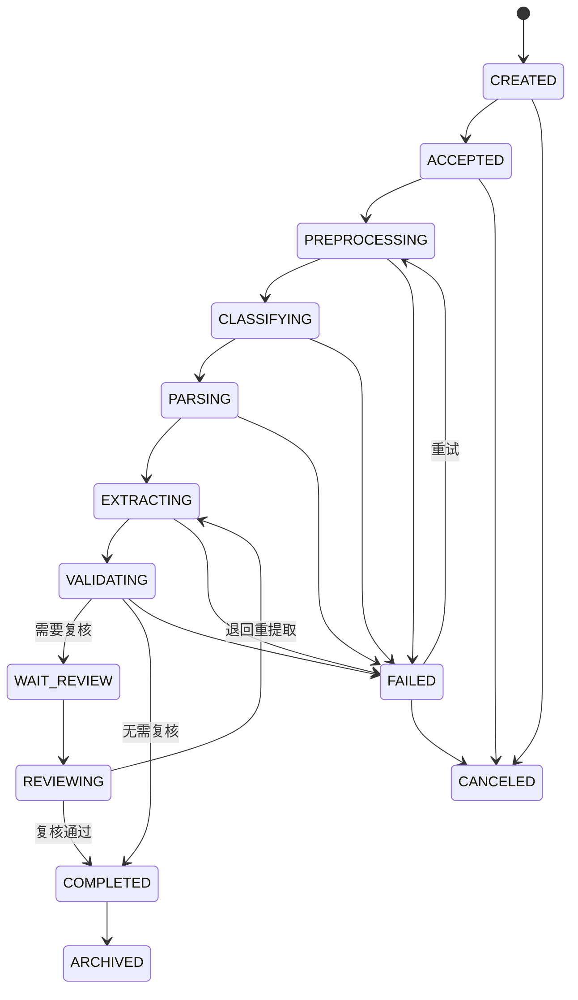
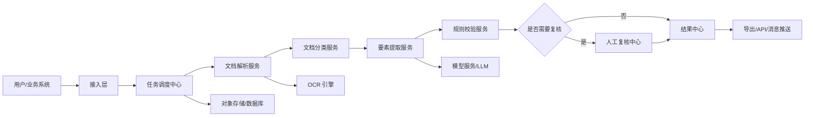
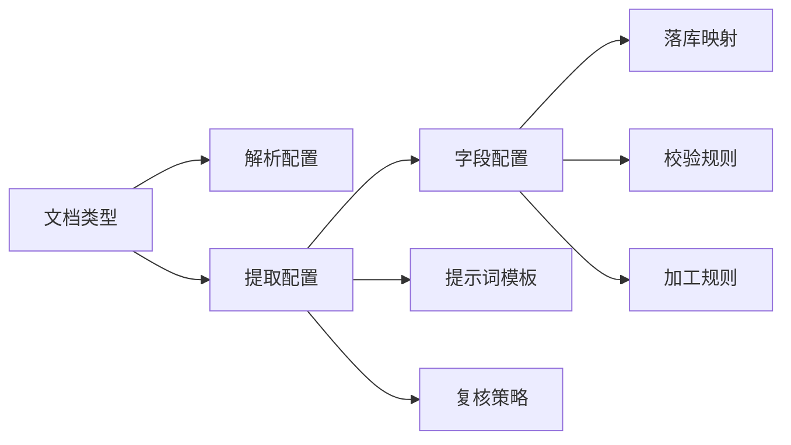
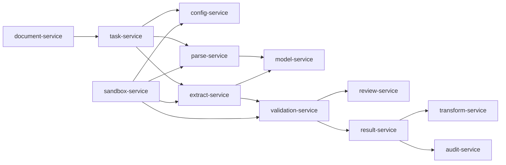

# 智能要素提取平台设计文档

## 1. 项目背景

基金公司内部存在大量 OCR、PDF、Office 文档、扫描件、图片、邮件附件等非结构化或半结构化材料。不同部门在开户、产品、交易、运营、风控、合规、财务、投研、客服等场景中，都需要从文档中提取关键业务要素，并沉淀为可复用、可追溯、可审核的数据。

本平台目标是建设一个统一的“智能要素提取”能力底座，支持多部门、多文档类型、多业务场景的要素配置、自动识别、人工复核、结果导出与系统集成。

## 2. 建设目标

### 2.1 总体目标

构建一个面向基金公司全部门的智能文档处理平台，实现文档接入、OCR 识别、版面分析、要素提取、规则校验、人工复核、结果归档、接口集成的一体化闭环。

### 2.2 业务目标

- 降低人工录入和人工核对成本。
- 提升文档处理效率和要素提取准确率。
- 统一各部门文档处理入口，避免重复建设。
- 支持业务人员通过配置方式快速新增提取模板。
- 保证提取过程可追溯、可审计、可复核。
- 支持与现有业务系统、数据平台、流程系统对接。

### 2.3 技术目标

- 支持 OCR、文档解析、表格识别、图像预处理、LLM 要素抽取等多种能力组合。
- 支持模板化提取与大模型语义提取两类模式。
- 支持高并发异步任务处理。
- 支持权限隔离、数据脱敏、日志审计。
- 支持模型、规则、模板持续迭代优化。

## 3. 适用部门与典型场景

| 部门 | 典型文档 | 提取要素示例 |
| --- | --- | --- |
| 运营部 | 开户资料、合同、指令单、对账单 | 客户名称、证件号、账号、金额、日期、签章状态 |
| 产品部 | 产品合同、托管协议、招募说明书 | 产品名称、产品代码、管理人、托管人、费率、期限 |
| 交易部 | 交易指令、划款指令、成交确认 | 交易方向、证券代码、数量、价格、账户、经办人 |
| 风控部 | 尽调材料、风险评估表、审批材料 | 风险等级、审批意见、关键阈值、异常项 |
| 合规部 | 合规审查材料、公告、法律文件 | 法规条款、承诺事项、审查意见、生效日期 |
| 财务部 | 发票、付款申请、银行回单 | 发票号、金额、税号、付款方、收款方、银行流水号 |
| 投研部 | 研报、公告、财报 | 公司名称、指标、财务数据、事件、观点摘要 |
| 客服/销售 | 客户申请表、回访记录、投诉材料 | 客户信息、业务类型、问题类型、处理结论 |

> TODO：补充公司内部真实部门、文档类型、系统边界和优先级。

## 4. 用户角色

| 角色 | 说明 | 主要权限 |
| --- | --- | --- |
| 普通业务用户 | 上传文档并查看本人或本部门任务 | 上传、查看、导出 |
| 复核人员 | 对低置信度或关键要素进行人工确认 | 复核、修正、退回 |
| 模板配置员 | 配置文档类型、提取字段、校验规则 | 模板管理、规则管理 |
| 部门管理员 | 管理本部门用户、模板和任务 | 部门级管理 |
| 平台管理员 | 管理全局配置、模型、系统参数 | 全局管理 |
| 审计人员 | 查看操作记录和处理链路 | 审计查询 |

## 5. 核心业务流程

### 5.1 文档处理主流程

1. 用户上传文档或通过接口接入文档或通过邮件分拣系统推送文档或通过文件分拣系统推送文档。
2. 平台创建提取任务，识别文档类型。
3. 对图片或扫描件执行图像预处理。
4. 执行 OCR、版面分析、表格识别、文本解析。
5. 根据文档类型匹配提取模板或语义抽取策略。
6. 输出结构化要素、置信度、来源位置和校验结果。
7. 对低置信度、规则异常、关键字段进入人工复核。
8. 复核通过后归档结果。
9. 结果通过页面导出、API、消息队列或数据库同步给下游系统。

### 5.2 模板配置流程

1. 模板配置员新增文档类型。
2. 配置字段名称、字段编码、数据类型、是否必填。
3. 配置字段提取方式：位置提取、关键词提取、正则提取、表格提取、语义提取。
4. 配置校验规则：格式校验、枚举校验、金额校验、日期校验、跨字段校验。
5. 上传样本文档进行调试。
6. 发布模板版本。
7. 线上任务按模板版本执行，历史任务保留原版本追溯。

### 5.3 人工复核流程

1. 系统根据置信度、字段重要性、规则异常决定是否进入复核。
2. 复核页面展示原文档、识别框、提取值、置信度和规则提示。
3. 复核人员修正字段值或标记无法识别。
4. 系统保存人工修正结果，并记录操作日志。
5. 修正样本可进入训练集或提示词优化集。

### 5.4 任务状态机

平台以“提取任务”为核心对象管理文档处理全过程。任务状态需要支持异步流转、失败重试、人工复核、结果归档和审计追踪。

### 5.5 全链路追踪与 TraceId

从邮件分拣系统、文件分拣系统、业务系统 API 推送、业务手工上传进入平台的每一份文档，都必须在接入层生成全局唯一 `traceId`。`traceId` 贯穿后续解析、提取、加工、校验、落库、复核、推送下游等所有环节，用于全链路监控、日志关联和快速回溯。

#### 5.5.1 TraceId 生成规则

| 项目 | 说明 |
| --- | --- |
| 生成时机 | 文档接入成功并完成基础校验后立即生成 |
| 唯一性 | 全平台唯一，不允许重复 |
| 格式建议 | TRACE-日期-序列号，例如 TRACE-20260628-0001 |
| 绑定对象 | 文档、任务、子任务、解析结果、提取结果、落库记录、复核记录、推送记录 |
| 外部传递 | 对下游推送、回调、导出日志中均携带 traceId |

#### 5.5.2 链路环节

| 环节 | 监控内容 |
| --- | --- |
| 文档接入 | 来源系统、文件名、文件大小、文件哈希、接入人或系统账号 |
| 规则匹配 | 命中的文档类型、解析配置、提取配置、映射方案 |
| 优先级入队 | 队列名称、优先级、等待时长 |
| 文档解析 | OCR/解析引擎、解析参数、耗时、输出摘要、错误信息 |
| 要素提取 | 提取策略、模型名称、提示词版本、JSON Schema、耗时、置信度 |
| 加工校验 | 字段转换规则、校验规则、异常等级、失败原因 |
| 落库 | 目标表、映射方案、入库字段、入库状态 |
| 人工复核 | 复核人、复核前值、复核后值、复核意见 |
| 推送下游 | 目标系统、请求摘要、响应摘要、推送状态 |

#### 5.5.3 链路日志要求

每个环节至少记录：

| 字段 | 说明 |
| --- | --- |
| traceId | 全链路追踪编号 |
| taskId | 任务编号 |
| documentId | 文档编号 |
| stage | 当前环节 |
| status | SUCCESS、WARNING、FAILED、WAITING、PENDING |
| startedAt | 开始时间 |
| endedAt | 结束时间 |
| durationMs | 耗时 |
| operator | 处理人、系统账号或服务名 |
| inputSummary | 输入摘要，不保存大体积或敏感原文 |
| outputSummary | 输出摘要 |
| errorCode | 错误码 |
| errorMessage | 错误信息 |

#### 5.5.4 回溯能力

平台需要支持按以下条件快速回溯：

- traceId。
- taskId。
- documentId。
- 业务流水号。
- 文件名。
- 来源系统。
- 目标落库表。
- 下游推送流水号。

回溯结果需要展示链路概览、阶段时间线、每个环节的输入输出摘要、耗时、异常信息和建议处理动作。

#### 5.4.1 主任务状态

| 状态编码 | 状态名称 | 说明 |
| --- | --- | --- |
| CREATED | 已创建 | 用户上传、接口接入或分拣系统推送后生成任务 |
| ACCEPTED | 已接入 | 文件完成格式校验、权限校验和基础信息登记 |
| PREPROCESSING | 预处理中 | 执行文件拆分、PDF 转图片、图像增强、去重等处理 |
| CLASSIFYING | 分类中 | 自动识别文档类型，或确认用户指定的文档类型 |
| PARSING | 解析中 | 执行 OCR、PDF 文本抽取、表格识别、Markdown 结构化 |
| EXTRACTING | 提取中 | 按模板和策略执行 AI、正则、表格等要素提取 |
| VALIDATING | 校验中 | 执行字段级、业务级、跨字段和外部系统校验 |
| WAIT_REVIEW | 待复核 | 存在低置信度、阻断级异常或强制复核字段 |
| REVIEWING | 复核中 | 复核人员正在处理 |
| COMPLETED | 已完成 | 提取结果已确认，可导出或推送下游 |
| FAILED | 失败 | 任务处理失败，需支持查看失败原因和重试 |
| CANCELED | 已取消 | 用户或系统取消任务 |
| ARCHIVED | 已归档 | 结果和文件按保留策略归档 |

#### 5.4.2 状态流转规则



#### 5.4.3 异常与重试机制

- 每个任务记录当前状态、上一状态、失败阶段、失败原因、重试次数、最后处理时间。
- OCR、模型调用、外部系统校验等可重试异常进入 FAILED 状态，并允许人工或系统自动重试。
- 任务重试应从失败阶段或指定阶段开始，避免重复执行已成功阶段。
- 超过最大重试次数后，任务保持 FAILED，并进入人工处理列表。
- 用户可对失败任务执行“重新解析”“重新提取”“重新校验”“取消任务”等操作。
- 对 ZIP、邮件附件包、多文档 PDF 拆分场景，平台应支持父任务和子任务关系，父任务状态由子任务汇总计算。

#### 5.4.4 父子任务关系

| 场景 | 处理方式 |
| --- | --- |
| ZIP 批量上传 | 一个上传批次生成父任务，每个文件生成子任务 |
| 邮件附件接入 | 邮件作为父任务，附件作为子任务 |
| PDF 按页或关键字拆分 | 原 PDF 为父任务，拆分后的子文档为子任务 |
| 文件分拣系统推送 | 分拣批次作为父任务，分拣结果文档作为子任务 |

父任务需要展示整体进度、成功数量、失败数量、待复核数量和最终汇总状态。

## 6. 功能模块设计

### 6.1 门户与工作台

- 任务概览：待处理、处理中、待复核、已完成、失败任务。
- 最近上传：展示最近文档处理状态。
- 部门统计：处理量、成功率、平均耗时、人工复核率。
- 快捷入口：上传文档、新建模板、复核任务、导出结果。

### 6.2 文档接入模块

- 支持手工上传：PDF、JPG、PNG、TIFF、DOCX、XLSX、TXT、ZIP。
- 支持批量上传。
- 支持业务系统 API 接入。
- 支持对象存储文件地址接入。
- 支持通过邮件分拣系统推送文档接入。
- 支持通过文件分拣系统推送文档接入。
- 支持文件去重、大小限制、格式校验、病毒扫描。

### 6.3 文档分类模块
- 基于文件来源、命名规则、上传入口进行初步分类。
- 基于关键词、版面特征、模型分类进行自动识别。
- 支持用户手工指定文档类型。
- 支持分类置信度和分类冲突提示。

### 6.4 文档解析模块
- 文档预处理：支持 PDF 按指定页号拆分、按文档内容包含关键字拆分、按文档内容不包含关键字拆分；支持 PDF 转图片等。
- 解析方式一-OCR 识别：图片、PDF、扫描件等支持通过 PaddleOCR-VL 模型、MinerU 模型等识别解析输出 Markdown 格式文本结果。
- 解析方式二-规则解析：文本型 PDF、TXT 等文档支持直接抽取文档内容。

### 6.5 要素提取模块

- 基于 AI 大模型（如 Qwen3.6 27B）的语义提取能力，将文档解析出来的文本结果及要素提取提示词提交给 AI 大模型实现文档要素提取，输出结构化 JSON 结果。
- 正则表达式提取：针对传统方式可实现的，可通过正则表达式实现要素提取。
- 表格字段提取：适用于清单、明细、持仓、交易记录等excel格式的。

注：要素提取规则设置要支持设置提取策略，如优先按 AI 提取，如果 AI 有问题，自动切换到传统规则提取方式，确保大模型出问题时有兜底方案。

#### 6.5.1 提取策略配置设计

提取策略用于定义“某类文档如何提取全部字段、哪些字段可用规则兜底、如何判定结果是否可信”。配置边界建议明确拆分为两层：

- AI 大模型提取为配置级能力：一个配置版本维护一套系统提示词和一套用户提示词，一次性覆盖该配置下的全部字段，并要求输出完整 JSON 对象或 JSON 数组。
- 正则、关键词、表格映射等传统规则为字段级能力：一个字段对应一套或多套取数规则，用于固定格式字段提取、兜底或与 AI 结果比对。

因此，平台不建议维护“字段级 AI 提示词”。字段差异通过字段定义、字段描述、落库映射、JSON Schema 和全局提示词中的字段清单表达；字段级差异明显、格式稳定的场景，使用正则或表格规则表达。

##### 6.5.1.1 策略配置维度

| 配置项 | 说明 | 示例 |
| --- | --- | --- |
| strategyCode | 策略编码 | ai_first_with_regex_fallback |
| strategyName | 策略名称 | AI 优先，正则兜底 |
| documentType | 适用文档类型 | payment_instruction |
| fieldCode | 适用字段。AI 策略为空表示覆盖全部字段；正则等规则策略填写具体字段 | amount |
| primaryExtractor | 主提取器 | LLM |
| fallbackExtractors | 兜底提取器列表 | REGEX、TABLE、KEYWORD |
| priority | 策略优先级 | 100 |
| confidenceThreshold | 置信度阈值 | 0.85 |
| reviewThreshold | 低于该阈值进入复核 | 0.70 |
| requiredEvidence | 是否要求返回证据 | true |
| onEmpty | 空值处理 | fallback / review / fail |
| onError | 异常处理 | fallback / retry / fail |
| maxRetry | 最大重试次数 | 2 |
| enabled | 是否启用 | true |

##### 6.5.1.2 AI 提示词配置

AI 提取提示词按配置版本维护，覆盖当前配置下的全部字段：

| 配置项 | 说明 |
| --- | --- |
| aiEnabled | 是否启用 AI 大模型提取 |
| systemPrompt | 系统提示词，约束模型角色、输出规范、禁止编造等全局行为 |
| userPrompt | 用户提示词，基于字段配置、落库映射、输出模式自动生成，允许高级用户补充 |
| outputMode | 输出单对象或数组对象 |
| jsonSchema | 当前配置全部字段的 AI 输出 JSON Schema |
| fieldList | 当前配置覆盖的字段清单，包含字段编码、名称、类型、是否必填、目标字段 |
| promptVersion | 提示词版本号，用于任务追溯 |

AI 用户提示词自动生成时，应包含：

- 文档类型、分类、子类、模板类型。
- 当前配置的全部提取字段。
- 字段编码、字段中文名、字段类型、是否必填、是否多值。
- 字段与落库表字段的映射关系。
- 输出 JSON 结构要求：每个字段返回 `value`、`confidence`、`evidence`、`sourcePage`。
- 无法识别时返回 `null`，不得编造。

##### 6.5.1.3 字段级规则配置

| 配置项 | 说明 |
| --- | --- |
| fieldCode | 字段编码，系统内唯一 |
| fieldName | 字段名称，页面展示使用 |
| dataType | 数据类型，如 string、number、date、amount、array、object |
| required | 是否必填 |
| multiple | 是否允许多个值 |
| extractionMethods | 支持的字段级提取方式，如 REGEX、TABLE、KEYWORD |
| regexEnabled | 是否启用正则提取 |
| regexPattern | 字段级正则表达式 |
| regexGroup | 使用第几个捕获分组作为字段值 |
| regexFlags | 正则标记，如 i、m |
| tableMapping | 表格列名、行定位、单元格定位配置 |
| keywordConfig | 关键词、前后缀、邻近范围配置 |
| normalizeRule | 标准化规则，如金额转数字、日期格式统一 |
| validationRules | 绑定的校验规则 |
| reviewPolicy | 复核策略，如 always、on_low_confidence、on_validation_error |

##### 6.5.1.4 常见策略模式

| 策略模式 | 适用场景 | 说明 |
| --- | --- | --- |
| AI_ONLY | 合同、公告、研报等非固定文本 | 仅使用大模型语义提取，失败后进入复核 |
| REGEX_ONLY | 身份证号、账号、日期、金额等格式明确字段 | 使用正则快速提取 |
| TABLE_ONLY | Excel 明细、清单、持仓、交易记录 | 根据表头和列映射提取 |
| AI_FIRST_RULE_FALLBACK | 多数业务文档 | AI 提取失败或低置信度时走正则、关键词或表格兜底 |
| RULE_FIRST_AI_FALLBACK | 固定版式表单 | 规则先提取，提取不到再调用 AI |

P0 原型和默认策略下拉框只提供 `AI_FIRST_RULE_FALLBACK`、`RULE_FIRST_AI_FALLBACK` 两种，暂不提供“AI + 正则比对”作为默认策略，避免业务用户理解成本过高。后续如确有高风险字段比对需求，可作为高级策略单独设计。

##### 6.5.1.5 AI 输出约束

调用大模型时必须要求模型按指定 JSON Schema 输出，不允许输出额外解释文本。建议统一约束如下：

- 无法识别的字段返回 null，不允许编造。
- 每个字段需要返回 value、confidence、evidence、sourcePage、sourceText。
- evidence 应记录支撑该字段的原文片段。
- sourcePage 应记录来源页码，无法定位时返回 null。
- confidence 取值范围为 0 到 1。
- 数字、金额、日期需要按字段配置进行格式化。
- 输出 JSON 解析失败时，应自动重试或切换兜底策略。

##### 6.5.1.6 策略配置示例

```json
{
  "documentType": "payment_instruction",
  "strategyCode": "ai_first_with_regex_fallback",
  "primaryExtractor": "LLM",
  "fallbackExtractors": ["REGEX"],
  "confidenceThreshold": 0.85,
  "reviewThreshold": 0.7,
  "onEmpty": "fallback",
  "onError": "fallback",
  "aiPromptConfig": {
    "aiEnabled": true,
    "systemPrompt": "你是金融文档要素提取助手，只能根据输入文档内容提取，不允许编造。",
    "userPrompt": "请从划款指令中一次性提取 payer_name、payee_account、amount、payment_date，并严格输出 JSON。",
    "outputMode": "SINGLE",
    "promptVersion": "v1"
  },
  "fieldRules": [
    {
      "fieldCode": "amount",
      "regexEnabled": true,
      "regexPattern": "(?:金额|付款金额|划款金额)[:：]?\\s*([0-9,]+(?:\\.\\d{1,2})?)",
      "regexGroup": 1,
      "regexFlags": ""
    }
  ]
}
```

### 6.6 规则校验模块

- 字段级校验：必填、类型、长度、格式、枚举。
- 业务校验：金额大小写一致、日期先后关系、账户号合法性。
- 跨字段校验：产品代码与产品名称匹配、客户名称与证件号匹配。
- 外部数据校验：调用主数据、产品系统、客户系统进行比对。
- 异常等级：提示、警告、阻断。

### 6.7 人工复核模块

- 原文档预览。
- OCR 文本层与识别框高亮。
- 字段列表编辑。
- 置信度与异常提示。
- 快捷键复核。
- 复核记录和修改历史。
- 支持双人复核或抽样复核。

### 6.8 模板与规则管理模块

- 文档类型管理。
- 字段字典管理。
- 提取模板管理。
- 校验规则管理。
- 版本管理。
- 模板调试与发布。
- 模板复制、停用、回滚。

### 6.9 结果管理与导出模块

- 任务结果查询。
- 字段级结果查看。
- JSON、Excel、CSV 导出。
- API 查询结果。
- Webhook 或消息队列推送。
- 结果归档与保留策略。

### 6.10 模型与样本管理模块

- 样本文档管理。
- 标注数据管理。
- 错误样本回流。
- 提示词版本管理。
- 模型调用配置。
- 准确率评估。
- A/B 测试。

### 6.11 权限与审计模块

- 用户、角色、部门、岗位权限。
- 文档数据按部门隔离。
- 敏感字段脱敏展示。
- 操作日志、接口日志、模型调用日志。
- 审计查询和导出。

## 7. 系统架构设计

### 7.1 逻辑架构



### 7.2 技术分层

| 层级 | 职责 |
| --- | --- |
| 前端层 | 工作台、上传、任务查询、复核、模板配置、统计报表 |
| 网关层 | 统一鉴权、路由、限流、审计、接口适配 |
| 业务服务层 | 任务、模板、规则、复核、结果、权限、统计 |
| 智能处理层 | OCR、版面分析、分类、要素提取、校验、模型调用 |
| 数据层 | 关系型数据库、对象存储、缓存、消息队列、向量库 |
| 运维层 | 日志、监控、告警、配置中心、任务追踪 |

## 8. 建议技术选型

> TODO：根据公司已有技术栈调整。

| 类型 | 建议选型 |
| --- | --- |
| 前端 | Vue 3 |
| 后端 | Java、Spring Boot、Spring Cloud、Spring AI 2.0、MyBatis、Mybatis Plus  |
| 异步任务 | Redis Stream |
| 数据库 | MySQL、Oracle、达梦都需要兼容 |
| 缓存 | Redis |
| 文件存储 | NAS |
| OCR | PaddleOCR-VL-1.6、MinerU |
| 文档解析 | PDFBox |
| 大模型 | 私有化模型（Qwen3.6 27B）、OpenAI 兼容接口 |

## 9. 核心数据模型草案

### 9.1 主要实体

| 实体 | 说明 |
| --- | --- |
| Department | 部门 |
| User | 用户 |
| Document | 原始文档 |
| ExtractionTask | 提取任务 |
| DocumentType | 文档类型 |
| ExtractionTemplate | 提取模板 |
| TemplateField | 模板字段 |
| ExtractionResult | 提取结果 |
| FieldResult | 字段结果 |
| ValidationRule | 校验规则 |
| ValidationIssue | 校验问题 |
| ReviewTask | 复核任务 |
| AuditLog | 审计日志 |
| ModelConfig | 模型配置 |
| SampleDocument | 样本文档 |

### 9.2 核心表结构草案

> 字段类型后续可按 MySQL、Oracle、达梦数据库兼容要求调整。建议业务主键使用字符串编码，数据库主键可使用 bigint 或 varchar。

#### 9.2.1 document 原始文档表

| 字段 | 说明 |
| --- | --- |
| id | 主键 |
| trace_id | 全链路追踪编号 |
| document_id | 文档业务编号 |
| file_name | 原始文件名 |
| file_type | 文件类型 |
| file_size | 文件大小 |
| file_hash | 文件哈希，用于去重 |
| storage_path | NAS 或对象存储路径 |
| source_type | 来源类型：UPLOAD、API、EMAIL、FILE_DISPATCH |
| source_ref | 来源系统流水号或邮件编号 |
| department_id | 所属部门 |
| uploader_id | 上传人 |
| status | 文档状态 |
| created_at | 创建时间 |
| updated_at | 更新时间 |

#### 9.2.2 extraction_task 提取任务表

| 字段 | 说明 |
| --- | --- |
| id | 主键 |
| trace_id | 全链路追踪编号 |
| task_id | 任务业务编号 |
| parent_task_id | 父任务编号，可为空 |
| document_id | 关联文档编号 |
| document_type | 文档类型 |
| template_id | 使用的模板 ID |
| template_version | 使用的模板版本 |
| status | 任务状态 |
| current_stage | 当前处理阶段 |
| progress | 任务进度 |
| retry_count | 重试次数 |
| max_retry | 最大重试次数 |
| fail_reason | 失败原因 |
| started_at | 开始时间 |
| completed_at | 完成时间 |
| created_at | 创建时间 |
| updated_at | 更新时间 |

#### 9.2.3 document_type 文档类型表

| 字段 | 说明 |
| --- | --- |
| id | 主键 |
| type_code | 文档类型编码 |
| type_name | 文档类型名称 |
| department_id | 所属部门，可为空表示全局 |
| description | 说明 |
| enabled | 是否启用 |
| created_at | 创建时间 |
| updated_at | 更新时间 |

#### 9.2.4 extraction_template 提取模板表

| 字段 | 说明 |
| --- | --- |
| id | 主键 |
| template_code | 模板编码 |
| template_name | 模板名称 |
| document_type | 文档类型 |
| version | 版本号 |
| status | 草稿、已发布、停用 |
| default_strategy | 默认提取策略 |
| confidence_threshold | 默认置信度阈值 |
| review_threshold | 默认复核阈值 |
| created_by | 创建人 |
| published_at | 发布时间 |
| created_at | 创建时间 |
| updated_at | 更新时间 |

#### 9.2.5 template_field 模板字段表

| 字段 | 说明 |
| --- | --- |
| id | 主键 |
| template_id | 模板 ID |
| field_code | 字段编码 |
| field_name | 字段名称 |
| data_type | 数据类型 |
| required | 是否必填 |
| multiple | 是否多值 |
| sort_no | 排序号 |
| extraction_methods | 支持的提取方式 |
| strategy_config | 字段级提取策略 JSON |
| validation_config | 字段校验配置 JSON |
| review_policy | 复核策略 |
| enabled | 是否启用 |

#### 9.2.6 field_result 字段结果表

| 字段 | 说明 |
| --- | --- |
| id | 主键 |
| trace_id | 全链路追踪编号 |
| task_id | 任务编号 |
| document_id | 文档编号 |
| field_code | 字段编码 |
| field_name | 字段名称 |
| field_value | 提取结果值 |
| normalized_value | 标准化后的值 |
| confidence | 置信度 |
| extract_method | 实际提取方式 |
| source_page | 来源页码 |
| source_box | 来源坐标 |
| source_text | 来源文本片段 |
| review_status | 复核状态 |
| final_value | 复核后的最终值 |
| created_at | 创建时间 |
| updated_at | 更新时间 |

#### 9.2.7 validation_rule 校验规则表

| 字段 | 说明 |
| --- | --- |
| id | 主键 |
| rule_code | 规则编码 |
| rule_name | 规则名称 |
| rule_type | 规则类型：FIELD、BUSINESS、CROSS_FIELD、EXTERNAL |
| target_field | 目标字段 |
| rule_config | 规则配置 JSON |
| severity | 异常等级：INFO、WARN、BLOCK |
| enabled | 是否启用 |

#### 9.2.8 validation_issue 校验问题表

| 字段 | 说明 |
| --- | --- |
| id | 主键 |
| task_id | 任务编号 |
| field_code | 字段编码 |
| rule_code | 命中的规则编码 |
| severity | 异常等级 |
| issue_message | 异常说明 |
| resolved | 是否已处理 |
| resolved_by | 处理人 |
| resolved_at | 处理时间 |

#### 9.2.9 review_task 复核任务表

| 字段 | 说明 |
| --- | --- |
| id | 主键 |
| review_task_id | 复核任务编号 |
| extraction_task_id | 提取任务编号 |
| assignee_id | 复核人 |
| status | 待复核、复核中、已通过、已退回 |
| review_reason | 进入复核原因 |
| review_comment | 复核意见 |
| submitted_at | 提交时间 |
| created_at | 创建时间 |
| updated_at | 更新时间 |

#### 9.2.10 model_config 模型配置表

| 字段 | 说明 |
| --- | --- |
| id | 主键 |
| model_code | 模型编码 |
| model_name | 模型名称 |
| provider | 模型供应方或部署平台 |
| endpoint | OpenAI 兼容接口地址或内部服务地址 |
| model_name_in_api | 调用时使用的模型名 |
| timeout_seconds | 超时时间 |
| max_tokens | 最大输出 token |
| temperature | 采样温度 |
| enabled | 是否启用 |

#### 9.2.11 audit_log 审计日志表

| 字段 | 说明 |
| --- | --- |
| id | 主键 |
| trace_id | 全链路追踪编号，可为空 |
| operator_id | 操作人 |
| operation | 操作类型 |
| target_type | 操作对象类型 |
| target_id | 操作对象 ID |
| before_value | 变更前内容 |
| after_value | 变更后内容 |
| ip_address | 操作 IP |
| created_at | 创建时间 |

### 9.3 字段结果示例

```json
{
  "taskId": "TASK-20260628-0001",
  "documentType": "payment_instruction",
  "fields": [
    {
      "fieldCode": "payer_name",
      "fieldName": "付款方名称",
      "value": "示例基金管理有限公司",
      "confidence": 0.96,
      "sourcePage": 1,
      "sourceBox": [120, 88, 420, 126],
      "extractMethod": "keyword",
      "reviewStatus": "confirmed"
    }
  ],
  "validationIssues": []
}
```

## 10. 接口设计草案

### 10.1 上传文档

```http
POST /api/documents/upload
Content-Type: multipart/form-data
```

请求参数：

| 参数 | 类型 | 说明 |
| --- | --- | --- |
| file | File | 文档文件 |
| departmentId | String | 部门 ID |
| documentType | String | 可选，文档类型 |
| businessNo | String | 可选，业务流水号 |

返回：

```json
{
  "documentId": "DOC-0001",
  "taskId": "TASK-0001",
  "status": "pending"
}
```

### 10.2 查询任务结果

```http
GET /api/tasks/{taskId}/result
```

返回结构：

```json
{
  "taskId": "TASK-0001",
  "status": "completed",
  "documentType": "payment_instruction",
  "fields": [],
  "validationIssues": []
}
```

### 10.3 提交复核结果

```http
POST /api/review-tasks/{reviewTaskId}/submit
Content-Type: application/json
```

请求体：

```json
{
  "fields": [
    {
      "fieldCode": "amount",
      "value": "100000.00",
      "reviewComment": "人工确认"
    }
  ],
  "decision": "approved"
}
```

## 11. 非功能需求

### 11.1 性能

- 单文档处理耗时：普通表单类文档目标 10 秒内完成。
- 批量处理：支持异步任务队列和横向扩容。
- 大文件处理：支持分页、分片、后台处理。

### 11.2 准确率

- 固定模板类文档字段准确率目标：95% 以上。
- 非固定长文本类文档字段准确率目标：按场景单独评估。
- 关键字段必须支持人工复核兜底。

### 11.3 安全

- 文件传输使用 HTTPS。
- 敏感字段加密存储或脱敏展示。
- 文档按部门、角色、数据权限隔离。
- 模型调用前支持敏感信息脱敏。
- 保留完整操作审计日志。

### 11.4 可用性

- 核心服务支持健康检查和故障重试。
- OCR、模型服务异常时任务进入可重试状态。
- 任务失败原因可见。

### 11.5 可扩展性

- 新增文档类型不应改代码，优先通过模板配置完成。
- OCR、LLM、表格识别引擎应支持插件化替换。
- 支持后续接入知识库、流程引擎、RPA 等能力。

## 12. MVP 范围建议

第一阶段建议优先建设“可跑通、可复核、可配置”的最小闭环。

### 12.1 MVP 试点范围

建议第一阶段选择一个业务部门、两到三类高频且规则相对明确的文档进行试点，优先验证“接入、解析、提取、校验、复核、导出”的完整闭环。

#### 12.1.1 推荐试点部门

| 试点部门 | 推荐理由 |
| --- | --- |
| 运营部 | 文档量大、格式相对稳定、人工录入和复核成本较高 |
| 财务部 | 发票、回单、付款申请等字段明确，便于衡量准确率 |
| 产品部 | 合同、协议、产品文件适合验证长文本语义提取能力 |

如需快速落地，建议优先选择“运营部”作为 MVP 试点部门。

#### 12.1.2 推荐试点文档

| 优先级 | 文档类型 | 文件格式 | 主要验证能力 |
| --- | --- | --- | --- |
| P0 | 划款指令 | PDF、扫描件、图片 | OCR、金额/账号/日期提取、人工复核 |
| P0 | 银行回单 | PDF、图片 | OCR、金额校验、付款方/收款方识别 |
| P1 | 开户资料 | PDF、扫描件 | 多页文档解析、客户信息提取、证件号校验 |
| P1 | 产品合同 | PDF、DOCX | 长文本解析、AI 语义提取 |

#### 12.1.3 MVP 字段清单示例

| 文档类型 | 字段编码 | 字段名称 | 是否必填 | 推荐提取方式 | 校验规则 | 复核策略 |
| --- | --- | --- | --- | --- | --- | --- |
| 划款指令 | payer_name | 付款方名称 | 是 | AI + 关键词 | 非空、主数据比对 | 低置信度复核 |
| 划款指令 | payee_name | 收款方名称 | 是 | AI + 关键词 | 非空、主数据比对 | 低置信度复核 |
| 划款指令 | payee_account | 收款账号 | 是 | 正则 + AI | 账号格式校验 | 必须复核 |
| 划款指令 | amount | 划款金额 | 是 | AI + 正则 | 金额格式、大小写一致 | 必须复核 |
| 划款指令 | payment_date | 划款日期 | 是 | AI + 正则 | 日期格式、不得早于申请日期 | 低置信度复核 |
| 银行回单 | transaction_no | 银行流水号 | 是 | 正则 + AI | 非空、唯一性校验 | 低置信度复核 |
| 银行回单 | amount | 回单金额 | 是 | AI + 正则 | 金额格式 | 必须复核 |
| 银行回单 | transaction_date | 交易日期 | 是 | AI + 正则 | 日期格式 | 低置信度复核 |
| 开户资料 | customer_name | 客户名称 | 是 | AI + 关键词 | 非空 | 低置信度复核 |
| 开户资料 | certificate_no | 证件号码 | 是 | 正则 + AI | 证件号格式 | 必须复核 |

#### 12.1.4 MVP 验收指标

| 指标 | 目标 |
| --- | --- |
| 支持文档类型 | 至少 2 类 |
| 单文档平均处理耗时 | 普通 5 页以内文档不超过 30 秒 |
| 关键字段提取准确率 | 试点样本人工复核后统计，目标不低于 90% |
| 任务状态可追踪 | 每个任务可查看处理阶段、失败原因和结果 |
| 人工复核闭环 | 支持字段修正、确认、退回、保存记录 |
| 结果导出 | 支持 Excel 和 JSON |
| 系统集成 | 至少提供上传接口和结果查询接口 |

### 12.2 MVP 包含

- 用户登录与基础权限。
- 文档上传。
- OCR 识别。
- 文档类型手工选择。
- 固定字段模板配置。
- 关键词、正则、LLM 三类基础提取方式。
- 字段结果展示。
- 人工复核。
- Excel/JSON 导出。
- 任务日志和简单统计。

### 12.3 MVP 暂不包含

- 复杂模型训练平台。
- 全量部门覆盖。
- 高级流程引擎。
- 多模型 A/B 测试。
- 复杂报表中心。
- 全自动模板生成。

## 13. 迭代路线

| 阶段 | 目标 | 主要内容 |
| --- | --- | --- |
| 第 1 阶段：MVP | 跑通单部门试点 | 上传、OCR、提取、复核、导出 |
| 第 2 阶段：模板化 | 支持多文档类型 | 模板管理、规则管理、版本管理 |
| 第 3 阶段：多部门推广 | 覆盖主要业务部门 | 权限隔离、统计报表、接口集成 |
| 第 4 阶段：智能优化 | 提升准确率和自动化 | 样本回流、提示词优化、模型评估 |
| 第 5 阶段：平台化 | 建成统一能力底座 | 插件化引擎、知识库、流程编排 |

## 14. 后续需要补充的问题

- 第一批试点部门是谁？
- 第一批文档类型有哪些？
- 每类文档的样本数量和格式分布如何？
- 是否必须私有化部署？
- 是否已有统一 OCR、模型平台、对象存储、用户权限系统？
- 是否需要对接 OA、流程系统、产品系统、客户系统、数据仓库？
- 文档保存期限和脱敏要求是什么？
- 哪些字段属于强监管或高风险字段，必须人工复核？
- 准确率、处理时效、并发量的验收标准是什么？

## 15. AI 开发拆解建议

后续可将平台拆分为以下 AI 开发任务：

1. 搭建前后端基础工程。
2. 实现文档上传与对象存储。
3. 实现任务队列与任务状态流转。
4. 接入 OCR 引擎并保存识别结果。
5. 实现文档预览与 OCR 框选展示。
6. 实现文档类型和字段模板管理。
7. 实现关键词、正则、LLM 提取器。
8. 实现字段结果和置信度展示。
9. 实现规则校验和异常提示。
10. 实现人工复核页面。
11. 实现结果导出和结果查询 API。
12. 实现权限、日志、统计和基础运维能力。

## 16. 实践落地方案深化

本章节基于实际建设设想，对文档接入、配置化、任务调度、权限控制和界面交互进行进一步细化，作为后续 AI 开发和原型设计的直接输入。

### 16.1 文档来源接入方案

平台需要统一承接多来源文档，所有来源接入后统一转换为“文档接入记录 + 提取任务”的内部模型。

| 来源类型 | 接入方式 | 典型数据 | 处理要求 |
| --- | --- | --- | --- |
| 邮件分拣系统 | 系统推送 API 或文件落盘通知 | 邮件主题、发件人、附件、业务标签 | 支持附件包拆分，邮件与附件建立父子关系 |
| 文件分拣系统 | 系统推送 API 或共享目录监听 | 文件路径、分拣类型、业务流水号 | 支持批量接入、重复文件识别、失败重试 |
| 上游业务系统 | API 接口推送 | 文件流、文件地址、业务主键、文档类型 | 支持同步返回任务号，异步查询处理结果 |
| 用户手工上传 | 前端页面上传 | 单文件、多文件、ZIP 包 | 支持拖拽上传、批量上传、上传前格式校验 |

#### 16.1.1 统一接入字段

无论来源如何，接入层建议统一转换为以下字段：

| 字段 | 说明 |
| --- | --- |
| sourceType | 来源类型：EMAIL、FILE_DISPATCH、API、MANUAL_UPLOAD |
| sourceSystem | 来源系统编码 |
| sourceBizNo | 来源业务流水号 |
| fileName | 文件名 |
| fileType | 文件类型 |
| fileHash | 文件哈希 |
| storagePath | 文件存储路径 |
| departmentId | 所属部门 |
| uploaderId | 上传人或系统用户 |
| documentType | 上游指定文档类型，可为空 |
| priority | 任务优先级：HIGH、MEDIUM、LOW |
| metadata | 扩展元数据 JSON |

#### 16.1.2 文档格式支持

| 处理类型 | 支持格式 | 处理方式 |
| --- | --- | --- |
| OCR 识别类 | PDF、JPG、PNG、TIFF、BMP、扫描件 | 图片预处理、PDF 转图片、OCR 引擎解析 |
| 非 OCR 文本类 | 文本型 PDF、DOCX、TXT、CSV | 直接抽取文本或结构化内容 |
| 表格类 | XLSX、XLS、CSV | 按 Sheet、表头、列映射解析 |
| 压缩包类 | ZIP | 解压后逐文件生成子任务 |

### 16.2 全场景配置化设计

平台的核心能力应围绕“配置驱动”建设，尽量减少新增场景时的代码开发。建议将一个业务场景抽象为“文档类型 + 解析配置 + 提取配置 + 落库配置 + 加工配置 + 校验配置 + 复核配置”。

#### 16.2.1 配置对象关系



#### 16.2.2 推荐配置步骤

建议前端提供一个分步骤配置向导：

1. 选择或新建文档类型。
2. 配置文档来源、匹配规则和任务优先级。
3. 配置解析引擎和解析参数。
4. 配置要素字段、字段类型、长度、必填和校验规则。
5. 配置落库表、字段映射、是否自动建表和自动扩字段。
6. 配置 AI 提示词生成规则和提取策略。
7. 配置字段加工、字典转换、SQL 衍生、接口取数。
8. 配置置信度阈值和复核策略。
9. 上传样本文档执行验证测试。
10. 发布配置版本。

### 16.3 OCR 解析引擎配置

平台应支持为不同文档类型配置不同解析引擎，并支持同一文档类型配置多个候选引擎。

#### 16.3.1 引擎配置项

| 配置项 | 说明 | 示例 |
| --- | --- | --- |
| engineCode | 引擎编码 | paddleocr_vl |
| engineName | 引擎名称 | PaddleOCR-VL-1.6 |
| engineType | 引擎类型 | OCR、LAYOUT、TABLE、SEAL |
| endpoint | 服务地址 | http://ocr-service/parse |
| enabled | 是否启用 | true |
| priority | 引擎优先级 | 100 |
| timeoutSeconds | 超时时间 | 120 |
| retryCount | 重试次数 | 2 |
| fallbackEngine | 兜底引擎 | mineru |

#### 16.3.2 解析参数配置

| 参数 | 说明 |
| --- | --- |
| enablePreprocess | 是否启用文档预处理 |
| enableDeskew | 是否启用倾斜矫正 |
| enableDenoise | 是否启用去噪 |
| enableHeader | 是否解析页头 |
| enableFooter | 是否解析页尾 |
| enableSeal | 是否识别印章 |
| enableSignature | 是否识别签名 |
| enableTable | 是否解析表格 |
| enableLayout | 是否进行版面分析 |
| outputFormat | 输出格式，如 Markdown、JSON、PlainText |
| pageRange | 指定解析页码范围 |
| splitRule | 文档拆分规则 |

#### 16.3.3 解析输出标准

无论底层使用 PaddleOCR-VL、MinerU 还是其他引擎，平台内部建议统一保存为标准解析结果：

```json
{
  "documentId": "DOC-0001",
  "pages": [
    {
      "pageNo": 1,
      "markdown": "## 标题\n正文内容",
      "plainText": "标题 正文内容",
      "blocks": [
        {
          "type": "text",
          "text": "付款金额：100000.00",
          "box": [10, 20, 300, 60],
          "confidence": 0.98
        }
      ],
      "tables": [],
      "seals": []
    }
  ]
}
```

### 16.4 落库配置与自动建表方案

平台需要支持将提取结果保存到业务结果表中，并允许通过配置自动生成表结构或为已有表追加字段。

#### 16.4.1 落库配置项

| 配置项 | 说明 |
| --- | --- |
| targetTable | 目标表名 |
| tableNameCn | 表中文名 |
| saveMode | 保存模式：单对象保存、数组批量保存 |
| autoCreateTable | 是否允许自动建表 |
| autoAddColumn | 是否允许自动增加字段 |
| primaryKeyStrategy | 主键策略 |
| uniqueKeys | 唯一键配置 |
| fieldMappings | 提取字段与落库字段映射 |
| beforeSaveRules | 入库前加工规则 |
| afterSaveAction | 入库后动作，如回调、推送消息 |

#### 16.4.2 字段映射配置

| 配置项 | 说明 |
| --- | --- |
| extractFieldCode | 提取字段编码 |
| targetColumn | 目标表字段名 |
| columnType | 字段类型 |
| columnLength | 字段长度 |
| nullable | 是否允许为空 |
| defaultValue | 默认值 |
| validationRule | 字段校验规则 |
| transformRule | 入库前转换规则 |
| remark | 字段说明 |

#### 16.4.3 同表复用与多映射方案

部分任务可能需要复用同一张物理结果表，仅字段映射关系不同。例如“划款指令”和“银行回单”都可以写入统一的资金业务结果表 `ext_fund_business_result`，但各自的提取字段与目标字段映射不同。

为支持该场景，平台需要将“提取字段配置”和“落库表字段映射”解耦：

| 层级 | 作用 | 示例 |
| --- | --- | --- |
| 提取字段配置 | 定义当前任务需要从文档中提取哪些逻辑字段 | payee_account、amount、payment_date |
| 目标结果表 | 定义复用的物理落库表 | ext_fund_business_result |
| 映射方案 | 定义某个任务/文档类型的提取字段如何写入目标表字段 | payee_account -> counterparty_account |

推荐配置方式：

- 落库模式支持“新建结果表”和“复用已有表”。
- 复用已有表时，不执行自动建表，只校验目标表字段是否存在。
- 同一张结果表可以挂载多个映射方案。
- 每个映射方案需要绑定文档类型、提取配置版本、目标表和字段映射关系。
- AI 提示词和 JSON Schema 应优先基于提取字段生成，入库时再按映射方案转换为目标表字段。
- 映射方案应支持复制、版本化、发布和停用。

示例：

| 文档类型 | 提取字段 | 目标表 | 目标字段 |
| --- | --- | --- | --- |
| 划款指令 | payee_account | ext_fund_business_result | counterparty_account |
| 划款指令 | amount | ext_fund_business_result | business_amount |
| 银行回单 | payer_name | ext_fund_business_result | counterparty_name |
| 银行回单 | transaction_no | ext_fund_business_result | biz_no |

该设计可以减少重复建表，便于下游系统按统一结果表消费数据，同时保留不同业务场景的字段差异。

#### 16.4.4 自动建表示例

```sql
CREATE TABLE ext_payment_instruction (
  id VARCHAR(64) PRIMARY KEY,
  task_id VARCHAR(64) NOT NULL,
  document_id VARCHAR(64) NOT NULL,
  payer_name VARCHAR(200),
  payee_name VARCHAR(200),
  payee_account VARCHAR(64),
  amount DECIMAL(18, 2),
  payment_date DATE,
  review_status VARCHAR(32),
  created_at TIMESTAMP
);
```

自动建表和自动扩字段需要受平台管理员权限控制，建议默认先生成 DDL 预览，由管理员确认后执行，避免误改生产库结构。

### 16.5 AI 提示词自动生成方案

平台应根据“字段配置 + 落库映射 + 输出结构要求”自动生成系统提示词和用户提示词，减少用户手写提示词成本，并确保 AI 输出结果能与落库字段一一对应。

#### 16.5.1 系统提示词生成原则

系统提示词用于固定模型行为，建议包含：

- 你是一个金融文档要素提取助手。
- 只允许根据输入文档内容提取，不允许编造。
- 必须严格输出 JSON，不允许输出解释文字。
- 无法识别的字段返回 null。
- 每个字段需要给出值、置信度、证据文本和来源页码。
- 字段名称必须与 schema 完全一致。

#### 16.5.2 用户提示词生成原则

用户提示词根据字段配置自动生成，建议包含：

- 文档类型。
- 待提取字段清单。
- 字段含义。
- 字段类型和格式要求。
- 是否必填。
- 输出 JSON Schema。
- 文档解析后的 Markdown 或文本内容。

#### 16.5.3 单对象输出示例

```json
{
  "payer_name": {
    "value": "示例基金管理有限公司",
    "confidence": 0.96,
    "evidence": "付款方：示例基金管理有限公司",
    "sourcePage": 1
  },
  "amount": {
    "value": 100000.00,
    "confidence": 0.92,
    "evidence": "付款金额：100000.00",
    "sourcePage": 1
  }
}
```

#### 16.5.4 数组对象输出示例

适用于明细、持仓、交易流水、费用清单等批量数据。

```json
[
  {
    "security_code": {
      "value": "000001",
      "confidence": 0.95,
      "evidence": "证券代码 000001",
      "sourcePage": 2
    },
    "quantity": {
      "value": 10000,
      "confidence": 0.93,
      "evidence": "数量 10000",
      "sourcePage": 2
    }
  }
]
```

### 16.6 置信度与人工复核策略

平台默认建议将 AI 提取结果置信度阈值设置为 90%。低于 90% 的字段进入复核提示，高风险字段即使高于 90% 也可以强制复核。

| 场景 | 处理方式 |
| --- | --- |
| 字段置信度 >= 0.90 且无校验异常 | 自动通过 |
| 字段置信度 < 0.90 | 标记低置信度，进入复核 |
| 字段为空但必填 | 进入复核 |
| 字段命中阻断级校验异常 | 进入复核或任务失败 |
| 多种提取方式结果不一致 | 进入复核 |
| 高风险字段 | 按配置强制复核 |

复核页面应突出显示低置信度字段、校验异常字段和证据文本，方便业务人员快速确认。

### 16.7 多提取规则与兜底策略

针对文本型 PDF、TXT、CSV、Excel 等文档，平台应支持传统正则、表格映射、SQL/脚本规则等方式，与 AI 提取形成组合策略。

#### 16.7.1 推荐策略链

| 策略链 | 说明 |
| --- | --- |
| AI -> 正则 -> 人工复核 | 非固定格式文档优先使用 |
| 正则 -> AI -> 人工复核 | 固定格式文档优先使用 |
| 表格映射 -> AI -> 人工复核 | Excel、CSV、表格型 PDF 优先使用 |

说明：P0 原型和默认策略只提供“AI -> 正则”和“正则 -> AI”两类。AI 与正则并行比对可作为后续高级策略，不进入当前默认策略下拉框。

#### 16.7.2 策略执行结果

每次提取需要记录：

| 字段 | 说明 |
| --- | --- |
| extractorType | 提取器类型：AI、REGEX、TABLE、KEYWORD |
| extractorConfigId | 提取配置 ID |
| rawValue | 原始提取值 |
| normalizedValue | 标准化后的值 |
| confidence | 置信度 |
| success | 是否成功 |
| errorMessage | 错误信息 |
| evidence | 证据文本 |

### 16.8 入库前加工与字段衍生

提取结果落库前，需要支持按配置进行标准化、转换和扩展。

#### 16.8.1 加工类型

| 加工类型 | 说明 | 示例 |
| --- | --- | --- |
| 字典转换 | 根据字典将原始值转换为标准值 | “买入”转 BUY |
| 格式转换 | 日期、金额、百分比格式标准化 | “2026年6月28日”转 2026-06-28 |
| SQL 衍生 | 通过 SQL 查询扩展字段 | 根据产品代码查产品名称 |
| 接口取数 | 调用主数据或产品系统扩展字段 | 根据客户号查询客户名称 |
| 固定值填充 | 按配置写入固定值 | source_system = OCR |
| 表达式计算 | 根据字段计算新字段 | amount_with_tax = amount * 1.06 |

#### 16.8.2 字段衍生示例

| 原始字段 | 衍生字段 | 加工方式 |
| --- | --- | --- |
| product_code | product_name | 调用产品主数据接口 |
| product_code | product_type | SQL 查询产品表 |
| customer_no | customer_name | 调用客户系统 |
| amount | amount_level | 按金额区间字典转换 |

所有加工规则需要记录执行日志，包含输入值、输出值、规则版本和失败原因。

### 16.9 配置验证与测试沙箱

配置完成后，用户需要能够点击“验证”按钮上传样本文档进行测试。验证任务不进入正式结果表，不触发正式下游推送。

#### 16.9.1 验证流程

1. 用户在配置页面点击“验证”。
2. 上传一份或多份样本文档。
3. 系统按当前未发布配置执行解析、提取、校验和加工。
4. 页面展示解析文本、提取结果、置信度、校验问题、入库预览。
5. 用户根据结果调整配置。
6. 验证数据按临时数据保留策略自动清理。

#### 16.9.2 验证结果展示

| 展示区域 | 内容 |
| --- | --- |
| 文档预览 | 原文档、页码、OCR 框选 |
| 解析结果 | Markdown、PlainText、表格结构 |
| 提取结果 | 字段值、置信度、证据、来源页码 |
| 校验结果 | 异常字段、异常等级、错误说明 |
| 落库预览 | 目标表、目标字段、入库值 |
| 调用日志 | OCR 耗时、模型耗时、token 消耗、错误信息 |

### 16.10 规则匹配与任务创建

接收到文档后，系统需要快速匹配对应解析提取规则。匹配不到规则时，不应直接失败，应进入“待配置/待确认”列表，提醒用户或模板配置员处理。

#### 16.10.1 匹配维度

| 匹配维度 | 示例 |
| --- | --- |
| 来源系统 | 邮件分拣系统、文件分拣系统、业务系统 |
| 文档类型 | 上游传入 documentType |
| 文件名称 | 包含“划款指令”“银行回单”等关键词 |
| 文件格式 | PDF、图片、Excel、TXT |
| 文档内容 | 首页关键字、标题、表头 |
| 部门 | 运营部、财务部、产品部 |
| 业务流水 | 特定业务编码规则 |

#### 16.10.2 匹配结果

| 结果 | 处理方式 |
| --- | --- |
| 唯一匹配 | 自动创建任务并进入队列 |
| 多个匹配 | 按优先级选择，或进入人工确认 |
| 无匹配 | 进入待配置列表，提醒用户选择文档类型或新建规则 |
| 匹配置信度低 | 创建任务但标记为需确认 |

### 16.11 优先级任务队列方案

目标是确保高优先级任务始终优先处理，低优先级任务可以延后，但不能永久饿死。推荐采用“多队列 + 加权调度 + 高优先级抢占 + 老化保护”的方案。

#### 16.11.1 队列分层

| 队列 | 说明 | 处理策略 |
| --- | --- | --- |
| HIGH | 高优先级任务 | 优先处理，允许插队 |
| MEDIUM | 中优先级任务 | 高优先级队列为空或资源有余量时处理 |
| LOW | 低优先级任务 | 系统空闲时处理，可被延后 |
| REVIEW | 复核任务 | 独立队列，供人工处理 |
| RETRY | 重试任务 | 按失败原因和原优先级重新投递 |
| DEAD | 死信队列 | 超过重试次数或不可恢复错误 |

#### 16.11.2 调度策略

建议执行器每次取任务时按以下规则：

1. 如果 HIGH 队列有任务，优先取 HIGH。
2. 如果 HIGH 队列持续有任务，MEDIUM 和 LOW 暂缓处理。
3. 如果 HIGH 队列为空，按 MEDIUM、LOW 顺序处理。
4. 为避免低优先级永久不处理，可设置最大等待时间，超过后临时提升一级。
5. 高优先级任务新进入队列后，新的空闲执行线程优先处理高优先级任务。
6. 已经开始执行的低优先级任务不建议强制中断，避免 OCR 或模型调用资源浪费。

#### 16.11.3 资源隔离建议

如果高优先级任务非常重要，建议进一步做资源隔离：

| 资源池 | 建议用途 |
| --- | --- |
| high-priority-worker | 专门处理 HIGH 队列 |
| normal-worker | 处理中低优先级队列 |
| ocr-worker | OCR 解析任务 |
| llm-worker | AI 提取任务 |

高优先级任务可独占部分 OCR 和 LLM 并发额度，例如保留 50% 并发给 HIGH 队列，避免低优先级任务占满模型服务。

#### 16.11.4 Redis Stream 实现建议

如果使用 Redis Stream，可以采用多个 Stream：

| Stream | 说明 |
| --- | --- |
| stream:extract:high | 高优先级提取任务 |
| stream:extract:medium | 中优先级提取任务 |
| stream:extract:low | 低优先级提取任务 |
| stream:extract:retry | 重试任务 |
| stream:extract:dead | 死信任务 |

消费者轮询顺序固定为 HIGH -> MEDIUM -> LOW。对于 HIGH 队列，可配置更多消费者实例和更高并发数。

### 16.12 权限控制与门户集成

平台可独立部署，也可挂载到不同门户系统，通过统一权限平台和单点登录进入。

#### 16.12.1 登录与认证

| 模式 | 说明 |
| --- | --- |
| 独立登录 | 平台自行维护用户、角色、密码 |
| 单点登录 | 对接统一身份认证平台，如 CAS、OAuth2、OIDC、SAML |
| 门户挂载 | 从门户系统跳转进入，携带登录态或授权码 |
| 系统账号 | 邮件分拣、文件分拣、业务系统 API 调用使用系统账号 |

#### 16.12.2 权限类型

| 权限类型 | 说明 |
| --- | --- |
| 菜单权限 | 控制用户可访问哪些菜单 |
| 按钮权限 | 控制新增、修改、删除、发布、导出等操作 |
| 接口权限 | 控制 API 调用权限 |
| 数据权限 | 控制用户可查看哪些部门、来源、文档类型、任务数据 |
| 字段权限 | 控制敏感字段是否脱敏展示 |
| 配置权限 | 控制是否可修改解析、提取、落库和模型配置 |

#### 16.12.3 数据权限隔离

数据权限建议支持以下维度组合：

- 本人数据。
- 本部门数据。
- 指定部门数据。
- 指定文档类型数据。
- 指定来源系统数据。
- 指定业务系统数据。
- 全部数据，仅平台管理员或审计人员可用。

所有任务查询、结果查询、复核列表、导出接口都必须应用数据权限过滤，避免只在前端控制。

#### 16.12.4 配置所属部门与角色权限绑定

配置向导中的“所属部门”只表示配置资源归属，不应单独作为最终访问权限。最终是否可见需要由“用户所属部门、用户在该部门下拥有的角色、配置归属部门、配置可见角色、数据权限策略”共同判断。

推荐权限判断模型：

```text
用户 -> 用户部门角色关系 -> 数据权限策略 -> 配置/任务/结果资源属性
```

关键规则：

- 用户可以在不同部门拥有不同角色，例如在运营部是复核人员，在产品部只是普通业务用户。
- 配置需要记录 `departmentId`、`ownerRole`、`visibleRoles` 等资源属性。
- 数据权限策略需要支持配置范围，例如按文档类型、配置 ID、目标表、来源系统限制。
- 用户只有同时满足“部门匹配 + 角色匹配 + 资源范围匹配”时，才能查看配置、任务、结果或落库数据。
- 后端所有查询接口必须统一应用该权限模型，不能只在前端菜单层控制。

示例：

| 用户 | 部门 | 角色 | 可访问配置 |
| --- | --- | --- | --- |
| 张三 | 运营部 | 复核人员 | 运营部下可见角色包含复核人员的配置 |
| 张三 | 产品部 | 普通业务用户 | 产品部下普通业务用户可见的配置 |
| 李四 | 运营部 | 模板配置员 | 运营部下可编辑的配置草稿和验证任务 |

### 16.13 界面与交互设计方案

界面设计目标是让业务人员可以按向导完成配置，让运维和管理员能清晰追踪任务，让复核人员能高效确认字段。

#### 16.13.1 推荐菜单结构

| 一级菜单 | 二级功能 |
| --- | --- |
| 工作台 | 任务概览、待复核、最近处理、异常提醒 |
| 文档接入 | 手工上传、接入记录、待确认文档 |
| 任务中心 | 全部任务、高优先级任务、失败任务、重试任务 |
| 配置中心 | 文档类型、解析配置、提取配置、落库配置、加工规则、校验规则 |
| 验证中心 | 配置验证、样本文档、验证历史 |
| 结果中心 | 提取结果、落库结果、导出记录、推送记录 |
| 模型中心 | OCR 引擎、LLM 配置、提示词模板、调用日志 |
| 系统管理 | 用户角色、权限、字典、审计日志、系统参数 |

#### 16.13.2 配置向导页面

配置页面建议采用步骤条：

1. 基础信息：文档类型、所属部门、来源范围、优先级。
2. 解析配置：选择 OCR/解析引擎，设置解析参数。
3. 字段配置：配置提取字段、类型、长度、必填、校验。
4. 落库配置：配置目标表、字段映射、自动建表策略。
5. 提取策略：配置 AI、正则、表格、兜底策略。
6. 加工规则：配置字典转换、SQL 衍生、接口取数。
7. 复核策略：配置置信度阈值、高风险字段、复核人员。
8. 验证发布：上传样本验证，确认后发布。

#### 16.13.3 复核页面

复核页面建议采用左右分栏：

| 区域 | 内容 |
| --- | --- |
| 左侧 | 文档预览、页码切换、OCR 框选、高亮证据文本 |
| 右侧 | 字段列表、提取值、置信度、校验结果、人工修正值 |
| 底部 | 通过、退回、保存草稿、重新提取、查看日志 |

复核页面需要支持按异常字段快速定位原文证据，减少业务人员在文档中查找的时间。

#### 16.13.4 新手引导

- 配置中心提供“从模板复制”能力。
- 字段配置提供常用字段模板，如金额、日期、账号、产品代码。
- 正则配置提供常用规则库。
- AI 提示词默认自动生成，允许高级用户编辑。
- 验证失败时给出可操作的错误提示，如“字段未匹配到目标表字段”“JSON Schema 校验失败”。

### 16.14 对 AI 开发的进一步拆解

基于上述实践方案，建议将后续开发任务进一步拆为：

1. 实现统一文档接入模型和接入 API。
2. 实现文档来源适配：手工上传、API 推送、邮件分拣、文件分拣。
3. 实现解析引擎配置管理。
4. 实现 OCR/解析服务统一输出标准。
5. 实现文档类型和规则匹配引擎。
6. 实现提取字段配置和落库映射配置。
7. 实现自动生成 DDL 预览和自动建表/扩字段能力。
8. 实现 AI 提示词自动生成。
9. 实现 AI JSON Schema 校验和结果解析。
10. 实现正则、表格、关键词提取器。
11. 实现多策略链和兜底执行器。
12. 实现置信度阈值和人工复核触发逻辑。
13. 实现字段加工、字典转换、SQL 衍生、接口取数。
14. 实现配置验证沙箱。
15. 实现 Redis Stream 多优先级队列调度。
16. 实现权限、数据权限和门户单点登录适配。
17. 实现配置向导、任务中心、复核页面和验证中心。

## 17. 后端模块与服务边界

为方便 AI 开发和后续微服务拆分，建议后端按业务边界拆分模块。MVP 阶段可以先采用单体工程的多模块结构，后续再按模块拆分为独立服务。

### 17.1 推荐模块划分

| 模块 | 职责 | 主要能力 |
| --- | --- | --- |
| gateway-service | 网关与统一入口 | 路由、鉴权、限流、审计、跨域 |
| auth-service | 用户权限服务 | 用户、角色、菜单、按钮、数据权限、单点登录适配 |
| document-service | 文档接入服务 | 上传、API 接入、分拣系统接入、文件校验、文件存储 |
| task-service | 任务调度服务 | 任务创建、状态流转、优先级队列、重试、取消、父子任务 |
| config-service | 配置中心服务 | 文档类型、解析配置、提取配置、落库配置、加工规则、校验规则 |
| parse-service | 文档解析服务 | PDF 转图片、OCR 调用、文本抽取、表格解析、解析结果标准化 |
| extract-service | 要素提取服务 | AI 提取、正则提取、表格提取、策略链、置信度计算 |
| validation-service | 校验服务 | 字段校验、业务校验、跨字段校验、外部系统校验 |
| transform-service | 加工转换服务 | 字典转换、SQL 衍生、接口取数、表达式计算 |
| review-service | 人工复核服务 | 复核任务、字段修正、复核流转、复核记录 |
| result-service | 结果服务 | 结果查询、结果落库、导出、下游推送 |
| model-service | 模型配置与调用服务 | OCR 引擎配置、LLM 配置、提示词生成、调用日志 |
| sandbox-service | 配置验证服务 | 验证任务、样本文档、临时结果、验证报告 |
| audit-service | 审计日志服务 | 操作日志、接口日志、模型调用日志、数据变更日志 |

### 17.2 MVP 工程结构建议

如果第一阶段采用 Java 单体工程，建议目录结构如下：

```text
backend
├── module-auth
├── module-document
├── module-task
├── module-config
├── module-parse
├── module-extract
├── module-validation
├── module-transform
├── module-review
├── module-result
├── module-model
├── module-sandbox
├── module-audit
└── module-common
```

`module-common` 放置统一返回对象、异常、枚举、数据权限工具、Redis Stream 工具、文件存储工具、JSON Schema 校验工具等公共能力。

### 17.3 模块调用关系



### 17.4 关键设计约束

- 任务状态只能由 task-service 统一流转，其他模块不能直接修改任务主状态。
- 配置读取必须带版本号，线上任务执行时绑定当时的配置版本。
- OCR、LLM、外部接口调用必须记录耗时、入参摘要、错误原因和调用结果。
- 结果落库前必须经过校验和加工，不允许直接将 AI 原始输出写入业务结果表。
- 所有查询接口必须经过后端数据权限过滤。
- 配置验证任务必须使用临时表或临时结果存储，不允许写入正式结果表。

## 18. 配置化核心表结构补充

本章节补充支撑“全场景配置化”的配置表。字段类型可根据 MySQL、Oracle、达梦兼容要求调整。

### 18.1 parse_config 解析配置表

| 字段 | 说明 |
| --- | --- |
| id | 主键 |
| config_code | 解析配置编码 |
| config_name | 解析配置名称 |
| document_type | 适用文档类型 |
| version | 配置版本 |
| status | DRAFT、TESTING、PUBLISHED、DISABLED |
| engine_code | 默认解析引擎 |
| engine_params | 解析参数 JSON |
| split_rule | 拆分规则 JSON |
| output_format | 输出格式 |
| created_by | 创建人 |
| published_at | 发布时间 |
| created_at | 创建时间 |
| updated_at | 更新时间 |

### 18.2 ocr_engine_config OCR 引擎配置表

| 字段 | 说明 |
| --- | --- |
| id | 主键 |
| engine_code | 引擎编码 |
| engine_name | 引擎名称 |
| engine_type | OCR、LAYOUT、TABLE、SEAL |
| endpoint | 服务地址 |
| auth_config | 鉴权配置 JSON |
| default_params | 默认参数 JSON |
| timeout_seconds | 超时时间 |
| retry_count | 重试次数 |
| enabled | 是否启用 |
| created_at | 创建时间 |
| updated_at | 更新时间 |

### 18.3 extract_config 提取配置表

| 字段 | 说明 |
| --- | --- |
| id | 主键 |
| config_code | 提取配置编码 |
| config_name | 提取配置名称 |
| document_type | 适用文档类型 |
| parse_config_id | 关联解析配置 |
| version | 配置版本 |
| status | DRAFT、TESTING、PUBLISHED、DISABLED |
| output_mode | SINGLE、ARRAY |
| default_strategy | 默认提取策略 |
| confidence_threshold | 自动通过阈值，默认 0.90 |
| review_threshold | 强复核阈值 |
| ai_enabled | 是否启用配置级 AI 提取 |
| system_prompt | 配置级系统提示词 |
| user_prompt | 配置级用户提示词 |
| prompt_version | 提示词版本 |
| output_json_schema | 覆盖全部字段的输出 JSON Schema |
| created_by | 创建人 |
| published_at | 发布时间 |
| created_at | 创建时间 |
| updated_at | 更新时间 |

### 18.4 extract_field_config 提取字段配置表

| 字段 | 说明 |
| --- | --- |
| id | 主键 |
| extract_config_id | 提取配置 ID |
| field_code | 字段编码 |
| field_name | 字段名称 |
| field_desc | 字段说明 |
| data_type | string、number、date、amount、array、object |
| field_length | 字段长度 |
| required | 是否必填 |
| multiple | 是否多值 |
| sort_no | 排序 |
| extract_methods | 字段级提取方式，如 REGEX、TABLE、KEYWORD；AI 由 extract_config 统一控制 |
| strategy_config | 策略配置 JSON |
| prompt_hint | 字段说明补充，用于生成配置级 AI 提示词，不作为字段级 AI 提示词单独执行 |
| json_schema | 字段 JSON Schema 片段，用于组装配置级 output_json_schema |
| regex_config | 正则配置 JSON |
| table_config | 表格映射配置 JSON |
| enabled | 是否启用 |

### 18.5 storage_mapping_config 落库映射配置表

| 字段 | 说明 |
| --- | --- |
| id | 主键 |
| extract_config_id | 提取配置 ID |
| target_table | 目标表名 |
| target_table_name | 目标表中文名 |
| save_mode | SINGLE、BATCH |
| auto_create_table | 是否允许自动建表 |
| auto_add_column | 是否允许自动扩字段 |
| ddl_status | NOT_GENERATED、GENERATED、APPROVED、EXECUTED |
| primary_key_strategy | 主键策略 |
| unique_key_config | 唯一键配置 JSON |
| enabled | 是否启用 |

### 18.6 storage_field_mapping_config 落库字段映射表

| 字段 | 说明 |
| --- | --- |
| id | 主键 |
| mapping_config_id | 落库映射配置 ID |
| extract_field_code | 提取字段编码 |
| target_column | 目标字段名 |
| column_type | 数据库字段类型 |
| column_length | 字段长度 |
| nullable | 是否可空 |
| default_value | 默认值 |
| transform_rule_id | 加工规则 ID |
| remark | 字段说明 |

### 18.6.1 storage_mapping_profile 映射方案表

当多个任务复用同一张结果表时，使用映射方案区分不同文档类型、不同提取配置与目标表字段之间的关系。

| 字段 | 说明 |
| --- | --- |
| id | 主键 |
| profile_code | 映射方案编码 |
| profile_name | 映射方案名称 |
| document_type | 适用文档类型 |
| extract_config_id | 提取配置 ID |
| target_table | 复用的目标表 |
| version | 版本 |
| status | DRAFT、PUBLISHED、DISABLED |
| description | 说明 |
| created_by | 创建人 |
| published_at | 发布时间 |
| created_at | 创建时间 |
| updated_at | 更新时间 |

映射方案与 `storage_field_mapping_config` 是一对多关系：一个映射方案包含多条字段映射。

### 18.7 transform_rule_config 加工规则配置表

| 字段 | 说明 |
| --- | --- |
| id | 主键 |
| rule_code | 加工规则编码 |
| rule_name | 加工规则名称 |
| rule_type | DICT、FORMAT、SQL、API、FIXED、EXPRESSION |
| input_fields | 输入字段 JSON |
| output_field | 输出字段 |
| rule_config | 规则配置 JSON |
| safe_level | 安全等级 |
| enabled | 是否启用 |

### 18.8 prompt_template_config 提示词模板表

| 字段 | 说明 |
| --- | --- |
| id | 主键 |
| template_code | 提示词模板编码 |
| template_name | 提示词模板名称 |
| template_type | SYSTEM、USER |
| document_type | 适用文档类型，可为空 |
| content | 模板内容 |
| variables | 模板变量 JSON |
| version | 版本 |
| enabled | 是否启用 |

### 18.9 rule_match_config 规则匹配配置表

| 字段 | 说明 |
| --- | --- |
| id | 主键 |
| match_code | 匹配规则编码 |
| match_name | 匹配规则名称 |
| source_type | 来源类型 |
| source_system | 来源系统 |
| file_name_pattern | 文件名匹配规则 |
| file_type | 文件类型 |
| content_keywords | 内容关键字 JSON |
| department_id | 部门 |
| document_type | 命中的文档类型 |
| extract_config_id | 命中的提取配置 |
| priority | 匹配优先级 |
| enabled | 是否启用 |

### 18.10 validation_test_record 配置验证记录表

| 字段 | 说明 |
| --- | --- |
| id | 主键 |
| test_id | 验证任务编号 |
| extract_config_id | 提取配置 ID |
| config_version | 配置版本 |
| sample_document_id | 样本文档 ID |
| status | RUNNING、SUCCESS、FAILED |
| parse_result_path | 解析结果临时路径 |
| extract_result_json | 提取结果 JSON |
| validation_result_json | 校验结果 JSON |
| storage_preview_json | 落库预览 JSON |
| error_message | 失败原因 |
| created_by | 创建人 |
| created_at | 创建时间 |

### 18.11 trace_stage_log 全链路阶段日志表

| 字段 | 说明 |
| --- | --- |
| id | 主键 |
| trace_id | 全链路追踪编号 |
| task_id | 任务编号 |
| document_id | 文档编号 |
| business_no | 业务流水号 |
| stage | 链路环节：接入、匹配、队列、解析、提取、加工、落库、复核、推送 |
| status | SUCCESS、WARNING、FAILED、WAITING、PENDING |
| started_at | 开始时间 |
| ended_at | 结束时间 |
| duration_ms | 耗时 |
| operator | 处理人、系统账号或服务名 |
| input_summary | 输入摘要 |
| output_summary | 输出摘要 |
| error_code | 错误码 |
| error_message | 错误信息 |
| created_at | 创建时间 |

### 18.12 配置发布版本规则

| 状态 | 说明 | 允许操作 |
| --- | --- | --- |
| DRAFT | 草稿 | 编辑、验证、删除 |
| TESTING | 验证中 | 查看验证结果、重新验证 |
| PUBLISHED | 已发布 | 复制新版本、停用、回滚 |
| DISABLED | 已停用 | 查看、复制新版本 |

配置发布规则：

- 线上任务只能使用 PUBLISHED 状态的配置。
- 每次发布生成新的版本号，历史任务继续绑定历史版本。
- 修改已发布配置时，需要复制为新草稿版本，不允许直接覆盖。
- 配置验证通过后建议发布，平台管理员可按权限强制发布。
- 回滚本质是将历史版本复制并重新发布为新版本。

## 19. 接口清单与请求响应规范

### 19.1 统一响应格式

```json
{
  "code": "0",
  "message": "success",
  "data": {},
  "traceId": "TRACE-20260628-0001"
}
```

### 19.2 通用错误码

| 错误码 | 说明 |
| --- | --- |
| 0 | 成功 |
| AUTH_401 | 未登录或登录过期 |
| AUTH_403 | 无权限 |
| DOC_400 | 文档格式不支持 |
| DOC_404 | 文档不存在 |
| CONFIG_404 | 未匹配到配置 |
| CONFIG_409 | 配置版本冲突 |
| TASK_404 | 任务不存在 |
| TASK_409 | 当前状态不允许操作 |
| OCR_500 | OCR 解析失败 |
| LLM_500 | 大模型调用失败 |
| LLM_SCHEMA_ERROR | AI 输出 JSON Schema 校验失败 |
| DB_DDL_REJECTED | 自动建表未授权 |
| SYSTEM_500 | 系统异常 |

### 19.3 文档接入接口

| 接口 | 方法 | 说明 |
| --- | --- | --- |
| /api/documents/upload | POST | 用户手工上传文档 |
| /api/documents/api-push | POST | 上游业务系统推送文档 |
| /api/documents/dispatch-push | POST | 邮件/文件分拣系统推送文档 |
| /api/documents/{documentId} | GET | 查询文档详情 |
| /api/documents/{documentId}/preview | GET | 获取文档预览地址 |
| /api/documents/unmatched | GET | 查询未匹配配置的文档 |
| /api/documents/{documentId}/confirm-type | POST | 人工确认文档类型 |

### 19.4 任务接口

| 接口 | 方法 | 说明 |
| --- | --- | --- |
| /api/tasks | GET | 查询任务列表 |
| /api/tasks/{taskId} | GET | 查询任务详情 |
| /api/tasks/{taskId}/timeline | GET | 查询任务流转记录 |
| /api/tasks/{taskId}/retry | POST | 重试任务 |
| /api/tasks/{taskId}/cancel | POST | 取消任务 |
| /api/tasks/{taskId}/reparse | POST | 重新解析 |
| /api/tasks/{taskId}/reextract | POST | 重新提取 |
| /api/tasks/{taskId}/result | GET | 查询任务结果 |
| /api/tasks/priority-summary | GET | 查询优先级队列统计 |

### 19.4.1 全链路监控接口

| 接口 | 方法 | 说明 |
| --- | --- | --- |
| /api/traces | GET | 按 traceId、taskId、documentId、业务号、来源系统查询链路记录 |
| /api/traces/{traceId} | GET | 查询单个 traceId 的链路概览 |
| /api/traces/{traceId}/stages | GET | 查询链路阶段明细 |
| /api/traces/{traceId}/logs | GET | 查询链路相关日志 |
| /api/traces/{traceId}/retry-stage | POST | 从指定失败阶段重试 |

### 19.5 配置中心接口

| 接口 | 方法 | 说明 |
| --- | --- | --- |
| /api/config/document-types | GET/POST | 查询/新增文档类型 |
| /api/config/document-types/{id} | PUT/DELETE | 修改/删除文档类型 |
| /api/config/parse-configs | GET/POST | 查询/新增解析配置 |
| /api/config/parse-configs/{id} | GET/PUT | 查询/修改解析配置 |
| /api/config/extract-configs | GET/POST | 查询/新增提取配置 |
| /api/config/extract-configs/{id} | GET/PUT | 查询/修改提取配置 |
| /api/config/extract-configs/{id}/copy | POST | 复制配置版本 |
| /api/config/extract-configs/{id}/publish | POST | 发布配置 |
| /api/config/extract-configs/{id}/disable | POST | 停用配置 |
| /api/config/storage-mappings | GET/POST | 查询/新增落库映射 |
| /api/config/transform-rules | GET/POST | 查询/新增加工规则 |
| /api/config/match-rules | GET/POST | 查询/新增匹配规则 |

### 19.6 模型与提示词接口

| 接口 | 方法 | 说明 |
| --- | --- | --- |
| /api/model/ocr-engines | GET/POST | OCR 引擎配置 |
| /api/model/llm-configs | GET/POST | LLM 模型配置 |
| /api/model/prompt-templates | GET/POST | 提示词模板配置 |
| /api/model/prompts/generate | POST | 根据字段配置生成提示词 |
| /api/model/call-logs | GET | 查询模型调用日志 |

### 19.7 配置验证接口

| 接口 | 方法 | 说明 |
| --- | --- | --- |
| /api/sandbox/tests | POST | 创建配置验证任务 |
| /api/sandbox/tests/{testId} | GET | 查询验证结果 |
| /api/sandbox/tests/{testId}/rerun | POST | 重新验证 |
| /api/sandbox/tests/{testId}/cleanup | POST | 清理验证数据 |

### 19.8 复核接口

| 接口 | 方法 | 说明 |
| --- | --- | --- |
| /api/review-tasks | GET | 查询待复核列表 |
| /api/review-tasks/{reviewTaskId} | GET | 查询复核详情 |
| /api/review-tasks/{reviewTaskId}/claim | POST | 领取复核任务 |
| /api/review-tasks/{reviewTaskId}/save | POST | 保存复核草稿 |
| /api/review-tasks/{reviewTaskId}/submit | POST | 提交复核结果 |
| /api/review-tasks/{reviewTaskId}/reject | POST | 退回复核任务 |

### 19.9 结果接口

| 接口 | 方法 | 说明 |
| --- | --- | --- |
| /api/results | GET | 查询提取结果 |
| /api/results/{taskId} | GET | 查询单任务结果 |
| /api/results/{taskId}/storage-preview | GET | 查询落库预览 |
| /api/results/{taskId}/export | POST | 导出结果 |
| /api/results/{taskId}/push | POST | 推送下游 |
| /api/exports | GET | 查询导出记录 |

### 19.10 权限与系统接口

| 接口 | 方法 | 说明 |
| --- | --- | --- |
| /api/auth/login | POST | 独立登录 |
| /api/auth/sso/callback | GET | 单点登录回调 |
| /api/auth/current-user | GET | 当前用户信息 |
| /api/system/users | GET/POST | 用户管理 |
| /api/system/roles | GET/POST | 角色管理 |
| /api/system/menus | GET/POST | 菜单管理 |
| /api/system/data-permissions | GET/POST | 数据权限管理 |
| /api/system/dictionaries | GET/POST | 字典管理 |
| /api/audit/logs | GET | 审计日志查询 |

## 20. 页面功能清单与交互说明

### 20.1 工作台

| 区域 | 内容 |
| --- | --- |
| 顶部指标 | 今日接入、处理中、待复核、失败任务、平均耗时 |
| 快捷入口 | 上传文档、新建配置、进入复核、查看失败任务 |
| 任务趋势 | 按天展示任务量、成功率、复核率 |
| 异常提醒 | 未匹配配置、处理失败、模型异常、低置信度待复核 |

### 20.2 手工上传页面

| 功能 | 说明 |
| --- | --- |
| 文件上传 | 支持拖拽、多文件、ZIP |
| 基础信息 | 部门、文档类型、业务流水号、优先级 |
| 上传前校验 | 文件格式、大小、重复文件提示 |
| 上传结果 | 展示 documentId、taskId、匹配配置、任务状态 |

### 20.2.1 接入记录页面

接入记录页面用于统一查看来自业务手工上传、业务系统 API、邮件分拣系统、文件分拣系统的文档接入情况。

| 区域 | 内容 |
| --- | --- |
| 顶部指标 | 今日接入、已匹配、待确认、API 推送、分拣接入 |
| 查询区 | 关键词、来源、匹配状态、部门 |
| 表格区 | traceId、文件名、来源系统、业务号、部门、文档类型、匹配状态、任务编号、文件大小、接入时间 |
| 详情抽屉 | traceId、documentId、taskId、来源系统、业务号、文件名、匹配状态 |

交互要求：

- 关键词支持按 traceId、documentId、taskId、业务号、文件名查询。
- 来源、匹配状态、部门筛选下拉框支持搜索、多选、清除。
- 未匹配或多规则命中的文档可跳转到待确认文档页面。
- 已创建任务的记录可跳转到全链路监控页面查看处理链路。
- 支持批量重新匹配规则。

### 20.2.2 待确认文档页面

待确认文档页面用于处理未匹配配置、命中多个配置、文档类型置信度较低的接入文档。

| 区域 | 内容 |
| --- | --- |
| 左侧待确认列表 | 文件名、traceId、未确认原因 |
| 文档摘要区 | traceId、documentId、来源、文件名、部门、接入时间 |
| 人工确认区 | 文档类型、提取配置、任务优先级、处理说明 |
| 候选规则区 | 候选文档类型、匹配置信度、命中原因 |

交互要求：

- 选择左侧待确认文档后，右侧刷新文档摘要和候选规则。
- 支持重新匹配规则。
- 支持人工选择文档类型、提取配置和任务优先级。
- 点击“确认并创建任务”后，系统绑定配置并创建正式提取任务。
- 人工确认结果需要写入审计日志，并继续沿用原 traceId。

### 20.3 任务中心

列表字段建议：

| 字段 | 说明 |
| --- | --- |
| taskId | 任务编号 |
| fileName | 文件名 |
| sourceType | 来源 |
| documentType | 文档类型 |
| priority | 优先级 |
| status | 任务状态 |
| currentStage | 当前阶段 |
| confidenceSummary | 置信度概览 |
| reviewStatus | 复核状态 |
| createdAt | 创建时间 |
| updatedAt | 更新时间 |

操作按钮：查看详情、查看日志、重试、取消、重新解析、重新提取、查看结果、导出。

### 20.4 配置向导页面

配置向导应尽量在一个页面内分步骤完成，步骤之间保留草稿。

| 步骤 | 主要字段 | 关键操作 |
| --- | --- | --- |
| 基础信息 | 配置名称、文档类型、部门、来源、优先级 | 保存草稿 |
| 解析配置 | OCR 引擎、解析参数、拆分规则、输出格式 | 测试解析 |
| 字段配置 | 字段编码、名称、类型、长度、必填、是否多值 | 添加字段、复制常用字段 |
| 落库配置 | 目标表、字段映射、自动建表、自动扩字段 | 生成 DDL 预览 |
| 提取策略 | AI/正则/表格/关键词、策略链、兜底方式 | 生成提示词 |
| 加工校验 | 字典转换、SQL 衍生、接口取数、校验规则 | 测试规则 |
| 复核策略 | 置信度阈值、高风险字段、复核人员 | 保存策略 |
| 验证发布 | 上传样本、查看验证结果、发布配置 | 验证、发布 |

### 20.5 验证中心

| 功能 | 说明 |
| --- | --- |
| 上传样本 | 上传测试文档，不进入正式任务 |
| 解析结果 | 展示 Markdown、PlainText、表格、OCR 坐标 |
| 提取结果 | 展示字段值、置信度、证据、来源页码 |
| 校验结果 | 展示异常等级、异常说明 |
| 落库预览 | 展示目标表、目标字段、入库值、DDL |
| 调试日志 | 展示 OCR、LLM、正则、加工规则执行日志 |

### 20.6 人工复核页面

| 区域 | 内容 |
| --- | --- |
| 左侧文档区 | 文档预览、页码、放大缩小、OCR 框、高亮证据 |
| 右侧字段区 | 字段名称、提取值、置信度、证据、人工修正值 |
| 异常提示 | 低置信度、必填为空、校验失败、多策略不一致 |
| 操作区 | 保存草稿、通过、退回、重新提取、查看日志 |

交互要求：

- 点击字段时，左侧文档自动定位到证据位置。
- 低于 90% 置信度字段需要醒目标识。
- 必填字段为空时不允许直接通过，除非复核人员填写无法识别原因。
- 所有人工修改都要记录修改前值、修改后值、操作人和时间。

### 20.7 结果中心

| 功能 | 说明 |
| --- | --- |
| 结果查询 | 按部门、文档类型、来源、任务状态、日期查询 |
| 字段结果 | 查看原始值、标准化值、最终值、置信度 |
| 落库结果 | 查看目标表和保存状态 |
| 导出 | 支持 Excel、CSV、JSON |
| 推送 | 支持手工重新推送下游 |

### 20.8 模型中心

| 功能 | 说明 |
| --- | --- |
| OCR 引擎配置 | 引擎地址、参数、启停、测试连接 |
| LLM 配置 | 模型名、接口地址、超时、token、temperature |
| 提示词模板 | 系统提示词、用户提示词、变量预览 |
| 调用日志 | 查看模型耗时、token、错误、任务关联 |

### 20.9 权限管理页面

| 功能 | 说明 |
| --- | --- |
| 用户管理 | 用户、部门、岗位、状态 |
| 角色管理 | 角色、菜单、按钮、接口权限 |
| 数据权限 | 本人、本部门、指定部门、指定文档类型、指定来源系统 |
| 字段权限 | 敏感字段脱敏、明文查看授权 |
| 系统账号 | 上游系统接入账号、密钥、IP 白名单 |

#### 20.9.1 用户管理页面

用户管理用于维护平台用户、统一权限同步用户和系统接入账号。

| 区域 | 内容 |
| --- | --- |
| 顶部指标 | 用户总数、启用用户、SSO 用户、本地账号、部门数 |
| 查询区 | 关键词、部门、角色、状态 |
| 操作区 | 同步统一权限用户、新增用户 |
| 表格区 | 姓名、账号、部门、角色、认证方式、状态、最后登录 |
| 详情抽屉 | 用户基础信息、角色、认证方式、数据权限摘要 |

交互要求：

- 部门、角色、状态筛选下拉框支持搜索、多选、清除。
- 用户支持启用、停用、编辑、查看详情。
- 系统账号需要与普通用户区分展示。
- 对接统一权限平台时，支持从统一权限同步用户和组织。

#### 20.9.2 角色权限页面

角色权限用于维护角色与菜单、按钮、接口权限的关系。

| 区域 | 内容 |
| --- | --- |
| 左侧角色列表 | 角色名称、说明、用户数 |
| 角色摘要 | 角色编码、用户数、状态 |
| 菜单按钮权限 | 树形勾选菜单和按钮权限 |
| 接口权限摘要 | 展示该角色关联的 API 权限点 |

交互要求：

- 点击左侧角色后，右侧刷新角色权限配置。
- 菜单、按钮权限使用树形结构展示。
- 保存角色权限时需要记录审计日志。
- 已启用角色可以复制为新角色，便于快速扩展。

#### 20.9.3 数据权限页面

数据权限用于控制任务、结果、落库数据、导出等业务数据的可见范围。

| 区域 | 内容 |
| --- | --- |
| 左侧策略列表 | 数据权限策略名称、授权对象、范围摘要 |
| 策略配置 | 授权对象类型、授权对象、数据范围、可见部门、文档类型、来源系统、配置范围 |
| 字段权限 | 配置敏感字段脱敏展示 |
| 部门角色绑定矩阵 | 配置某部门下某角色可访问哪些配置或资源范围 |
| 权限效果预览 | 展示任务中心、结果中心、落库数据查询、导出等场景下的权限效果 |

交互要求：

- 可见部门、文档类型、来源系统、脱敏字段均支持搜索、多选、清除。
- 配置范围支持按具体配置、文档类型、目标表进行授权。
- 需要支持“部门 + 角色 + 配置/资源范围”的绑定矩阵，实现精细到某部门下某角色的访问控制。
- 数据权限必须由后端接口统一过滤，不能只依赖前端控制。
- 落库数据查询同样需要应用数据权限策略。
- 导出权限需要单独控制。
- 字段脱敏规则应支持按角色或用户配置。

## 21. MVP 验收标准与测试用例

### 21.1 MVP 交付范围

| 类型 | 范围 |
| --- | --- |
| 文档来源 | 手工上传、API 推送，预留邮件/文件分拣接口 |
| 文档格式 | PDF、图片、文本型 PDF、TXT、XLSX、CSV |
| 文档类型 | 至少支持 2 类试点文档 |
| 提取方式 | AI 提取、正则提取、表格映射 |
| 配置能力 | 解析配置、字段配置、落库映射、策略配置、复核阈值 |
| 任务能力 | 状态流转、优先级队列、失败重试、取消 |
| 复核能力 | 待复核列表、字段修正、通过、退回 |
| 结果能力 | 结果查询、Excel/JSON 导出、落库预览 |
| 权限能力 | 登录、角色菜单、数据权限基础隔离 |

### 21.2 功能验收标准

| 编号 | 验收项 | 标准 |
| --- | --- | --- |
| A01 | 文档上传 | 支持单文件、多文件上传，成功生成 documentId 和 taskId |
| A02 | API 接入 | 上游系统可推送文档并查询任务状态 |
| A03 | 配置匹配 | 文档可按来源、文件名、文档类型匹配配置 |
| A04 | 未匹配处理 | 未匹配配置的文档进入待确认列表 |
| A05 | OCR 解析 | 图片和扫描件可输出标准解析 JSON |
| A06 | 文本解析 | 文本型 PDF、TXT 可直接抽取文本 |
| A07 | AI 提取 | 可根据字段配置自动生成提示词并输出 JSON |
| A08 | 正则提取 | 可配置正则并提取字段 |
| A09 | 表格提取 | 可按表头或列映射提取 Excel/CSV |
| A10 | 置信度复核 | 低于 90% 的字段进入复核 |
| A11 | 字段加工 | 支持至少字典转换和固定值填充 |
| A12 | 落库预览 | 可根据映射展示目标表和字段值 |
| A13 | 任务重试 | 失败任务可从失败阶段重试 |
| A14 | 优先级队列 | 高优先级任务优先于中低优先级任务执行 |
| A15 | 数据权限 | 不同部门用户不能查看无权限任务和结果 |

### 21.3 性能验收标准

| 指标 | MVP 目标 |
| --- | --- |
| 普通 5 页以内 PDF 处理耗时 | 30 秒内完成，不含人工复核 |
| 图片类单页文档处理耗时 | 10 秒内完成 |
| 批量上传 | 支持一次上传不少于 20 个文件 |
| 任务列表查询 | 常规条件下 2 秒内返回 |
| 高优先级插队 | 高优先级任务进入后，新空闲 worker 优先处理 |

### 21.4 准确率验收标准

| 指标 | MVP 目标 |
| --- | --- |
| 关键字段提取准确率 | 试点样本人工确认后不低于 90% |
| 必填字段召回率 | 不低于 90% |
| 金额、日期、账号格式校验 | 规则命中准确率不低于 95% |
| 低置信度识别 | 低于阈值字段应进入复核，不得自动通过 |

### 21.5 安全验收标准

| 验收项 | 标准 |
| --- | --- |
| 登录认证 | 未登录不能访问业务接口 |
| 菜单按钮权限 | 无权限用户不能看到或调用相关操作 |
| 数据权限 | 后端接口必须过滤无权限数据 |
| 文件权限 | 用户不能下载无权限文档 |
| DDL 执行 | 自动建表和扩字段需要管理员授权 |
| SQL 衍生 | 仅允许配置只读 SQL，限制数据源和超时时间 |
| 审计日志 | 配置发布、复核修改、结果导出必须记录日志 |

### 21.6 测试用例清单

| 用例 | 操作 | 预期结果 |
| --- | --- | --- |
| 上传 PDF 文档 | 手工上传 PDF | 生成任务并进入队列 |
| 上传不支持格式 | 上传 exe 文件 | 拒绝上传并提示格式不支持 |
| API 推送文档 | 调用推送接口 | 返回 documentId 和 taskId |
| 配置匹配成功 | 上传命中文档类型的文件 | 自动绑定已发布配置 |
| 配置匹配失败 | 上传未知文件 | 进入待确认列表 |
| AI 提取成功 | 执行提取任务 | 返回符合 JSON Schema 的字段结果 |
| AI 输出异常 | 模型返回非 JSON | 自动重试或进入兜底策略 |
| 正则兜底 | AI 失败后执行正则 | 成功提取字段并记录提取方式 |
| 低置信度复核 | 字段置信度 0.80 | 生成复核任务 |
| 复核通过 | 人工修正字段并提交 | 任务状态变为已完成 |
| 高优先级插队 | 低优先级排队时提交高优先级任务 | 高优先级任务优先被 worker 获取 |
| 权限隔离 | A 部门用户查询 B 部门任务 | 查询不到数据 |
| 自动建表预览 | 配置落库表后生成 DDL | 展示 DDL，不直接执行 |
| 验证沙箱 | 上传样本文档验证配置 | 生成验证结果，不写正式结果表 |

### 21.7 AI 开发提交要求

后续将本设计文档提交给 AI 开发时，建议每个开发任务都明确以下内容：

- 负责模块。
- 涉及表结构。
- 涉及接口。
- 页面或后台能力。
- 输入输出示例。
- 状态流转要求。
- 权限要求。
- 测试用例。
- 不允许改动的边界。

## 22. 原型界面开发规格

本章节面向前端原型开发，目标是让 AI 能快速开发一个可运行、可点击、可演示的 Vue 原型界面。原型阶段优先使用 Mock 数据，不强依赖真实后端接口。

### 22.1 原型开发目标

第一版原型需要覆盖平台核心工作流：

1. 用户进入工作台查看任务概览。
2. 手工上传文档并生成模拟任务。
3. 在任务中心查看任务状态和处理进度。
4. 通过配置向导完成一套解析提取规则配置。
5. 上传样本文档执行配置验证。
6. 在人工复核页面查看低置信度字段并手工确认。
7. 在结果中心查看提取结果、落库预览和导出记录。
8. 在模型中心维护 OCR 和 LLM 配置。
9. 在权限管理页面查看用户、角色和数据权限配置。

### 22.2 前端技术栈建议

| 类型 | 建议 |
| --- | --- |
| 前端框架 | Vue 3 |
| 开发语言 | TypeScript |
| UI 组件库 | Element Plus |
| 路由 | Vue Router |
| 状态管理 | Pinia |
| HTTP 请求 | Axios，原型阶段可用 Mock Adapter |
| 图表 | ECharts |
| JSON 编辑 | Monaco Editor 或 vue-json-pretty |
| 代码/正则编辑 | Monaco Editor |
| 图标 | Element Plus Icons 或 lucide-vue-next |
| 构建工具 | Vite |

### 22.3 视觉与交互风格

- 整体采用企业后台系统风格，浅色主题，信息密度适中。
- 页面以表格、表单、步骤条、抽屉、弹窗为主，避免营销页和大面积装饰。
- 原型界面采用紧凑型后台布局，优先把屏幕空间留给表格、表单、配置项和文档预览。
- 基础字号建议控制在 12px-13px，标题字号也应克制，避免大字号造成单屏信息量不足。
- 顶部栏、侧边栏、卡片、表格、表单、按钮、标签、步骤条、抽屉等组件应统一压缩间距。
- 表格行高、表单项间距、卡片内边距应偏紧凑，减少不必要空白和滚动条拖动。
- 配置向导、任务中心、复核页面等高频工作界面应优先保证单屏展示更多字段、规则和任务数据。
- 主色建议使用稳重蓝色，状态色保持统一：
  - 成功：绿色。
  - 警告：橙色。
  - 失败：红色。
  - 处理中：蓝色。
  - 草稿/停用：灰色。
- 配置类页面应突出“步骤清晰、可保存草稿、可验证、可发布”。
- 复核页面应突出“文档证据 + 字段修正 + 异常提示”。
- 所有列表页都应有查询区、表格区、分页区和行操作。
- 所有危险操作，如删除、停用、取消任务、执行 DDL，应有二次确认。

### 22.3.1 界面密度规范

为满足业务配置和复核场景的信息密度要求，前端原型和后续正式开发应遵循以下界面密度规范：

| 区域 | 设计要求 |
| --- | --- |
| 顶部栏 | 高度保持紧凑，展示系统标题、面包屑、快捷操作和用户信息即可 |
| 侧边栏 | 宽度不宜过大，菜单文字保持简洁 |
| 页面间距 | 页面主内容区外边距保持较小，避免大面积留白 |
| 卡片 | 卡片用于分组，不做大面积装饰；卡片头部和内容内边距应压缩 |
| 表格 | 表格字号、行高保持紧凑，优先展示更多行数据 |
| 表单 | 表单项间距保持紧凑，复杂配置优先使用双列表单或可编辑表格 |
| 步骤条 | 配置向导步骤条应压缩高度，不挤占配置区空间 |
| 上传区 | 上传区域高度适中，不占用过多首屏空间 |
| 抽屉/弹窗 | 抽屉内容内边距保持紧凑，优先展示详情、日志和字段内容 |
| 文档预览 | 文档预览区域应与字段复核区平衡，避免单侧占用过多空间 |

原型当前采用的调整方向：

- 侧边栏宽度约 216px。
- 顶部栏高度约 58px。
- 全局基础字号约 13px。
- 表格、表单、按钮、标签、卡片、抽屉、步骤条使用紧凑间距。
- 工作台、任务中心、配置向导、人工复核等页面减少空白区域，让单屏展示更多数据。

后续如果继续调整界面布局、交互流程、字段配置或页面结构，需要同步更新本设计文档，确保设计说明与原型实现保持一致。

### 22.4 路由与菜单设计

| 一级菜单 | 页面 | 路由 | 说明 |
| --- | --- | --- | --- |
| 工作台 | 工作台 | /dashboard | 任务概览、趋势、异常提醒 |
| 文档接入 | 手工上传 | /documents/upload | 上传文档并创建任务 |
| 文档接入 | 接入记录 | /documents/records | 查看文档接入记录 |
| 文档接入 | 待确认文档 | /documents/unmatched | 未匹配规则的文档 |
| 任务中心 | 全部任务 | /tasks | 任务列表和状态跟踪 |
| 任务中心 | 全链路监控 | /monitor/traces | 按 traceId 回溯接入到推送的全流程 |
| 任务中心 | 失败任务 | /tasks/failed | 失败任务重试和排查 |
| 配置中心 | 配置向导 | /configs/wizard | 分步骤创建配置 |
| 配置中心 | 配置列表 | /configs | 查看、复制、发布、停用配置 |
| 验证中心 | 配置验证 | /sandbox | 上传样本文档验证配置 |
| 验证中心 | 验证历史 | /sandbox/history | 查看历史验证结果 |
| 复核中心 | 待复核任务 | /reviews | 待复核列表 |
| 复核中心 | 复核详情 | /reviews/:reviewTaskId | 字段修正和确认 |
| 结果中心 | 提取结果 | /results | 查询提取结果 |
| 结果中心 | 落库数据查询 | /storage-data | 按目标表查询所有任务写入的数据 |
| 结果中心 | 导出记录 | /exports | 查看导出记录 |
| 模型中心 | OCR 引擎 | /models/ocr | OCR 引擎配置 |
| 模型中心 | LLM 配置 | /models/llm | 大模型配置 |
| 模型中心 | 调用日志 | /models/logs | OCR/LLM 调用日志 |
| 系统管理 | 用户管理 | /system/users | 用户列表 |
| 系统管理 | 角色权限 | /system/roles | 角色、菜单、按钮权限 |
| 系统管理 | 数据权限 | /system/data-permissions | 数据权限配置 |

### 22.5 通用页面布局

#### 22.5.1 应用整体布局

- 顶部：系统名称、当前用户、所属部门、消息提醒、退出按钮。
- 左侧：菜单导航，支持折叠。
- 主区域：面包屑、页面标题、页面内容。
- 页面内容：默认白底或浅灰背景，核心区域使用表格和表单。

#### 22.5.2 列表页布局

列表页统一由以下区域组成：

| 区域 | 内容 |
| --- | --- |
| 查询区 | 关键词、状态、文档类型、来源、日期范围等筛选条件 |
| 操作区 | 新增、上传、导出、批量操作、刷新 |
| 表格区 | 数据列表、状态标签、行操作 |
| 分页区 | 页码、每页条数、总数 |
| 详情区 | 使用右侧抽屉展示详情、日志、结果预览 |

#### 22.5.3 表单页布局

- 简单表单使用卡片分组。
- 复杂配置使用步骤条。
- JSON、正则、SQL、提示词等内容使用代码编辑器。
- 字段映射、字段配置、校验规则使用可编辑表格。

### 22.6 页面规格

#### 22.6.1 工作台页面

页面目标：让用户快速了解系统运行情况和待办事项。

| 模块 | 内容 |
| --- | --- |
| 指标卡片 | 今日接入、处理中、待复核、失败任务、平均耗时 |
| 趋势图 | 近 7 天任务量、成功率、复核率 |
| 优先级队列 | 高、中、低优先级队列积压数 |
| 待办列表 | 待复核、未匹配配置、失败任务 |
| 快捷入口 | 上传文档、新建配置、进入复核、查看失败 |

交互要求：

- 点击指标卡片可跳转到对应列表页。
- 点击待办项进入任务详情或复核详情。
- 图表使用 Mock 数据展示，不要求真实统计。

#### 22.6.2 手工上传页面

页面目标：让用户上传文档并模拟创建任务。

表单字段：

| 字段 | 控件 | 说明 |
| --- | --- | --- |
| departmentId | 下拉框 | 所属部门 |
| documentType | 下拉框 | 文档类型，可为空 |
| priority | 单选按钮 | HIGH、MEDIUM、LOW |
| businessNo | 输入框 | 业务流水号 |
| sourceRemark | 输入框 | 来源说明 |
| files | 上传控件 | 支持多文件、拖拽上传 |

上传结果展示：

| 字段 | 说明 |
| --- | --- |
| documentId | 文档编号 |
| taskId | 任务编号 |
| matchStatus | 匹配状态 |
| matchedConfig | 命中的配置 |
| taskStatus | 任务状态 |

交互要求：

- 未选择文件时禁用上传按钮。
- 上传成功后展示结果卡片。
- 点击“查看任务”跳转到任务详情。

#### 22.6.3 任务中心页面

查询字段：

| 字段 | 控件 |
| --- | --- |
| keyword | 输入框 |
| sourceType | 下拉框 |
| documentType | 下拉框 |
| priority | 下拉框 |
| status | 下拉框 |
| dateRange | 日期范围 |

列表列：

| 列 | 展示 |
| --- | --- |
| traceId | 全链路追踪编号 |
| taskId | 任务编号 |
| fileName | 文件名 |
| sourceType | 来源标签 |
| documentType | 文档类型 |
| priority | 优先级标签 |
| status | 状态标签 |
| currentStage | 当前阶段 |
| progress | 进度条 |
| confidence | 平均置信度 |
| createdAt | 创建时间 |
| actions | 查看、日志、重试、取消、结果 |

详情抽屉：

- 基础信息。
- 状态时间线。
- 解析结果摘要。
- 提取结果摘要。
- 错误信息。
- 操作日志。

#### 22.6.3.1 全链路监控页面

全链路监控页面用于按 `traceId` 快速回溯文档从接入到推送下游的完整处理链路。

页面区域：

| 区域 | 内容 |
| --- | --- |
| 左侧检索区 | 关键字、来源系统、状态筛选，支持 traceId、任务号、文档号、业务号、文件名查询 |
| 链路记录列表 | 展示 traceId、文件名、当前阶段、总耗时 |
| 链路概览 | traceId、taskId、documentId、业务号、来源、文档类型、所属部门、当前阶段 |
| 阶段步骤条 | 接入、匹配、队列、解析、提取、加工、落库、复核、推送 |
| 阶段明细表 | 环节、状态、开始时间、耗时、处理方、输入摘要、输出摘要 |
| 异常建议 | 根据失败或预警环节展示回溯建议 |

交互要求：

- 用户可以通过 traceId 一键定位完整链路。
- 来源系统、状态筛选下拉框支持搜索、多选、清除。
- 链路阶段需要明确区分成功、预警、失败、等待、未开始。
- 输入输出摘要不能展示大体积原文或未脱敏敏感信息。
- 失败环节后续可提供“从该阶段重试”能力。

#### 22.6.3.2 失败任务页面

失败任务页面用于集中处理任务失败、超过重试次数、需要人工排查的任务。

页面区域：

| 区域 | 内容 |
| --- | --- |
| 顶部指标 | 失败任务、可重试、不可重试、高优先级、超限任务 |
| 查询区 | 关键词、失败阶段、是否可重试、优先级 |
| 表格区 | traceId、任务编号、文件名、文档类型、部门、优先级、失败阶段、错误码、错误信息、重试次数、失败时间 |
| 详情抽屉 | traceId、任务编号、失败阶段、错误码、错误信息、重试次数、处理建议、错误日志摘要 |
| 重试弹窗 | 重试方式、重试优先级、重试原因 |

列表操作：

| 操作 | 说明 |
| --- | --- |
| 详情 | 查看失败原因、错误日志和处理建议 |
| 链路 | 跳转全链路监控页面，通过 traceId 回溯上下游 |
| 重试 | 对可重试任务提交重试 |
| 转人工 | 将不可自动恢复任务转人工处理 |

重试方式：

| 重试方式 | 说明 |
| --- | --- |
| 从失败阶段重试 | 默认方式，避免重复执行已成功阶段 |
| 重新解析 | 从 OCR/文档解析阶段重新开始 |
| 重新提取 | 从要素提取阶段重新开始 |
| 全流程重试 | 从接入后的任务处理流程重新执行 |

交互要求：

- 关键词支持 traceId、任务号、文件名、错误码检索。
- 失败阶段和优先级筛选支持多选、搜索、清除。
- 不可重试任务的重试按钮应禁用。
- 提交重试需要填写原因，并记录审计日志。
- 超过最大重试次数的任务应进入人工处理。

#### 22.6.4 配置向导页面

配置向导是原型重点页面，建议分 8 步。

##### 第 1 步：基础信息

| 字段 | 控件 | 校验 |
| --- | --- | --- |
| configName | 输入框 | 必填 |
| category | 下拉框 | 必填 |
| subCategory | 下拉框 | 必填 |
| templateType | 下拉框，可创建 | 必填 |
| documentType | 下拉框 | 必填 |
| departmentId | 下拉框 | 必填 |
| ownerRole | 下拉框 | 必填 |
| visibleRoles | 多选下拉框 | 必填 |
| sourceTypes | 多选框 | 必填 |
| defaultPriority | 单选按钮 | 必填 |
| description | 文本域 | 可选 |

权限绑定说明：

- `departmentId` 表示配置归属部门。
- `ownerRole` 表示该配置的主要维护角色。
- `visibleRoles` 表示该部门下哪些角色可以查看或使用该配置。
- 最终权限仍需结合数据权限策略判断，不能只依赖配置向导中的可见角色。

分类配置说明：

- `category` 表示业务大类，如资金业务、基金交易、客户业务。
- `subCategory` 表示业务子类，如基金申购、基金赎回、划款指令。
- `templateType` 表示具体模板或表单类型，如大成基金申购单、南方基金申购单。
- 筛选和匹配时优先使用 `category + subCategory + templateType`，避免仅靠单一文档类型导致配置混乱。
- 同一业务子类下可维护多个具体模板，每个模板可绑定不同解析参数、字段配置和落库映射。

示例：

| 业务分类 | 业务子类 | 模板/表单类型 |
| --- | --- | --- |
| 基金交易 | 基金申购 | 大成基金申购单 |
| 基金交易 | 基金申购 | 南方基金申购单 |
| 基金交易 | 基金赎回 | 大成基金赎回单 |
| 资金业务 | 划款指令 | 通用划款指令模板 |

##### 第 2 步：解析配置

| 字段 | 控件 |
| --- | --- |
| engineCode | 下拉框 |
| enablePreprocess | 开关 |
| enableHeader | 开关 |
| enableFooter | 开关 |
| enableSeal | 开关 |
| enableTable | 开关 |
| outputFormat | 单选按钮 |
| pageRange | 输入框 |
| splitRule | JSON 编辑器 |

操作：测试解析、查看解析参数 JSON。

##### 第 3 步：字段配置

使用可编辑表格。

| 列 | 控件 |
| --- | --- |
| fieldCode | 输入框 |
| fieldName | 输入框 |
| dataType | 下拉框 |
| fieldLength | 数字输入 |
| required | 开关 |
| multiple | 开关 |
| promptHint | 输入框 |
| actions | 删除、复制 |

操作：添加字段、从常用字段库添加、批量导入字段。

##### 第 4 步：落库配置

| 字段 | 控件 |
| --- | --- |
| storageMode | 单选按钮：新建结果表、复用已有表 |
| mappingProfileName | 输入框 |
| targetTable | 输入框 |
| tableNameCn | 输入框 |
| saveMode | 单选按钮 |
| autoCreateTable | 开关 |
| autoAddColumn | 开关 |
| primaryKeyStrategy | 下拉框 |

字段映射表：

| 列 | 控件 |
| --- | --- |
| extractFieldCode | 下拉框 |
| targetColumn | 输入框 |
| columnType | 下拉框 |
| columnLength | 数字输入 |
| nullable | 开关 |
| defaultValue | 输入框 |

操作：自动生成映射、生成 DDL 预览。

如果选择“复用已有表”，目标表应改为下拉选择已有结果表，字段映射表中的目标字段应从该表字段中选择；此时不执行 DDL，仅保存或发布映射方案。

##### 第 5 步：提取策略

| 字段 | 控件 |
| --- | --- |
| outputMode | 单选按钮：单对象、数组对象 |
| defaultStrategy | 下拉框：AI 优先，正则兜底；正则优先，AI 兜底 |
| confidenceThreshold | 滑块或数字输入 |
| aiEnabled | 开关 |
| systemPrompt | 文本域/代码编辑器 |
| userPrompt | 文本域/代码编辑器 |
| jsonSchema | JSON 编辑器 |
| regexRules | 可编辑表格 |
| tableMapping | 可编辑表格 |

操作：自动生成 JSON Schema、自动生成提示词。

提取策略需要明确区分 AI 与传统规则的配置粒度：

- AI 提示词为配置级：一个配置版本只维护一套系统提示词和一套用户提示词，覆盖当前配置下全部字段，一次调用返回完整 JSON。
- 正则表达式为字段级：只有正则表达式时，按字段一一对应配置取数规则，一个字段对应该字段的正则、分组、flags 和测试样例。

| 配置项 | 说明 |
| --- | --- |
| aiEnabled | 是否启用 AI 大模型提取，配置级开关 |
| systemPrompt | 配置级系统提示词 |
| userPrompt | 配置级用户提示词，由字段配置和落库映射自动生成，可高级编辑 |
| outputSchema | 覆盖全部字段的 JSON Schema |
| extractByRegex | 是否启用正则提取 |
| regexPattern | 字段级正则表达式 |
| regexGroup | 使用第几个捕获分组作为字段值 |
| regexFlags | 正则标记，如 i、m |
| strategy | 策略链，仅支持 AI 优先正则兜底、正则优先 AI 兜底两类默认策略 |

字段级正则规则表建议列：

| 列 | 控件/说明 |
| --- | --- |
| 字段 | 字段名称、字段编码 |
| 必填 | 标签 |
| 启用 | 开关 |
| 正则表达式 | 多行输入框 |
| 分组 | 数字输入框 |
| flags | 输入框 |
| 验证结果 | 标签，展示匹配值或错误状态 |
| 操作 | 单行验证按钮 |

交互要求：

- 页面采用同屏配置，不使用 Tabs 隐藏关键信息。
- 顶部展示策略概览：AI 覆盖字段数、已配置正则字段数、复核阈值。
- 左侧配置“AI 一次性提取全部字段”：包含启用开关、系统提示词、用户提示词、自动生成预览、字段清单。
- 右侧配置“字段级正则取数规则”：以表格一次性展示全部字段，用户可直接看到哪些字段需要配置规则，并在每一行维护是否启用正则、正则表达式、捕获分组、正则标记。
- 正则规则表上方提供统一测试文本，支持逐行验证单个字段正则，也支持一键批量验证所有已启用正则的字段。
- 底部展示执行说明表：逐字段说明 AI 是否覆盖、正则是否配置、当前默认策略如何执行。
- 正则验证结果直接展示在字段规则表中，状态包括待验证、未配置、未匹配、正则错误、匹配值。
- AI 提示词应由字段配置和落库映射自动生成，允许高级用户编辑全局提示词，但不提供字段级 AI 提示词。
- 当前默认策略不提供“AI + 正则比对”。如 AI 或正则结果低于置信度阈值，进入兜底或人工复核。

##### 第 6 步：加工校验

加工规则表：

| 列 | 控件 |
| --- | --- |
| ruleName | 输入框 |
| ruleType | 下拉框 |
| inputFields | 多选框 |
| outputField | 下拉框 |
| ruleConfig | JSON/SQL/表达式编辑器 |

校验规则表：

| 列 | 控件 |
| --- | --- |
| fieldCode | 下拉框 |
| ruleType | 下拉框 |
| severity | 下拉框 |
| ruleConfig | JSON 编辑器 |

##### 第 7 步：复核策略

| 字段 | 控件 |
| --- | --- |
| confidenceThreshold | 数字输入，默认 0.90 |
| forceReviewFields | 多选框 |
| reviewerRole | 下拉框 |
| allowBatchApprove | 开关 |
| reviewTimeoutHours | 数字输入 |

##### 第 8 步：验证发布

| 区域 | 内容 |
| --- | --- |
| 样本上传 | 上传测试文档 |
| 验证结果 | 解析、提取、校验、落库预览 |
| 发布检查 | 必填项、字段映射、提示词、DDL 状态 |
| 操作按钮 | 保存草稿、验证、发布、返回修改 |

#### 22.6.4.1 配置列表页面

配置列表用于统一管理草稿、验证中、已发布、已停用的解析提取配置，支持版本复制、发布、停用、查看详情和进入配置向导编辑。

页面区域：

| 区域 | 内容 |
| --- | --- |
| 顶部指标 | 全部配置、已发布、草稿、验证中、复用结果表数量 |
| 查询区 | 关键词、文档类型、部门、状态 |
| 操作区 | 新建配置、配置验证 |
| 表格区 | 配置名称、文档类型、部门、版本、状态、解析引擎、目标表、映射方案、置信度、更新时间 |
| 详情抽屉 | 基础信息、版本流转、字段映射摘要 |

列表操作：

| 操作 | 说明 |
| --- | --- |
| 详情 | 打开右侧抽屉查看配置详情、版本流转和字段映射摘要 |
| 编辑 | 进入配置向导继续编辑 |
| 复制 | 将当前配置复制为新的草稿版本 |
| 发布 | 将草稿或验证中配置发布，后续新任务可匹配该版本 |
| 停用 | 停用已发布配置，停用后不再被新任务匹配 |

交互要求：

- 配置状态使用明确标签展示：草稿、验证中、已发布、已停用。
- 配置列表需要展示并支持筛选业务分类、业务子类、模板/表单类型。
- 已发布配置不能直接覆盖编辑，应通过复制生成草稿版本后再修改。
- 发布、停用等影响线上任务匹配的操作需要二次确认。
- 目标表和映射方案需要在列表中直接展示，方便识别多个配置是否复用同一张结果表。
- 详情抽屉需要展示字段映射摘要，例如 `payee_account -> counterparty_account`。

#### 22.6.5 验证中心页面

页面结构：

- 左侧：验证历史列表。
- 右侧上方：样本文档上传与当前配置选择。
- 右侧下方：验证结果 Tabs。

Tabs：

| Tab | 内容 |
| --- | --- |
| 文档预览 | PDF/图片模拟预览 |
| 解析结果 | Markdown 和 PlainText |
| 提取结果 | 字段值、置信度、证据 |
| 校验结果 | 异常列表 |
| 落库预览 | 目标表字段和值 |
| 调用日志 | OCR、LLM、正则、加工耗时 |

#### 22.6.6 人工复核页面

页面结构：左右分栏。

左侧文档区：

- 文档标题。
- 页码切换。
- 放大、缩小、适应宽度。
- 模拟 OCR 框。
- 高亮当前字段证据。

右侧字段区：

| 列 | 说明 |
| --- | --- |
| fieldName | 字段名称 |
| extractedValue | 提取值 |
| finalValue | 人工确认值 |
| confidence | 置信度标签 |
| issue | 异常提示 |
| evidence | 证据文本 |

操作：

- 保存草稿。
- 通过复核。
- 退回重提取。
- 标记无法识别。
- 查看模型日志。

#### 22.6.7 结果中心页面

查询字段：

- 任务编号。
- 文档类型。
- 来源系统。
- 部门。
- 复核状态。
- 日期范围。

详情抽屉展示：

- 文档信息。
- 字段结果。
- 校验结果。
- 落库结果。
- 导出记录。

结果中心原型需要进一步覆盖“结果查询、字段结果、落库预览、导出记录、推送记录”的完整查看链路。

页面区域：

| 区域 | 内容 |
| --- | --- |
| 顶部指标 | 结果总数、已落库、待复核、已推送、平均置信度 |
| 查询区 | 任务编号/文件名关键词、文档类型、部门、来源、结果状态 |
| 操作区 | 导出 Excel、导出 JSON |
| 表格区 | 任务编号、文件名、文档类型、部门、来源、状态、目标表、映射方案、字段数、置信度、落库时间 |
| 详情抽屉 | 基础信息、字段结果、落库预览、导出记录、推送记录 |

列表操作：

| 操作 | 说明 |
| --- | --- |
| 字段 | 打开详情抽屉并定位到字段结果 Tab |
| 落库 | 打开详情抽屉并定位到落库预览 Tab |
| 导出 | 查看导出记录，也可触发导出 |
| 推送 | 手工重新推送到下游系统，需要二次确认 |

详情抽屉 Tabs：

| Tab | 内容 |
| --- | --- |
| 字段结果 | 字段名称、提取字段、目标字段、原始值、最终值、置信度、来源页码 |
| 落库预览 | 目标字段、入库值、加工逻辑 |
| 导出记录 | 导出编号、格式、状态、操作人、导出时间 |
| 推送记录 | 目标系统、状态、推送时间、返回消息 |

交互要求：

- 结果状态使用标签展示：已落库、待复核、已推送、失败。
- 置信度低于阈值时用警告色展示，便于快速识别风险结果。
- 目标表和映射方案必须在列表中直接展示，方便定位同表复用场景。
- 手工推送下游需要二次确认。
- 导出操作在原型阶段可使用消息提示模拟。

#### 22.6.7.1 落库数据查询页面

落库数据查询页面用于从“目标结果表”的角度查看数据，与结果中心的任务结果查询形成区分：

- 结果中心：按任务查看提取结果、字段结果、落库预览和推送记录。
- 落库数据查询：按目标表查看已经落库的数据，适合多个任务复用同一张表的场景。

适用场景：

| 场景 | 说明 |
| --- | --- |
| 多任务复用同一张表 | 例如划款指令和银行回单都写入 `ext_fund_business_result` |
| 按业务表统一查询 | 业务人员不关心来源任务，只想查看资金业务结果表的所有数据 |
| 追溯来源任务 | 从某条落库数据反查来源任务、文档、映射方案和复核记录 |
| 导出表数据 | 按目标表筛选后导出 Excel/CSV |

页面布局：

| 区域 | 内容 |
| --- | --- |
| 左侧表列表 | 展示可查询的落库表、中文名、表名、数据量、说明，支持关键字模糊搜索 |
| 表说明区 | 展示当前表用途、关联映射方案 |
| 查询区 | 关键词、文档类型、来源系统、复核状态、日期范围 |
| 表格区 | 展示当前表的业务字段、来源任务、文档类型、置信度、入库时间 |
| 详情抽屉 | 展示单条数据详情、来源任务、文档类型、置信度、入库链路 |

交互要求：

- 左侧选择不同落库表后，右侧动态切换查询条件和表格列。
- 左侧落库表数量较多时，需要提供关键字模糊查询，支持按表中文名、物理表名、说明、关联映射方案快速定位。
- 当前原型阶段可以先用通用列模拟，后续正式开发应根据表元数据动态生成列。
- 如果多个文档类型复用同一张表，需要在表说明区展示关联映射方案。
- 右侧筛选区中只要是下拉框，都需要支持关键字筛选、多选、清除选择；多选项较多时应折叠展示标签。
- 表格中必须保留 `taskId`、`documentType`、`sourceSystem`、`createdAt` 等来源追溯字段。
- 点击某条记录可打开详情抽屉，查看来源任务和入库链路。
- 导出操作应基于当前表和查询条件导出。

推荐数据设计：

| 字段 | 说明 |
| --- | --- |
| tableName | 目标表名 |
| tableCnName | 表中文名 |
| relatedMappingProfiles | 关联映射方案 |
| columns | 当前表字段元数据 |
| queryFields | 当前表可查询字段 |
| sourceTaskId | 来源任务编号 |
| sourceDocumentId | 来源文档编号 |
| sourceDocumentType | 来源文档类型 |
| sourceMappingProfile | 来源映射方案 |

正式开发建议：

- 建立“结果表元数据配置”，维护哪些落库表允许在页面查询。
- 每张表配置可展示字段、可查询字段、脱敏字段和默认排序。
- 后端查询必须做数据权限过滤，不能直接暴露任意表查询能力。
- 只允许查询平台配置过的 `ext_` 结果表，禁止用户输入任意表名。
- 查询 SQL 必须由后端根据表元数据生成，避免前端传入原始 SQL。

#### 22.6.8 模型中心页面

OCR 引擎配置列表：

| 列 | 说明 |
| --- | --- |
| engineCode | 引擎编码 |
| engineName | 引擎名称 |
| endpoint | 服务地址 |
| enabled | 启用状态 |
| timeoutSeconds | 超时时间 |
| actions | 编辑、测试连接、启停 |

LLM 配置列表：

| 列 | 说明 |
| --- | --- |
| modelCode | 模型编码 |
| modelName | 模型名称 |
| endpoint | 接口地址 |
| temperature | 温度 |
| maxTokens | 最大 Token |
| enabled | 启用状态 |

调用日志列表：

| 列 | 说明 |
| --- | --- |
| callId | 调用编号 |
| taskId | 任务编号 |
| modelName | 模型 |
| callType | OCR/LLM |
| duration | 耗时 |
| status | 成功/失败 |
| errorMessage | 错误信息 |

模型中心原型拆分为 OCR 引擎、LLM 配置、调用日志三个页面。

##### OCR 引擎页面

| 区域 | 内容 |
| --- | --- |
| 顶部指标 | OCR 引擎数量、启用中、平均成功率、平均耗时、兜底引擎 |
| 表格区 | 引擎编码、引擎名称、能力类型、服务地址、启用状态、优先级、超时、平均耗时、成功率 |
| 参数抽屉 | 文档预处理、倾斜矫正、页头页尾、印章、表格、输出格式等默认解析参数 |

交互要求：

- 支持启停 OCR 引擎。
- 支持测试连接。
- 支持查看或编辑默认解析参数。
- 支持设置优先级和兜底引擎。

##### LLM 配置页面

| 区域 | 内容 |
| --- | --- |
| 顶部指标 | LLM 配置数量、启用模型、默认模型、平均耗时、JSON 成功率 |
| 表格区 | 模型编码、模型名称、供应方、接口地址、启用状态、默认标识、temperature、maxTokens、平均耗时、token 用量 |
| 参数抽屉 | 模型名称、供应方、接口地址、temperature、maxTokens、超时时间 |

交互要求：

- 支持启停模型。
- 支持设置默认模型。
- 支持测试模型调用。
- 要素提取场景建议使用低 temperature，并强制 JSON Schema 校验。

##### 调用日志页面

| 区域 | 内容 |
| --- | --- |
| 顶部指标 | 调用次数、成功、失败、平均耗时、token |
| 查询区 | 关键词、调用类型、状态 |
| 表格区 | 调用编号、traceId、任务编号、调用类型、模型/引擎、环节、状态、耗时、token、错误信息、调用时间 |

交互要求：

- 关键词支持 traceId、任务编号、调用编号、模型名称查询。
- 调用类型、状态筛选支持搜索、多选、清除。
- 每条调用日志都应关联 traceId，支持跳转全链路监控。
- 错误日志需要展示错误信息，但不能泄露敏感原文。

### 22.7 通用组件清单

| 组件 | 说明 |
| --- | --- |
| AppLayout | 顶部栏 + 侧边栏 + 内容区 |
| StatusTag | 任务状态标签 |
| PriorityTag | 优先级标签 |
| ConfidenceTag | 置信度标签，低于阈值显示警告色 |
| SearchPanel | 列表查询区 |
| DataTable | 通用表格封装 |
| DetailDrawer | 详情抽屉 |
| TimelinePanel | 任务时间线 |
| DocumentPreview | 文档预览和 OCR 框模拟 |
| FieldResultTable | 字段结果表格 |
| EditableFieldTable | 字段配置可编辑表格 |
| JsonEditor | JSON 编辑器 |
| CodeEditor | 正则、SQL、表达式编辑器 |
| ConfigWizard | 配置向导步骤容器 |
| UploadPanel | 上传组件 |
| ValidationResultTabs | 验证结果 Tabs |
| OperationLogDrawer | 操作日志抽屉 |

### 22.8 页面状态要求

每个核心页面至少需要覆盖以下状态：

| 状态 | 表现 |
| --- | --- |
| 加载中 | 表格和卡片展示 loading |
| 空数据 | 展示空状态和引导按钮 |
| 正常数据 | 展示 Mock 数据 |
| 操作成功 | 消息提示，局部刷新 |
| 操作失败 | 错误提示，可查看原因 |
| 无权限 | 展示无权限提示 |
| 处理中 | 任务进度条和状态标签 |
| 待复核 | 低置信度字段高亮 |
| 验证失败 | 展示失败原因和定位建议 |

### 22.9 Mock 数据结构

#### 22.9.1 任务列表 Mock

```json
[
  {
    "taskId": "TASK-20260628-0001",
    "fileName": "划款指令_001.pdf",
    "sourceType": "MANUAL_UPLOAD",
    "documentType": "划款指令",
    "priority": "HIGH",
    "status": "WAIT_REVIEW",
    "currentStage": "VALIDATING",
    "progress": 86,
    "confidence": 0.88,
    "createdAt": "2026-06-28 09:30:00"
  },
  {
    "taskId": "TASK-20260628-0002",
    "fileName": "银行回单_002.png",
    "sourceType": "API",
    "documentType": "银行回单",
    "priority": "MEDIUM",
    "status": "COMPLETED",
    "currentStage": "COMPLETED",
    "progress": 100,
    "confidence": 0.95,
    "createdAt": "2026-06-28 10:15:00"
  }
]
```

#### 22.9.2 字段结果 Mock

```json
[
  {
    "fieldCode": "payer_name",
    "fieldName": "付款方名称",
    "extractedValue": "示例基金管理有限公司",
    "finalValue": "示例基金管理有限公司",
    "confidence": 0.96,
    "sourcePage": 1,
    "evidence": "付款方：示例基金管理有限公司",
    "reviewRequired": false
  },
  {
    "fieldCode": "amount",
    "fieldName": "划款金额",
    "extractedValue": "100000.00",
    "finalValue": "100000.00",
    "confidence": 0.82,
    "sourcePage": 1,
    "evidence": "金额：100000.00",
    "reviewRequired": true
  }
]
```

#### 22.9.3 配置字段 Mock

```json
[
  {
    "fieldCode": "amount",
    "fieldName": "划款金额",
    "dataType": "amount",
    "fieldLength": 18,
    "required": true,
    "multiple": false,
    "extractMethods": ["AI", "REGEX"],
    "targetColumn": "amount"
  }
]
```

#### 22.9.4 模型调用日志 Mock

```json
[
  {
    "callId": "CALL-0001",
    "taskId": "TASK-20260628-0001",
    "callType": "LLM",
    "modelName": "Qwen3.6-27B",
    "duration": 2300,
    "status": "SUCCESS",
    "tokenUsage": 4096,
    "errorMessage": null
  }
]
```

### 22.10 核心交互流程

#### 22.10.1 文档处理演示流程

1. 进入工作台。
2. 点击“上传文档”。
3. 上传模拟 PDF，选择文档类型和优先级。
4. 上传成功后进入任务中心。
5. 点击任务详情，查看状态时间线。
6. 点击“进入复核”。
7. 在复核页面修改低置信度字段。
8. 点击“通过复核”。
9. 跳转结果中心查看最终结果。

#### 22.10.2 配置向导演示流程

1. 进入配置中心。
2. 点击“新建配置”。
3. 填写基础信息。
4. 配置 OCR 引擎和解析参数。
5. 添加字段配置。
6. 自动生成落库映射。
7. 自动生成 JSON Schema 和提示词。
8. 上传样本文档验证。
9. 查看验证结果。
10. 发布配置。

### 22.11 原型验收标准

| 验收项 | 标准 |
| --- | --- |
| 可运行 | 执行 npm install 和 npm run dev 后可访问 |
| 路由完整 | 22.4 中核心路由可访问 |
| 菜单完整 | 左侧菜单与路由匹配 |
| Mock 数据 | 核心页面有模拟数据，不是空页面 |
| 上传流程 | 可模拟上传并展示任务创建结果 |
| 任务中心 | 可查看任务列表、详情抽屉、状态标签 |
| 配置向导 | 8 个步骤可前后切换并保存草稿状态 |
| 验证中心 | 可展示解析、提取、校验、落库预览 |
| 复核页面 | 可编辑字段并模拟提交 |
| 结果中心 | 可展示最终字段结果和导出记录 |
| 模型中心 | 可展示 OCR、LLM 配置和调用日志 |
| 页面状态 | 至少包含加载、空数据、失败、无权限模拟状态 |
| 视觉效果 | 企业后台风格，布局清晰，主要操作突出 |

### 22.12 原型开发优先级

| 优先级 | 页面/能力 |
| --- | --- |
| P0 | 应用布局、路由、工作台、手工上传、任务中心、复核页面 |
| P0 | 配置向导基础信息、字段配置、提取策略、验证发布 |
| P1 | 验证中心、结果中心、模型中心 |
| P1 | 配置列表、失败任务、接入记录、待确认文档 |
| P2 | 权限管理、数据权限、字段权限、审计日志 |
